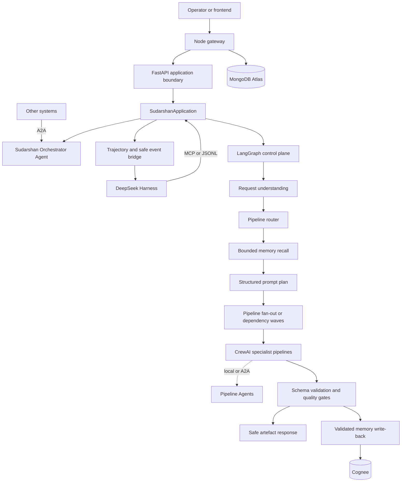
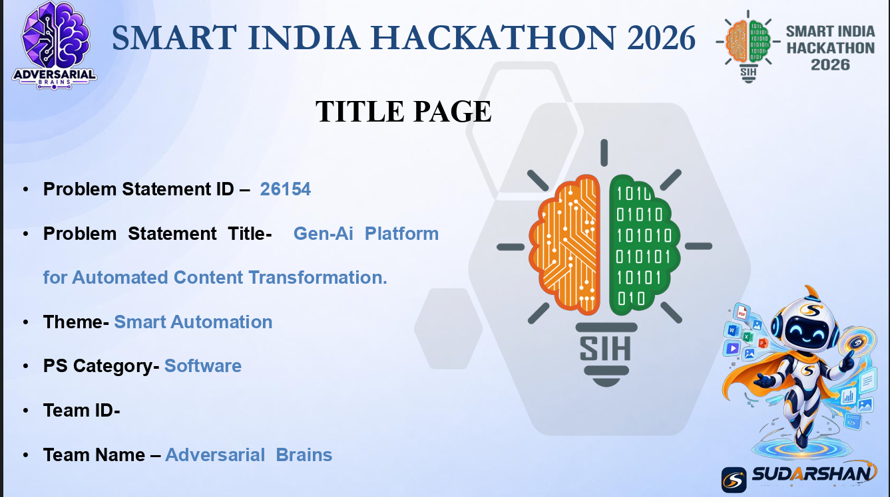
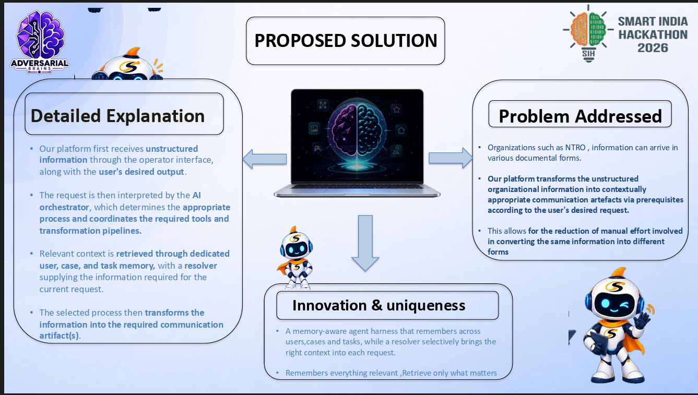
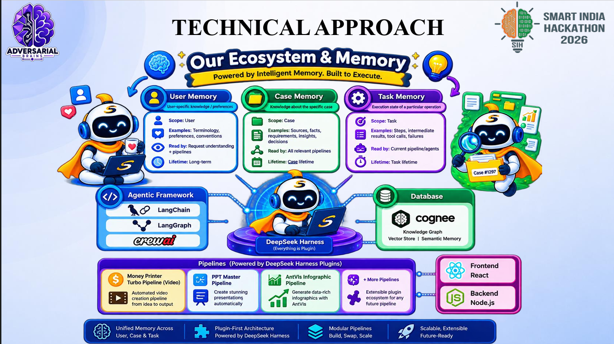
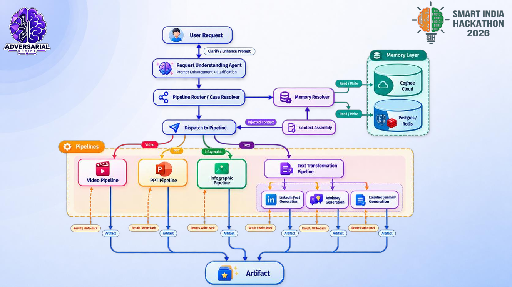
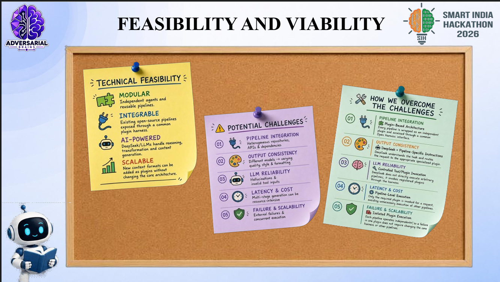
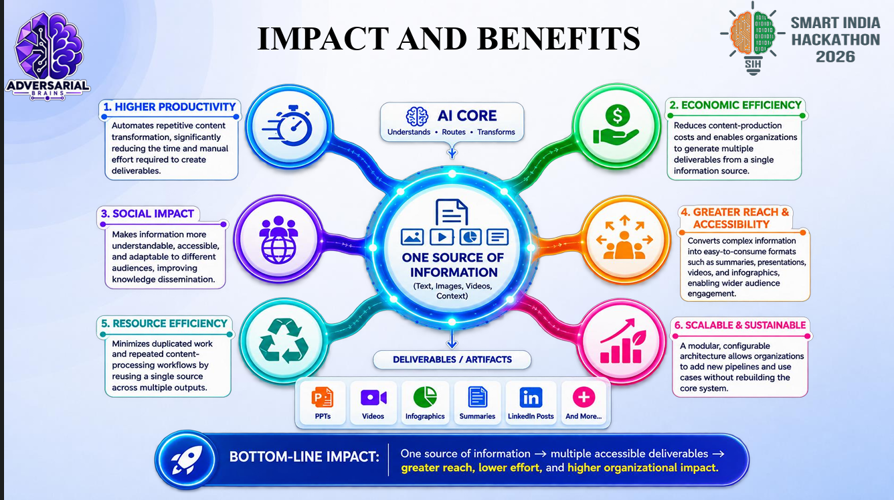
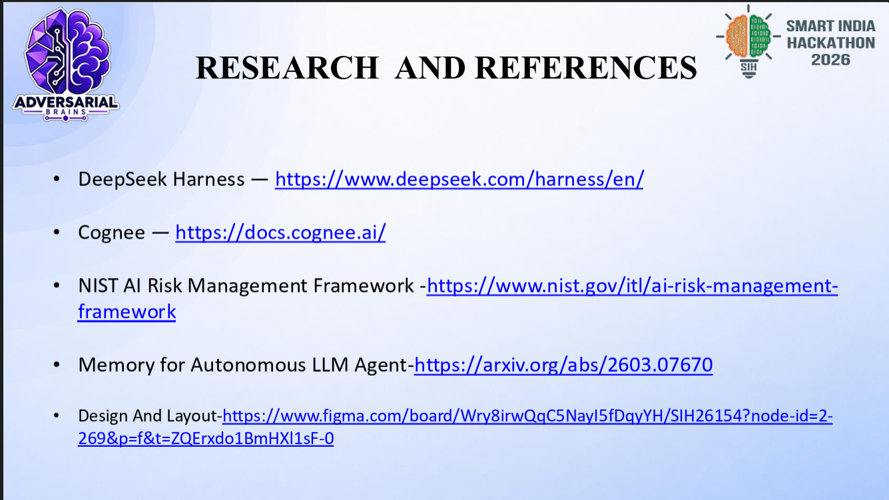

# Sudarshan Agentic Core

<p align="center">
  
  
  
</p>

<p align="center">
  
  
  
  
  
  
  
</p>

Sudarshan is a governed, memory-aware agentic platform for transforming
case-grounded source material into validated communication artefacts. It is
being developed for the Smart India Hackathon 2026 NTRO problem statement
SIH26154.

The platform ingests documents, images, presentations, video, or text; stores
source-derived knowledge through User/Case/Task memory boundaries; understands
the operator request; routes it to specialist pipelines; validates the result;
and returns frontend-safe artefacts and progress events.

> This is a competition/project implementation, not an official NTRO system.
> Do not connect it to classified production data without approved identity,
> storage, network, security, and operating controls.

## Current implementation status

Sudarshan 2.0 currently has a strong, tested local vertical slice: the Python
application boundary, skill runtime, memory policy, specialist pipelines,
quality gates, artifact manifests, scheduler, cache, telemetry, audit trail,
DeepSeek Harness/MCP integration, and reference dashboard are connected.
Pipelines already support bounded parallel execution and typed child handoffs.
The next scale-out step is to expose those same pipeline contracts as portable
per-pipeline A2A agents, with Harness as one optional client and trajectory UI.

It is not yet production-complete for distributed deployment. Shared queue and
lease infrastructure, object storage, signed skill packages, OS/container
sandboxing, live external-service smoke tests, final visual regression gates,
matched evaluation benchmarks, and release/rollback sign-off remain open.
See the detailed [current status](docs/current-status.md) and
[assumption ledger](docs/sudarshan-2.0-assumptions.md).

## Agent map

Human/developer documentation is separated under `docs/`. Agent-facing
navigation, ownership, request flow, local-versus-A2A execution, parallel
visibility, and safe-edit rules are in [AGENT_MAP.md](AGENT_MAP.md).

| If you need to... | Start with... |
| --- | --- |
| understand the whole request flow | [AGENT_MAP.md](AGENT_MAP.md), then `pipelines/orchestrator/graph.py` |
| add or change a pipeline agent | `pipelines/<name>/`, `skills/`, and [skill authoring](docs/skill-authoring.md) |
| make agents hand work to each other | `pipelines/orchestrator/contracts.py`, `skill_runtime.py`, `cross_skill.py` |
| run work in parallel | `pipelines/orchestrator/cross_skill.py`, `graph.py`, `dag.py` |
| expose a remote agent | `integrations/deepseek_harness/a2a.py` and the A2A section in [AGENT_MAP.md](AGENT_MAP.md) |
| show child work in Harness | `integrations/deepseek_harness/`, progress contracts, and the trajectory section in [AGENT_MAP.md](AGENT_MAP.md) |
| change PPT/AntV/diagram behavior | `pipelines/ppt/`, `pipelines/infographic/`, or `pipelines/diagram/` and their quality gates |
| change memory behavior | `memory/` and `pipelines/common/memory_tools.py`; do not call Cognee directly |
| understand what is actually complete | [current status](docs/current-status.md) |

Agents should read the map before editing. It is navigation, not a second
runtime or scheduler.

## Agent handoff: skills, plugins, and tickets

This repository has two related but different extension concepts:

- A **Sudarshan skill** is a product capability that transforms typed input
  into a validated result or artifact. Its source lives under
  `skills/<skill-name>/` and normally contains `SKILL.md`, `manifest.json`,
  schemas, references, and evaluation fixtures.
- A **Harness/plugin adapter** is an integration surface for the native
  DeepSeek Harness, MCP, A2A, or another runtime. It may expose Sudarshan
  skills and projections, but it must not own routing, memory policy, budgets,
  approvals, or artifact authorization. The checked-in Harness integration is
  optional; the native Sudarshan application remains the source of truth.
- A **pipeline agent** is a reusable Sudarshan capability exposed through the
  same typed `SkillManifest`, `ChildTaskSpec`, and `SkillResult` contracts. It
  can run through a local adapter or an A2A endpoint. For example, the
  Presentation Agent can request an Infographic Agent or Diagram Agent and
  consume the returned artifact and quality receipt.

Runtime skill discovery is defined by [skills/catalog.py](skills/catalog.py),
the package manifests under [skills](skills), and `SkillWorkspace`. Do not add
a central `if/else` branch for a new capability and do not import provider SDKs
or credentials from a skill. Register a versioned manifest, implement the
adapter behind the existing runtime contract, add deterministic fixtures, and
let the Harness/MCP/plugin layer discover it.

### Where tickets are stored

Use these files in this order:

1. [Full 2.0 execution plan](docs/archive/sudarshan-2.0-full-execution-plan.md) —
   research-backed architecture, HLD/LLD, original T00–T52 plan, constraints,
   sources, and release principles.
2. [Next execution plan](docs/next-plan.md) — the active audit-derived ticket
   ledger with current priorities, dependencies, acceptance criteria, and
   release gates. The former T39–T90 backlog is preserved only as history in
   `docs/archive/`.
3. [Team-parallel guide](docs/archive/sudarshan-2.0-team-parallel-guide.md) — ownership,
   branch boundaries, shared contracts, fixtures, and parallel execution order.
4. [Current status](docs/current-status.md) — honest implementation and
   production-readiness summary; do not infer completion from a passing unit
   test alone.
5. [Skill authoring guide](docs/skill-authoring.md) — the required skill
   package, manifest, prompt, child-skill, tool, budget, quality, and eval
   contract.

The active ticket workflow is:

```text
read plan and assumptions
  -> inspect current code and reference adaptations
  -> write/confirm a small ticket with owner, dependencies, and acceptance
  -> implement behind existing contracts
  -> add or update deterministic tests/fixtures
  -> run focused checks and the relevant full suite
  -> audit for regressions, security, scope, and stale documentation
  -> update ticket status and assumptions
```

When taking a ticket, an agent should report: ticket ID, files in scope,
assumptions, tests to run, and any dependency it is intentionally leaving for
another team. A ticket is not complete merely because code exists: its
acceptance criteria, focused tests, compatibility checks, and documentation
status must be satisfied. Do not commit unless the repository owner asks for a
commit.

### Adding a new skill or plugin capability

Start with the base skill structure, then specialize it:

```text
skills/<skill-name>/
  SKILL.md              # concise operating instructions
  manifest.json         # ID, version, tools, risk, budget, gates, children
  schema.json           # typed input/output when applicable
  references/           # on-demand domain guidance
  evals/                # deterministic fixtures and smoke cases
```

The manifest must declare allowed tools, output artifact types, quality gates,
risk class, model/token budget, wall-time limit, child skills, and whether a
child may run locally or through A2A. Parent skills invoke children only
through the typed `SkillRuntime` contract with a bounded context, budget
reservation, cancellation signal, idempotency key, deadline, and lineage. A
child returns structured IR/artifact references; it cannot publish, write
memory, read credentials, or overwrite a parent artifact by itself.

For every new skill, update the runtime catalog/package discovery, add success,
ambiguity, prompt-injection, unauthorized-scope, timeout/cancellation, and
budget fixtures, then add a ticket entry to the remaining-work plan. If a
reference repository inspired behavior, adapt the behavior natively and record
the source/license decision in the reference-adaptation or release ledger;
do not make Sudarshan depend on that repository at runtime.

## What it delivers

| Pipeline | Output |
| --- | --- |
| Advisory | Case-grounded advisory with quality review and human approval seam |
| Executive summary | Structured decision-facing summary |
| LinkedIn post | Professional draft with optional image asset |
| Infographic | Validated AntV syntax and optional SVG |
| Presentation/PPT | Native PowerPoint deck |
| Video | Full package: script, storyboard, scene PNG/MP3/MP4 assets, manifest, final MP4 |

Pipelines can be invoked locally, through MCP, or through portable A2A agent
cards where a separate process or deployment is useful. The durable
orchestrator remains the authority for policy, memory, budgets, dependencies,
retries, artifacts, and quality decisions.

The public presentation route is presentation. ppt is its legacy compatibility
alias and should not be selected as a second pipeline.

## Architecture



Sudarshan is a hybrid agentic workflow:

- LangGraph/application services own routing, lifecycle, retries, checkpoints,
  fan-out/fan-in, cancellation, approval boundaries, and delivery policy.
- CrewAI owns specialist collaboration inside each pipeline.
- Pipeline agents own specialist execution and can be local adapters or
  portable A2A services. The orchestrator mediates their handoffs and keeps
  parent/child scope, budgets, dependencies, and artifact lineage.
- MemoryManager owns Cognee access and User/Case/Task scope policy.
- A Harness adapter owns session, MCP, trajectory, and runtime integration; the
  checked-in DeepSeek Harness profile is optional and replaceable. Harness is
  one client of the orchestrator, not the home of pipeline implementations.
- The Node gateway owns browser authentication, ownership, quotas, and safe
  delivery.
- The frontend owns request composition, uploads, previews, and progress display.

Prompt planning occurs after routing. Pipeline collaboration is bounded by
typed capability proposals, shared constraints, declared dependencies, and
execution waves. The default coordinator does not create unrestricted
LLM-to-LLM conversations or extra model calls.

## Request lifecycle

```text
upload or operator request
  -> authenticated application boundary and idempotent run admission
  -> bounded User/Case recall
  -> request understanding and clarification
  -> pipeline routing
  -> bounded User/Case/Task recall
  -> structured prompt plan
  -> local or A2A pipeline-agent execution in dependency waves
  -> schema validation and quality critic
  -> renderer/provider adapter
  -> safe result and progress events
  -> validated Case/Task memory write-back
```

Writer/critic loops are bounded to two total attempts by default. Video passes
critic issues and required revisions into its second planning attempt.
Independent pipelines and child skills may run in parallel up to the parent
policy. The orchestrator emits one parent run plus child lifecycle events;
Harness trajectory and other clients can show each child lane, dependency,
artifact, quality result, retry, and wait reason without becoming the scheduler.

## Native video path

The default video implementation runs in-process:

1. CrewAI creates evidence, narration, storyboard, and quality review.
2. OpenAI Images creates scene images when configured.
3. OpenAI TTS creates narration audio when configured.
4. imageio-ffmpeg creates and joins local scene videos.
5. the package is written to artifacts/videos/<run_id>/.

MONEYPRINTERTURBO_BASE_URL is optional compatibility mode for an asynchronous
worker. DeepSeek Harness calls only the application boundary; it never calls
OpenAI, Cognee, or the native renderer directly.

## Frontend capabilities

The reference frontend is gateway-first. It checks the Node gateway on port
8080 and uses the direct FastAPI port 8000 only as a local development
fallback. Gateway mode provides Google authentication, MongoDB-backed cases
and task history, ownership checks, quotas, and authenticated artifact
delivery.

From the dashboard, an operator can:

- attach supported source files (`txt`, `pdf`, common image formats, PPTX, and
  common video formats) to the selected case;
- submit executive summary, presentation, advisory report, infographic,
  complete video package, or LinkedIn post pipelines;
- follow SSE progress events and the polling fallback, including ingestion and
  agent/pipeline stages;
- stop an active run at the next safe orchestration boundary. Stop is
  cooperative; it is not a provider pause or resumable checkpoint;
- preview videos and rendered images and open/download PPTX, SVG, Markdown,
  and other returned artifacts;
- see quality status, wait reasons, classification markings, cache/latency/
  token summaries, and safe artifact telemetry;
- reload the page and recover task history from the authenticated gateway.

The frontend is a reference operator dashboard, not the security boundary.
The gateway/backend owns authentication, case ownership, quotas, classification
checks, artifact authorization, and provider credentials. The full frontend
feature matrix and known UI gaps are in
[docs/current-status.md](docs/current-status.md).

If the development backend reports that `OPENAI_API_KEY` is not configured,
the dashboard offers a one-time session setup dialog. The submitted key is
held only in the running backend process and is never stored in browser
storage. Production disables this development-only flow.

## Quick start

### Requirements

- Windows PowerShell 7
- Python 3.13+
- Node.js compatible with the lockfiles
- MongoDB Atlas access for the Node gateway
- Cognee endpoint credentials for live memory
- OpenAI credentials for live model/media calls

### Install and start

```powershell
Copy-Item .env.example .env
# Fill .env; never commit .env.
pwsh -NoProfile -ExecutionPolicy Bypass -File .\startup.ps1
```

Default services:

| Service | URL |
| --- | --- |
| FastAPI | http://127.0.0.1:8000 |
| Node gateway | http://127.0.0.1:8080 |
| Static frontend | http://127.0.0.1:3000 |

### Stop local services

`startup.ps1` launches the API, gateway, and frontend as detached processes, so
closing the terminal does not stop them. Stop only the Sudarshan processes with:

```powershell
pwsh -NoProfile -ExecutionPolicy Bypass -File .\stop-servers.ps1
```

The script targets the default ports `3000`, `8000`, and `8080`. If custom ports
are configured, pass them explicitly:

```powershell
pwsh -NoProfile -ExecutionPolicy Bypass -File .\stop-servers.ps1 -Ports 3001,8001,8081
```

Startup records exact service PIDs in `artifacts/.state/sudarshan-processes.json`,
so normal shutdown does not terminate unrelated processes. Use `-ByPort` only
as an explicit fallback when that manifest is unavailable.

Useful options and manual service commands are in
[docs/operations.md](docs/operations.md).

## Verification

```powershell
.\.venv\Scripts\python.exe -m pytest -q

Push-Location backend-node
npm test
npm run check
Pop-Location

node --check frontend\script.js
node --check frontend\api.js
node --check frontend\login.js
```

Recorded focused baselines include 178 Python tests passed with 1 skipped, 9
Node gateway tests passed, 3 frontend projection/cursor tests passed, and
frontend JavaScript syntax checks passed. The latest audit run reached 367
Python tests passed and 8 skipped, with one AntV SSR deadline failure; external
MongoDB, Cognee, Google OAuth, OpenAI, AntV SSR, and worker reachability still
require separate live smoke tests.

## Documentation index

Agent-facing navigation is intentionally separate in [AGENT_MAP.md](AGENT_MAP.md)
and [docs/agent/README.md](docs/agent/README.md). Human/developer documents are
categorized in [docs/human/README.md](docs/human/README.md). The most-used
human documents are:

| Document | Use it for |
| --- | --- |
| [Operations](docs/operations.md) | setup, configuration, API list, testing, troubleshooting, deployment limits |
| [Current status](docs/current-status.md) | implemented frontend/backend features, honest production gaps, and verification snapshot |
| [Engineering handbook](docs/sudarshan-2.0-engineering-handbook.md) | end-to-end HLD/LLD, lifecycle, skills, parallelism, memory, rendering, security, deployment, and team workflow |
| [Skill authoring](docs/skill-authoring.md) | manifests, prompts, child skills, budgets, tools, quality, and evaluation fixtures |
| [Artifact rendering](docs/artifact-rendering-and-quality.md) | PPT, flowchart, infographic, video, LinkedIn, repair, cache, and quality gates |
| [Architecture](docs/internal/pipeline-orchestration.md) | graph, memory sequence, pipelines, model routing, diagrams |
| [Backend integration](docs/backend-integration.md) | Python API, ingestion, MCP, status, resume, cancellation |
| [Ingestion architecture](docs/ingestion-architecture.md) | typed multimodal evidence, async ingestion jobs, provenance, budgets, cache, and Cognee projection |
| [Gateway integration](docs/gateway-integration.md) | OAuth, cases, transformations, tasks, quotas, MongoDB |
| [Frontend integration](docs/frontend-integration.md) | browser calls, uploads, polling, SSE, rendering, security |
| [Memory](memory/README.md) | Cognee adapter and User/Case/Task memory policy |
| [Pipelines](pipelines/README.md) | pipeline contracts, video package, images, renderers |
| [Harness integration](integrations/deepseek_harness/README.md) | MCP and JSONL boundary |
| [Harness UI composition](docs/harness-ui-plugin.md) | replaceable Sudarshan brand/theme plugins and preview-state security |
| [Reference architecture audit](docs/reference-architecture-audit.md) | what was adopted from local references and what remains separate |
| [Reference adoption plan](docs/reference-repository-adoption-plan.md) | reference-derived tickets and license boundaries |
| [Third-party notices](THIRD_PARTY_NOTICES.md) | project, vendored, runtime, and reference licenses |
| [Design review](docs/archive/design-review.md) | corrections recommended for the submitted slides |

## Team and credits

### Adversarial Brains

- **Sarthak Singh — Team Leader** · [GitHub](https://github.com/keyboard-warrior-777)
- **Udit Jain — Agentic system design and implementation; FigmaJam pipeline design** · [GitHub](https://github.com/udit79)
- **Ayush Gupta — Backend and frontend; backend system design** · [GitHub](https://github.com/DevDripCodes)
- **Abhishek Padi — Ingestion pipeline and testing** · [GitHub](https://github.com/GokalaIsCool)
- **Gaurav — PPT and frontend ideas** · [GitHub](https://github.com/Gaurav123456789000)
- **Asmee — Communication, frontend images, and Figma designs** · [GitHub](https://github.com/asmeesaxena0777-oss)

Design board: [FigmaJam](https://www.figma.com/board/Wry8irwQqC5NayI5fDqyYH/SIH26154?t=tzArXaqZqowMYnAq-0).

## Design gallery

The supplied presentation assets are stored in
[docs/assets/presentation](docs/assets/presentation).

<details>
<summary>Open the presentation gallery</summary>

### Title page



### Proposed solution



### Technical approach and memory



### System architecture



### Feasibility and viability



### Impact and benefits



### Research and references



</details>

Use [docs/archive/design-review.md](docs/archive/design-review.md) to align the slides with the
implemented routing order, memory boundaries, provider boundaries, and
production claims.

## Licensing and reference boundary

Original Sudarshan code is released under the MIT License; see
[LICENSE](LICENSE). The vendored DeepSeek Harness retains its own MIT license.
External references are not all MIT: agentmemory is Apache-2.0 and the main
OpenViking repository is AGPL-3.0. Read [THIRD_PARTY_NOTICES.md](THIRD_PARTY_NOTICES.md)
before copying any upstream code or assets. Sudarshan generally reimplements
reference ideas behind its own typed contracts rather than importing reference
runtimes.
