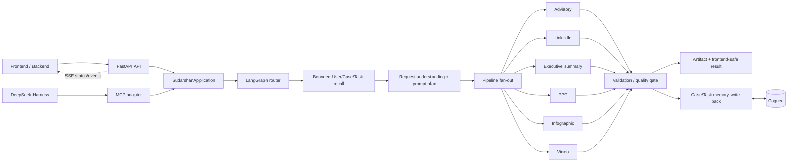

# Sudarshan Agentic Core — NTRO Intelligent Advisory Platform

The `memory` package is the Sudarshan-side memory unit. It accepts ingestion
`KnowledgeUnit` objects, applies User/Case/Task scope policy, and delegates
knowledge graph and semantic retrieval to Cognee. See
[`memory/README.md`](memory/README.md) for setup and usage.

## One-command setup

From PowerShell, run the single bootstrap command:

```powershell
pwsh -NoProfile -ExecutionPolicy Bypass -File .\setup.ps1
```

This bootstraps `uv` through Python when it is missing, installs the locked
Python dependencies, installs the pinned AntV infographic renderer, and
installs the frozen DeepSeek Harness workspace. It requires Python 3.13+ and
Node.js LTS/npm; pnpm is used when present or installed automatically.
Runtime rendering is performed by the checked-in AntV bridge under
`pipelines/infographic/antv_renderer/`.

After setup, use the Python environment with `uv run ...`; no separate npm
installation command is needed.

## Native Media Pipelines

The in-repo presentation pipeline generates native PPTX files. The ingestion process now includes a native **PPT Master** implementation that extracts structural markdown and slide transitions natively. No external service is required.

Video generation defaults to a native **MoneyPrinterTurbo-inspired** architecture running in-process using `imageio-ffmpeg` and optional OpenAI TTS. Deployments that already operate the upstream MoneyPrinterTurbo worker can set `MONEYPRINTERTURBO_BASE_URL`; the same adapter then uses its asynchronous submit/status contract and preserves provider-pending state.

## Start testing

Copy `.env.example` to `.env` if needed, then add the Cognee Cloud values and
the CrewAI provider credentials. The example disables optional CrewAI telemetry
by default. Run the focused unit suite with:

```powershell
uv run pytest -q
```

The test configuration intentionally targets the Sudarshan-owned suites and
does not collect the vendored DeepSeek Harness test tree.

Generated advisory, LinkedIn image, and infographic files are written below
`artifacts/`, which is intentionally ignored by Git.

Internal backend/frontend integration details are in
[`docs/internal/pipeline-orchestration.md`](docs/internal/pipeline-orchestration.md).
The backend handoff and HTTP/MCP contract are in
[`docs/backend-integration.md`](docs/backend-integration.md).
The frontend API, upload, polling/SSE, resume/cancel, TypeScript, and security
guide is in [`docs/frontend-integration.md`](docs/frontend-integration.md).

## Running the API Server

The system includes a FastAPI server equipped with SSE streaming, NTRO security middleware, and tamper-evident audit logging. Production deployments must provide approved at-rest encryption for the SQLite state stores.

```powershell
uv run python -m api.server
```

The API will start at `http://localhost:8000`. It enforces `X-Operator-Id` headers on mutations and returns `X-Classification-Level` headers.

Real source ingestion is available at `POST /ingest` as an authenticated
`multipart/form-data` upload. It extracts the file, persists the resulting
knowledge unit through Cognee-backed `MemoryManager`, writes the NTRO audit
entry, and returns a frontend-safe ingestion receipt. `main.py` is only the
production API entry point; it no longer runs sample-data demos.

## DeepSeek Harness integration

The LangGraph orchestrator now provides the thin application boundary for
routing, lifecycle state, approval interrupts, and progress events. The
Harness should own session, tool, and runtime execution; CrewAI pipelines own
agent collaboration; and MemoryManager owns memory policy. Do not make each
pipeline depend directly on Harness internals.

For a local headless Harness bridge, send one JSON request to:

```powershell
'{"query":"Create an executive summary","user_id":"u-1","case_id":"c-1","task_id":"t-1"}' |
  .\.venv\Scripts\python.exe -m integrations.deepseek_harness.runner
```

In production, register the MCP overlay at
`integrations/deepseek_harness/sudarshan.cordis.yml` or expose the same
boundary through an authenticated backend service. MoneyPrinterTurbo is
called by `integrations/providers/moneyprinterturbo/client.py` from the
backend process; the Harness does not call it directly.

The MCP application boundary exposes four operations:

- `run_sudarshan`: start a routed operation with a stable `task_id`.
- `get_sudarshan_status`: poll frontend-safe stage and progress events.
- `resume_sudarshan`: continue a clarification, approval, or revision.
- `cancel_sudarshan`: request cooperative cancellation while preserving the
  task audit trail.

The application owns a durable LangGraph checkpoint store, so a resume or
status request does not create a second orchestration instance. Raw Cognee
context, provider credentials, and model reasoning are not serialized into
the Harness response.

## How the components interact



The runtime sequence is:

1. The frontend/backend submits a real source to `/ingest` or a generation
   request to `/runs`. The Harness uses the same application boundary through
   MCP tools.
2. `SudarshanApplication` validates the request and delegates to the
   LangGraph router.
3. The router performs bounded, scope-aware memory recall, understands the
   request, creates a validated prompt plan, and selects one or more pipeline
   adapters.
4. Selected pipelines run independently with their specialist CrewAI agents,
   quality gates, and optional render/provider adapters.
5. Results fan back into the parent run. Validated artifacts are written to
   scoped memory, while the frontend receives only safe status, artifact, and
   progress metadata.

## Agentic system or workflow?

Sudarshan is a hybrid agentic workflow platform. LangGraph is the deterministic
control plane: it owns routing, state, retries, fan-out/fan-in, checkpoints,
approval interrupts, cancellation boundaries, and delivery policy. Inside that
controlled workflow, CrewAI specialist agents perform agentic analysis,
evidence review, drafting, criticism, and pipeline-specific decisions. The
Harness supplies sessions, tools, and runtime integration; Cognee supplies
scoped long-term memory.

Therefore it is more than a fixed workflow, but it is not an unrestricted
autonomous agent. It is a governed agentic system designed for NTRO operations,
where agent reasoning is bounded by typed contracts, memory access policy,
quality gates, audit logging, and human approval where required. The full
architecture and individual pipeline diagrams are in
[`docs/internal/pipeline-orchestration.md`](docs/internal/pipeline-orchestration.md).
