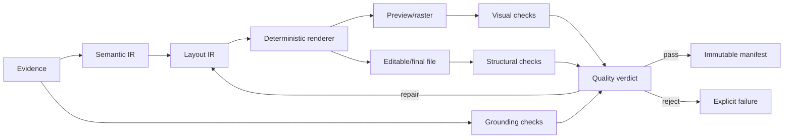

# Artifact rendering and quality guide

This document defines how Sudarshan turns typed semantic output into useful,
editable, presentation-quality artifacts. It applies to PPTX, SVG/infographic,
video, images, Markdown, and future document types.

## 1. Rendering principles

1. Models produce semantic plans and visual intent.
2. Typed intermediate representations preserve meaning, evidence, and
   constraints.
3. Deterministic renderers produce files and previews.
4. Validators inspect structure, provenance, media integrity, and layout.
5. Repair targets the failed node/slide/scene instead of regenerating all work.
6. Only quality-passed artifacts enter the immutable artifact registry.



## 2. Common artifact contract

Every renderer should accept a typed input and return:

```json
{
  "artifact_id": "artifact-...",
  "artifact_type": "pptx",
  "uri": "/artifacts/...",
  "preview_uri": "/artifacts/.../preview.svg",
  "sha256": "...",
  "bytes": 12345,
  "renderer": "pptx-native",
  "renderer_version": "1.0.0",
  "quality_status": "passed",
  "quality_report_id": "quality-...",
  "evidence_ids": ["source-1#page=3"],
  "classification": "RESTRICTED"
}
```

Paths are internal implementation details. The API exposes stable artifact IDs
or authorized download routes. Renderer warnings and fallback mode must be
visible in the quality report and telemetry.

The shared local post-render process is `ArtifactStore.register_checked`:
resolve the requested renderer through the capability registry, run the
renderer-specific integrity gate, save a bounded quality report under
`artifacts/.state/quality_reports/`, and register the manifest with the
renderer version, quality report ID, issue list, and explicit degraded/fallback
metadata. A failed candidate may remain registered for diagnostics, but its
manifest is marked failed and is not a deliverable.

## 3. PowerPoint pipeline

### Representation

```text
PresentationSpec
  ├── narrative and audience
  ├── theme and typography tokens
  ├── SlideSpec[]
  │     ├── purpose / one-message statement
  │     ├── evidence bindings
  │     ├── archetype and layout constraints
  │     ├── elements: text, shape, image, chart, table, flowchart
  │     └── speaker notes
  └── release policy
```

Never ask a slide worker to write arbitrary PPTX XML. Slide workers return
`SlideContentIR` or visual child IR; the assembler owns the final deck.

### Flowchart child

Use `visual.flowchart` when the content has a process, dependency graph,
decision tree, causal chain, architecture, or lifecycle. The child returns:

- node IDs, labels, roles, and evidence bindings;
- directed edges and relationship labels;
- normalized positions and dimensions;
- theme/token references;
- diagnostics and repair suggestions;
- SVG/PPTX-compatible visual references.

The parent slide skill chooses whether and where to place that visual. A
flowchart is not decoration and must not be selected only to fill whitespace.

### Quality gates

| Gate | Examples |
| --- | --- |
| schema | required fields, valid layout, valid bounds |
| evidence | every factual claim maps to source/evidence IDs |
| structure | slide count, title, notes, editable shapes |
| geometry | no overlap, off-canvas elements, edge crossings, overflow |
| typography | font availability, minimum size, line wrapping |
| visual | contrast, density, hierarchy, projector-scale readability |
| policy | classification, approval, artifact ownership |

The current local renderer implements strong schema/geometry/manifest slices;
rasterized projector-scale visual QA and font-aware measurement remain a
production promotion gate.

## 4. Infographics

The infographic path is split between Python and Node:

```text
Python: evidence → typed infographic spec → AntV syntax validation
Node: validated syntax → bounded SSR worker → SVG
Python: SVG integrity/provenance/quality → artifact manifest
```

The Node bridge must not receive Cognee credentials or uncontrolled memory. It
receives only the validated render payload. If AntV fails or times out, the
result is an explicit renderer failure or clearly labelled fallback; a blank or
fake SVG is never a pass.

## 5. Video

Video is a package, not one opaque model call:

```text
subject/transcript → script → storyboard → scene manifests
                 → scene images/audio → scene clips → ordered composition
                 → media QA → immutable MP4/package manifest
```

Each scene has a stable fingerprint based on its semantic inputs, provider
policy, and renderer version. Successful scenes can be reused after a partial
failure. Scene workers run with a bounded concurrency limit and cooperative
cancellation. FFmpeg composition preserves storyboard order and must fail
explicitly when required media is missing.

## 6. LinkedIn and text artifacts

Text artifacts still require typed validation, source grounding, uncertainty,
and human review policy. The humanizer may improve tone and structure but may
not alter claims, fabricate statistics, or remove required caveats. Optional
visual children return separate assets and metadata; the parent draft refers
to them through artifact IDs.

## 7. Repair loop

Repair is bounded and typed:

```text
quality report → failing component + diagnostic → repair patch
              → re-render component → re-run affected gates
```

Do not regenerate the whole deck/video when one slide or scene fails. The
repair budget must be included in the parent budget policy. After the repair
limit is reached, the run becomes `needs_revision` or `failed` with diagnostics.

## 8. Renderer versioning and cache

The cache key for rendered output must include:

```text
semantic IR hash
renderer name + version
theme version
font set / locale
provider policy when provider output is included
quality policy version
authorization scope
```

An artifact cache may reuse only exact compatible results with a prior passed
quality verdict. Cache metadata must not contain raw prompts, source text,
private memory, or secrets. Renderer/theme changes invalidate render caches;
evidence/context changes invalidate planning caches; policy changes invalidate
delivery eligibility.

## 9. Evaluation matrix

Measure every artifact class on both quality and operations:

| Dimension | Example measurement |
| --- | --- |
| groundedness | supported claim ratio, citation correctness |
| semantic completeness | required sections/entities present |
| visual quality | human preference, density, contrast, overflow |
| editability | editable shapes/connectors, round-trip validity |
| reliability | pass rate, retry rate, recovery rate |
| efficiency | tokens, provider cost, cache savings |
| latency | time to accepted, first progress, final artifact |
| usability | correction time, approval time, download success |

Promotion requires matched legacy-versus-staged runs with fixed synthetic
fixtures and a small human review set. Never promote a renderer based only on
one attractive example.
