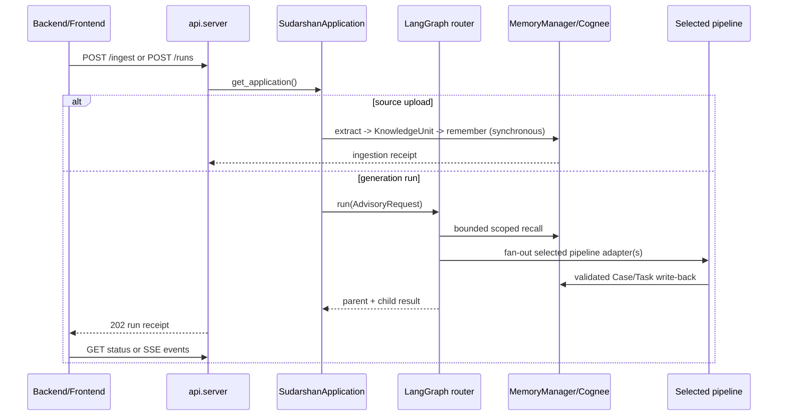

# Backend integration handoff

This document is the contract between the backend, frontend, and the
DeepSeek Harness integration. The Python application is the source of truth
for routing, memory policy, pipeline execution, approval, cancellation, and
artifact metadata. The Harness is the session/tool/runtime layer.

## Integration rule

There is one application boundary. Backend code should call the HTTP API or
`SudarshanApplication`; it should not import a pipeline crew, call Cognee
directly, construct a `KnowledgeUnit` manually, or duplicate routing logic.
That keeps identity, NTRO classification, memory scope, audit, progress, and
provider behavior consistent across the frontend, backend, and Harness.

## Code map: where backend integration lives

| Concern | File | Entry point |
| --- | --- | --- |
| HTTP application | `api/server.py` | `app`, `/health`, `/pipelines`, `/ingest`, `/runs/*` |
| HTTP security and audit | `api/middleware.py` | `NTROSecurityMiddleware`, `AuditMiddleware` |
| HTTP progress stream | `api/sse.py` | `event_generator()` |
| Trusted application boundary | `integrations/deepseek_harness/application.py` | `get_application()`, `SudarshanApplication` |
| Harness MCP tools | `integrations/deepseek_harness/mcp_server.py` | `run_sudarshan()`, `resume_sudarshan()`, `cancel_sudarshan()` |
| Harness registration | `integrations/deepseek_harness/sudarshan.cordis.yml` | stdio MCP server command |
| Headless JSON bridge | `integrations/deepseek_harness/runner.py` | `run_one()` |
| Real file ingestion | `ingestion_pipelines/ingest.py` | `ingest_file()` |
| Source extraction dispatch | `ingestion_pipelines/extract.py` | `extract_text()` |
| Memory policy and Cognee adapter | `memory/memory_manager.py`, `memory/cognee_adapter.py` | `MemoryManager.from_env()`, `remember()`, `recall()` |
| Router and lifecycle | `pipelines/orchestrator/graph.py` | `PipelineOrchestrator.run()`, `resume()`, `cancel()` |
| Pipeline registration | `pipelines/orchestrator/__init__.py` | `build_default_pipeline_registry()` |
| Request/response schemas | `pipelines/common/contracts.py` | `AdvisoryRequest`, `PipelineResponse` |
| Integration tests | `api/tests/test_api_server.py`, `tests/component/test_application_boundary.py` | HTTP and application-boundary tests |

The normal backend path is `api/server.py -> get_application() ->
SudarshanApplication -> PipelineOrchestrator`. The MCP path starts at
`mcp_server.py` but joins the same `get_application()` boundary. Both paths
therefore use the same router, memory manager, checkpoint store, progress
sink, pipeline registry, and audit behavior.

## Start the service

```powershell
Copy-Item .env.example .env
# Fill Cognee, CrewAI/model, and any provider settings in .env.
pwsh -NoProfile -ExecutionPolicy Bypass -File .\setup.ps1
uv run python -m api.server
```

`setup.ps1` is the single dependency command. It bootstraps `uv` when needed,
installs the locked Python environment, installs the AntV renderer, and installs
the frozen `deepseek-harness` workspace. If the machine already has pnpm,
the script uses it directly and avoids a Corepack version download.

The API listens on `SUDARSHAN_API_HOST:SUDARSHAN_API_PORT` (default
`0.0.0.0:8000`). Use `SUDARSHAN_CORS_ORIGINS` for a comma-separated allow-list;
do not use `*` with credentials in a deployed NTRO environment.

### First backend smoke test

```powershell
$headers = @{ "X-Operator-Id" = "operator-1" }
Invoke-RestMethod http://localhost:8000/health -Headers $headers
Invoke-RestMethod http://localhost:8000/pipelines -Headers $headers
```

For a deployed environment, replace the header-only development identity with
the approved gateway/SSO identity before exposing the service to users.

## HTTP contract

All mutating requests require `X-Operator-Id`. `X-Case-Id` may supply the case
when it is not in the JSON payload. If `user_id` is present, it must match the
operator header. Classification is normalized to one of `UNCLASSIFIED`,
`RESTRICTED`, `CONFIDENTIAL`, `SECRET`, or `TOP SECRET`.

| Method | Route | Use | Success |
| --- | --- | --- | --- |
| GET | `/health` | service and registry check | `200` |
| GET | `/pipelines` | discover registered pipeline names | `200` |
| POST | `/ingest` | upload a real source into scoped memory | `201` |
| POST | `/runs` | queue an advisory/generation run | `202` |
| GET | `/runs/{run_id}` | read frontend-safe status | `200` |
| GET | `/runs/{run_id}/events` | stream progress over SSE | `200` / `text/event-stream` |
| POST | `/runs/{run_id}/resume` | answer clarification or approval | `200` |
| POST | `/runs/{run_id}/cancel` | request cooperative cancellation | `200` |

The backend should treat `run_id` and `task_id` as opaque identifiers. Do not
derive them from user-visible names or reuse them across revisions.

### Real source ingestion

`POST /ingest` accepts an authenticated `multipart/form-data` upload with a
`file` field and optional `case_id`, `task_id`, `user_id`, and
`classification_level` fields. The backend streams the file to a bounded
temporary location, extracts its text/timeline, creates a `KnowledgeUnit`,
persists it through `MemoryManager`/Cognee, records the audit entry, deletes
the temporary file, and returns a receipt with `memory_persisted=true`.
There is no demo or sample-data ingestion path in the production entry point.

Supported file extensions are defined in `ingestion_pipelines/extract.py` and
the upload size is controlled by `SUDARSHAN_MAX_INGEST_BYTES` (50 MiB by
default). A frontend or backend should send the original filename; the service
uses it only as a safe source reference and never as a filesystem path.

PowerShell example:

```powershell
$headers = @{
  "X-Operator-Id" = "operator-1"
  "X-Case-Id" = "case-42"
  "X-Classification-Level" = "RESTRICTED"
}
$form = @{
  file = Get-Item .\brief.pdf
  task_id = "ingest-brief-42"
}
Invoke-RestMethod http://localhost:8000/ingest -Method Post -Headers $headers -Form $form
```

The receipt contains `document_id`, `doc_type`, `case_id`, `task_id`,
`classification_level`, `content_characters`, `memory_persisted`, and
`ingested_at`. A `401` means the operator header is missing, `403` means the
user/operator identity mismatched, `413` means the upload is too large, `415`
means the extension is unsupported, and `502` means extraction or memory
persistence failed. The service does not return raw extracted content.

### Create a run

`POST /runs` returns `202 Accepted` immediately:

```json
{
  "query": "Create an executive summary of the case",
  "user_id": "operator-1",
  "case_id": "case-42",
  "task_id": "task-42-summary",
  "classification_level": "RESTRICTED",
  "distribution": "Authorized NTRO personnel",
  "requested_pipelines": ["executive_summary"],
  "metadata": {}
}
```

The response contains `status`, `run_id`, and `task_id`. Poll
`GET /runs/{run_id}` or subscribe to `GET /runs/{run_id}/events`.

The minimum backend call is:

```powershell
$headers = @{ "X-Operator-Id" = "operator-1"; "X-Case-Id" = "case-42" }
$body = @{
  query = "Create an executive summary of the case"
  user_id = "operator-1"
  case_id = "case-42"
  task_id = "task-42-summary"
  requested_pipelines = @("executive_summary")
  classification_level = "RESTRICTED"
  distribution = "Authorized NTRO personnel"
  metadata = @{}
} | ConvertTo-Json -Depth 5

$accepted = Invoke-RestMethod http://localhost:8000/runs -Method Post `
  -Headers $headers -ContentType "application/json" -Body $body
$accepted
Invoke-RestMethod "http://localhost:8000/runs/$($accepted.run_id)" -Headers $headers
```

When `requested_pipelines` is empty, the router selects from the registered
pipeline set. When it contains names, every name must be registered; unknown
names are rejected by the application contract rather than silently replaced.
Multiple names fan out into isolated child runs and fan in into one parent
response.

### Status and events

`GET /runs/{run_id}` returns frontend-safe state only: stage, status, selected
pipelines, clarification questions, errors, and ordered lifecycle events. Raw
Cognee results, prompts, credentials, and model reasoning are not returned.
The SSE event payload is a `ProgressEvent` with `event_id`, `run_id`,
`task_id`, `pipeline`, `stage`, `status`, `progress`, `message`, and optional
`artifact_id`/`error_code`.

### Resume and cancel

```text
POST /runs/{run_id}/resume
{ "task_id": "task-42-summary", "answer": "Focus on maritime activity" }

POST /runs/{run_id}/cancel
{ "task_id": "task-42-summary" }
```

Resume is used for clarification or authorized approval decisions. Cancellation
is cooperative: a provider call already in progress may finish, but the graph
records cancellation at the next safe boundary.

## Harness/MCP contract

Register `integrations/deepseek_harness/sudarshan.cordis.yml` with the vendored
Harness. It starts the trusted Python MCP server and exposes:

- `run_sudarshan`
- `get_sudarshan_status`
- `resume_sudarshan`
- `cancel_sudarshan`
- `get_sudarshan_health`
- `list_sudarshan_pipelines`
- `remember_sudarshan_context`
- `recall_sudarshan_context`

The MCP tools map to the application boundary as follows:

| Harness tool | Application method | Purpose |
| --- | --- | --- |
| `run_sudarshan` | `SudarshanApplication.run()` | create or revise a run |
| `get_sudarshan_status` | `.status()` | frontend-safe state and progress |
| `resume_sudarshan` | `.resume()` | clarification or authorized approval |
| `cancel_sudarshan` | `.cancel()` | cooperative cancellation |
| `get_sudarshan_health` | `.health()` | operational readiness projection |
| `list_sudarshan_pipelines` | `.list_pipelines()` | pipeline discovery |
| `remember_sudarshan_context` | `.remember_context()` | User/Case session memory |
| `recall_sudarshan_context` | `.recall_session_context()` | bounded User/Case recall |

File ingestion remains an HTTP concern because it requires multipart streaming
and temporary-file lifecycle management. A Harness or frontend that needs to
ingest a file should upload it to `/ingest`, then pass the returned case/task
identity into `run_sudarshan`.

The MCP server and HTTP API call the same process-scoped
`SudarshanApplication`; they do not create a second router or direct Cognee
tool. Never put Cognee, OpenAI, provider, or NTRO case secrets in a Harness
workflow, Cordis patch, or E2B sandbox.

### Calling from another Python backend

Use this only when the backend runs in the same trusted Python service
process. A separate service should use HTTP so it gets an independent process
boundary and deployment lifecycle.

```python
from integrations.deepseek_harness.application import get_application

application = get_application()
accepted = application.run({
    "query": "Create an executive summary of the case",
    "user_id": "operator-1",
    "case_id": "case-42",
    "task_id": "task-42-summary",
    "requested_pipelines": ["executive_summary"],
    "classification_level": "RESTRICTED",
    "distribution": "Authorized NTRO personnel",
    "metadata": {},
})
status = application.status(accepted["run_id"])
```

For source files in the same trusted process, call
`application.ingest_path(...)` only after the file has been received and
validated by the host backend. The public upload path is still `/ingest` in
`api/server.py`; it owns size limits, filename safety, cleanup, and HTTP error
mapping.

### Integration sequence



## End-to-end memory path

1. `ingestion_pipelines.ingest_file(..., memory_manager=manager)` extracts a
   source, converts it to a `KnowledgeUnit`, and writes it through
   `MemoryManager` into the correct Case/User/System scope.
2. The router recalls bounded User/Case memory for request understanding.
3. After pipeline selection, the router recalls permitted User/Case/Task
   memory and passes only bounded, provenance-preserving context to the flow.
4. CrewAI agents get a scoped recall tool; they never get a Cognee client or
   credentials.
5. Task lifecycle events are written through `TaskMemoryWriter`.
6. Validated pipeline outputs are written back to Case memory according to the
   pipeline's release policy. Revisions create new task/artifact versions.

Cognee is configured through `COGNEE_BASE_URL`, `COGNEE_API_KEY`,
`COGNEE_TENANT_ID`, and `COGNEE_DATASET_NAME`. The local `MemoryStore` is an
idempotency/domain cache, not a replacement for Cognee.

## Pipeline and provider behavior

The default registry exposes `advisory`, `linkedin_post`, `executive_summary`,
`infographic`, `presentation`, and `video`. Multiple requested pipelines fan
out with isolated child task/run IDs and fan in under one parent response.

The complete Mermaid architecture and per-pipeline diagrams are maintained in
[`docs/internal/pipeline-orchestration.md`](internal/pipeline-orchestration.md):
the shared router/memory diagram appears first, followed by advisory, LinkedIn,
executive summary, PPT, infographic, and video diagrams. This backend document
defines the transport contract; that document defines the internal execution
topology.

- Presentation output is native PPTX. Optional PPT Master intake enriches
  uploaded PPTX source content without executing arbitrary slide code.
- Infographic output is validated AntV syntax and optionally rendered to SVG
  through the checked-in Node SSR bridge.
- Video defaults to the in-process native generator. If
  `MONEYPRINTERTURBO_BASE_URL` is set, the adapter uses the upstream
  MoneyPrinterTurbo task API and returns `pending` while the provider job is
  running. Provider-pending is not treated as human approval.
- Human approval is entered only when an adapter returns `pending` with an
  approval resume seam or explicitly sets `human_approval_required=true`.

### Adding a new pipeline

The supported extension point is `PipelineAdapter` in
`pipelines/orchestrator/types.py`. A backend engineer does not need to modify
the HTTP routes, MCP server, memory adapter, or frontend contract.

1. Implement a runner that accepts `AdvisoryRequest` and returns the validated
   `PipelineResponse` contract.
2. Wrap it in `PipelineAdapter(name="your_pipeline", run=your_runner)`.
3. Register it in `build_default_pipeline_registry()` in
   `pipelines/orchestrator/graph.py`, or expose an approved
   `sudarshan.pipelines` entry point for plugin loading.
4. Add the pipeline name to its own tests and verify it appears in
   `GET /pipelines`.
5. Add the pipeline-specific diagram and release policy to
   `docs/internal/pipeline-orchestration.md`.

The orchestrator automatically supplies scoped memory context, task identity,
progress events, cancellation boundaries, result sanitization, fan-out/fan-in,
and Case-memory write-back. A pipeline should not create its own router or call
Cognee directly. See `pipelines/orchestrator/types.py` and
`tests/pipeline/test_pipeline_contracts.py` for the stable contract tests.

### Adding a provider adapter

Keep external services behind `integrations/providers/<provider>/`. The pipeline
calls the provider through a small adapter and returns an explicit `pending`
state when the provider is asynchronous. Provider credentials belong in the
service environment, never in request metadata, Harness prompts, browser code,
or artifacts. The MoneyPrinterTurbo integration at
`integrations/providers/moneyprinterturbo/` is the reference implementation.

## NTRO deployment checklist

- Put Cognee and model/provider services behind the approved government
  network boundary; do not expose them to the browser.
- Replace header-only operator identity with the deployment's authenticated
  gateway/SSO identity and pass the verified operator/case claims into this
  service.
- Use approved encrypted-at-rest storage for the LangGraph checkpoint,
  progress-event, and audit databases. The local SQLite files are a
  single-instance deployment default.
- Set a strict CORS allow-list and terminate TLS at the approved gateway.
- Keep `CREWAI_DISABLE_TELEMETRY=true` unless telemetry is explicitly cleared.
- Configure `SUDARSHAN_LOAD_PLUGINS=true` only when the installed entry points
  are allow-listed and reviewed.
- Persist artifacts in an approved controlled store before production use;
  `artifacts/` is a local development default.
- Run the live Cognee, model, provider, artifact-store, and Harness smoke
  tests in the deployment environment with synthetic/non-sensitive data.

## Verification

```powershell
$env:UV_CACHE_DIR = (Join-Path (Get-Location) '.uv-cache')
uv lock --check
uv run pytest -q --basetemp .pytest-tmp-run -p no:cacheprovider
node deepseek-harness/node_modules/typescript/bin/tsc -b deepseek-harness/tsconfig.host.json
node deepseek-harness/node_modules/typescript/bin/tsc -b deepseek-harness/tsconfig.client.json
git diff --check
```

The upstream patterns used by the adapters are documented at [MoneyPrinterTurbo](https://github.com/harry0703/MoneyPrinterTurbo), [PPT Master](https://github.com/hugohe3/ppt-master), and [AntV Infographic](https://github.com/antvis/infographic).
