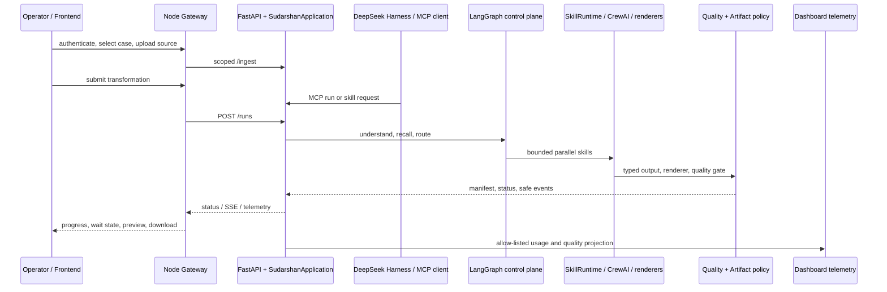

# Sudarshan 2.0 current status

Status is measured against the implementation on the `Sudarshan2.0` branch,
after T28 reliability work. This document separates local capability from
production readiness so demos, judging material, and engineering work use the
same claims.

## Executive status

| Area | Current state | Honest claim |
| --- | --- | --- |
| Agentic control plane | Implemented locally | LangGraph owns routing and lifecycle; specialist pipelines and typed child skills run behind bounded contracts. |
| Harness/MCP boundary | Implemented locally | DeepSeek Harness and external MCP clients use the same Sudarshan application boundary. |
| Python backend | Strong local vertical slice | Ingestion, memory, routing, pipelines, quality gates, artifacts, scheduler, cache, telemetry, audit, and recovery are wired and tested locally. |
| Reference frontend | Functional dashboard | Authenticated gateway mode, case/source flow, run progress, cancellation, artifact preview/download, and safe telemetry are available. |
| Production deployment | Not complete | Shared queue/leases, object storage, distributed tracing, sandboxing, signed skills, asynchronous evidence ingestion, live external-service smoke tests, and release benchmarks remain. |

## Frontend capabilities

The frontend is a gateway-first static application in `frontend/`. It is a
reference operator dashboard, not the security boundary; identity, ownership,
quotas, and artifact authorization belong to the gateway/backend.

The optional DeepSeek Harness web surface is composed separately: the
Sudarshan brand and theme are replaceable packages documented in
[Harness UI composition](harness-ui-plugin.md). This keeps product styling out
of the official Harness branding package and lets another compatible Harness
profile use the same Sudarshan application boundary.

### Available now

- Google OAuth login through the Node gateway with HttpOnly-cookie sessions.
- Authenticated case selection, case creation, task history, and refresh-safe
  task recovery.
- Source upload for text, PDF, common image formats, presentation formats,
  and common video formats. The backend remains the final extension and size
  validator.
- Pipeline selection for advisory, executive summary, LinkedIn draft,
  infographic, presentation/PPT, and video.
- Run submission with idempotent task identity and gateway/FastAPI fallback
  projection.
- Live progress through SSE, with polling fallback and `sessionStorage`
  cursor recovery after refresh or reconnect.
- Visible waiting states for clarification, approval, provider-pending work,
  and other safe-action boundaries.
- Cooperative Stop/cancel action. It requests cancellation at an orchestration
  boundary; it does not forcibly stop a provider thread.
- Artifact manifest, preview, open, and download behavior. Videos and images
  are previewed; PPTX, Markdown, SVG, and other files can be opened/downloaded.
- Quality status, failure notices, wait reasons, classification, and safe
  telemetry such as tokens, latency, cache, wait, artifact, and quality
  counters.
- Development-only one-time OpenAI key setup when enabled by the backend.
  The key is not stored in browser storage.

### Not yet a complete product UI

- No full parent/child execution graph or per-slide execution lane view.
- No interactive visual QA/repair editor for PPT, infographic, or diagram
  outputs.
- No operator-facing audit-log explorer with retention/access controls.
- No browser end-to-end test suite against live OAuth, MongoDB, Cognee, and
  provider services; current frontend tests focus on the API projection and
  cursor contract.
- Direct FastAPI fallback does not provide gateway-level user history,
  OAuth, quotas, or production ownership enforcement.

## Backend capabilities

### Implemented and tested locally

- FastAPI application boundary with health, pipeline discovery, ingestion,
  asynchronous run admission, status, bounded wait, SSE events, resume, and
  cooperative cancellation.
- Node gateway integration for OAuth, MongoDB-backed cases/tasks, ownership,
  quotas, idempotency, authenticated artifact delivery, and Python API proxying.
- User/Case/Task-scoped memory through `MemoryManager`, with Cognee kept behind
  the adapter boundary and bounded context packs, provenance, lifecycle, and
  prompt-injection markers.
- LangGraph request understanding, clarification, routing, fan-out/fan-in,
  checkpoints, cancellation, and safe result projection.
- CrewAI specialist pipelines for advisory, executive summary, LinkedIn,
  infographic, presentation, and video.
- Native media/rendering paths: editable flowchart SVG/PPTX, AntV SSR bridge,
  native video scene generation/composition, and quality reports.
- Typed skill contracts, versioned manifests, skill workspace resources,
  trust-tier checks, capability/tool allow-lists, side-effect approvals,
  bounded child execution, cooperative timeouts, and token/tool budgets.
- Durable local SQLite scheduler with leases, renewal, stale-lease recovery,
  retries, dead-letter state, cancellation, duplicate submission protection,
  and execution deadlines.
- Persisted dependency DAG with bounded parallel admission, dependency
  blocking, repair limits, and restarted-bridge dependent-node recovery.
- Verified artifact manifests, checksum validation, safe path checks, previews,
  classification access checks, and quality-gated delivery.
- Exact-match quality-gated cache with authorization-aware fingerprints,
  privacy-filtered metadata, TTL, and stampede leases.
- Allow-listed observability projections for run/task/skill usage, latency,
  cache, waits, quality, and artifacts; safe dashboard telemetry endpoint.
- Tamper-evident audit records, query hashing, recursive secret redaction,
  classification propagation, and first-slice source-content injection guards.
- DeepSeek Harness JSONL/MCP integration, skill discovery, local skill calls,
  durable background skill jobs, bounded waiting, artifact lookup, health, and
  memory tools.
- DeepSeek Harness web composition through replaceable Sudarshan brand and
  theme plugins; generated preview credentials and session state are ignored.
- Current source upload and extraction compatibility path for text, PDF, PPTX,
  image, and video. T31 contracts, T32 source safety, and the T33 local
  asynchronous admission slice, and T34 typed-evidence adapters for text,
  PDF, PPTX, image, and video are implemented; the T35 deterministic
  structure/chunk compiler, the T36 local evidence-index/projection slice, and
  the T37 budget/fingerprint-cache boundary are also implemented locally. The
  asynchronous ingestion worker now receives a normalized budget, skips a
  matching scoped parser-stage cache entry, and returns safe cache/budget
  receipts. Optional image/PDF/video provider failures now preserve explicit
  fallback metadata and can finish as `PARTIAL`. Scheduler status and health
  metrics include queue-wait telemetry. Shared indexing, full provider-usage
  reconciliation, and distributed ingestion remain open in T36–T38. The
  ingestion receipt now separates preflight token estimates from provider
  response usage when available. T38 now has a deterministic multimodal
  benchmark and promotion gate comparing flat-text retrieval with typed
  evidence and recording extraction coverage, evidence recall/faithfulness,
  tokens, cost, P50/P95 latency, cache hits, queue wait, repairs, and
  human-correction time. It is an offline evaluation slice, not production
  benchmark evidence.

### Backend work still required

These are real engineering gaps, not cosmetic follow-ups:

1. Replace process-local SQLite queue, cache, DAG coordination, and progress
   storage with shared durable services for multi-worker/multi-host deployment.
2. Add kill-9, host-loss, concurrent duplicate-worker, lease-fencing, and
   abandoned-artifact cleanup tests against the production-like control plane.
3. Add shared object storage, encryption at rest, retention policy, artifact
   garbage collection, and operational backup/restore procedures.
4. Move telemetry to a controlled collector/control plane, add retention and
   role-based access, and reconcile estimated usage with provider billing.
5. Add signed skill/package manifests, package integrity verification,
   authenticated distributed authorization, and OS/container sandboxing for
   untrusted skills.
6. Finish visual production gates: rasterized PPT QA, font-aware measurement,
   infographic PNG/visual regression, rendered-media QA, and renderer version
   promotion policy.
7. Finish cross-skill execution: executable LinkedIn visual-child
   reconciliation, full PPT child routing/assembly, and external MCP-client
   lifecycle smoke tests.
8. Complete the T34–T38 ingestion workstream in production-like infrastructure:
   shared evidence/object storage, modality provenance, structure-aware
   indexing, Cognee projection, cache/budget controls, security, and benchmark
   runs on reviewed real or sanitized sources. The local T38 evaluator is
   ready, but it is not a substitute for these runs.
9. Run T29 matched evaluations across legacy/staged pipelines for quality,
   groundedness, tokens, cost, latency, cache savings, retries, and human
   correction time; then complete T30 release/rollback sign-off.

## Request and data flow



## Verification snapshot

The current local verification snapshot is:

```text
Python: 208 passed, 1 skipped
T28 reliability focus: 21 passed
Frontend projection/cursor tests: 3 passed
Node gateway tests: 9 passed
JavaScript syntax checks: passed
git diff --check: passed
```

The Python suite is deterministic and uses a workspace-local pytest temporary
directory in the restricted development environment. It does not prove live
MongoDB, Google OAuth, Cognee, OpenAI, AntV SSR availability, or production
multi-host behavior.

## Source-of-truth documents

- [Engineering handbook](sudarshan-2.0-engineering-handbook.md)
- [Full execution plan](sudarshan-2.0-full-execution-plan.md)
- [Skill authoring](skill-authoring.md)
- [Artifact rendering and quality](artifact-rendering-and-quality.md)
- [Assumption ledger](sudarshan-2.0-assumptions.md)
- [Backend integration contract](backend-integration.md)
- [Frontend integration contract](frontend-integration.md)
- [Operations and deployment guide](operations.md)
- [Harness integration](../integrations/deepseek_harness/README.md)
- [Harness UI composition](harness-ui-plugin.md)
