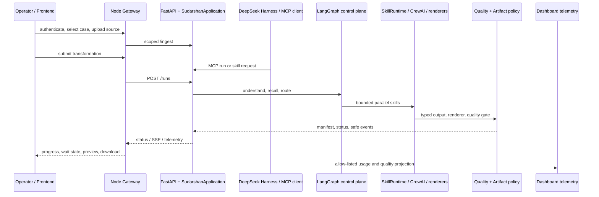

# Sudarshan 2.0 current status

Status is measured against the implementation on the current `Sudarshan2.2`
working branch, including the local T43–T60 and H-series integration slices.
This document
separates local capability from
production readiness so demos, judging material, and engineering work use the
same claims.

## Executive status

| Area | Current state | Honest claim |
| --- | --- | --- |
| Agentic control plane | Implemented locally | LangGraph owns routing and lifecycle; specialist pipelines and typed child skills run behind bounded contracts. |
| Harness/MCP boundary | Implemented locally | DeepSeek Harness is the authenticated application frontend and the MCP/A2A clients use the same Sudarshan application boundary. |
| H-series agentic integration | Complete locally; staging gates open | H-01–H-08 implementation, native OperationsBridge, sandbox contract, parity tests, and offline benchmark are present; live container, authenticated staging, external interop, and real-artifact evidence remain. Harness is one client; portable per-pipeline A2A agents remain the scale-out work. |
| Python backend | Strong local vertical slice | Ingestion, memory, routing, pipelines, quality gates, artifacts, scheduler, cache, telemetry, audit, and recovery are wired and tested locally. |
| User/Case/Task memory isolation | Partially implemented; P0 gaps open | Evidence, cache, and memory scope filters exist, but fail-closed Cognee scope enforcement, stale-data lifecycle, and artifact ownership authorization are not complete. The platform must not claim complete case isolation until NP-13, NP-14, and NP-16 pass. |
| Frontend shell | Active landing + Harness flow | The new landing/About/sign-in shell is the public entry point; successful sign-in opens the DeepSeek Harness application frontend. |
| Production deployment | Release-candidate code present; deployment gates open | T43–T52 code paths and local tests are present. Live Redis/object-storage, provider reconciliation, signed-sandbox drills, real-corpus benchmarks, external MCP/A2A, visual approval, backup/restore, and release sign-off remain environment gates. |

## Frontend capabilities

The public frontend is the Vite app in `landing page/landing page/`. It owns
the landing, About, and sign-in shell. After authentication, the browser opens
the DeepSeek Harness web frontend; identity, ownership, quotas, and artifact
authorization remain responsibilities of the gateway/backend.

The optional DeepSeek Harness web surface is composed separately: the
Sudarshan brand and theme are replaceable packages documented in
[Harness UI composition](harness-ui-plugin.md). This keeps product styling out
of the official Harness branding package and lets another compatible Harness
profile use the same Sudarshan application boundary.

### H-series handoff

The native Harness/MCP agentic layer is ready for frontend and backend teams to
consume through the stable projections and MCP contracts. Harness is one host,
not the ownership boundary for the pipelines. Teams must not introduce a
second orchestrator or couple browser code to Harness internals. The scalable
agent boundary is the existing typed skill contract: each pipeline may keep a
local adapter and additionally expose an A2A agent card. A Presentation Agent
can request an Infographic Agent or Diagram Agent through the orchestrator,
receive an artifact and quality receipt, and continue its work. The remaining
agentic work is to add per-pipeline A2A cards, local/A2A adapter selection,
mediated handoff authorization, and one event stream that renders local and
remote children consistently in trajectory.

### Available now

- Google OAuth login through the Node gateway with HttpOnly-cookie sessions.
- Authenticated case selection, case creation, task history, and refresh-safe
  task recovery.
- Source upload for text, PDF, common image formats, presentation formats,
  and common video formats. The backend remains the final extension and size
  validator.
- Pipeline selection for advisory, executive summary, LinkedIn draft,
  infographic, presentation/PPT, and video.
- Run submission with idempotent task identity and gateway/FastAPI fallback
  projection.
- Live progress through SSE, with polling fallback and `sessionStorage`
  cursor recovery after refresh or reconnect.
- Visible waiting states for clarification, approval, provider-pending work,
  and other safe-action boundaries.
- Cooperative Stop/cancel action. It requests cancellation at an orchestration
  boundary; it does not forcibly stop a provider thread.
- Artifact manifest, preview, open, and download behavior. Videos and images
  are previewed; PPTX, Markdown, SVG, and other files can be opened/downloaded.
- Authenticated artifact approve/reject review through the live Harness bridge,
  using the configured `SUDARSHAN_OPERATOR_ID` and the backend resume boundary.
- Quality status, failure notices, wait reasons, classification, and safe
  telemetry such as tokens, latency, cache, wait, artifact, and quality
  counters.
- Artifact history is gateway-backed, with stable task/artifact identifiers and
  download/manifest URIs; browser storage is only a cache.
- Development-only one-time OpenAI key setup when enabled by the backend.
  The key is not stored in browser storage.

### Not yet a complete product UI

- No full parent/child execution graph or per-slide execution lane view.
- No interactive visual QA/repair editor for PPT, infographic, or diagram
  outputs.
- No operator-facing audit-log explorer with retention/access controls.
- No browser end-to-end test suite against live OAuth, MongoDB, Cognee, and
  provider services; current frontend tests focus on the API projection and
  cursor contract.
- Direct FastAPI fallback does not provide gateway-level user history,
  OAuth, quotas, or production ownership enforcement.

## Backend capabilities

### Implemented and tested locally

- FastAPI application boundary with health, pipeline discovery, ingestion,
  asynchronous run admission, status, bounded wait, SSE events, resume, and
  cooperative cancellation.
- Node gateway integration for OAuth, MongoDB-backed cases/tasks, ownership,
  quotas, idempotency, authenticated artifact delivery, and Python API proxying.
- User/Case/Task-scoped memory through `MemoryManager`, with Cognee kept behind
  the adapter boundary and bounded context packs, provenance, lifecycle, and
  prompt-injection markers.
- LangGraph request understanding, clarification, routing, fan-out/fan-in,
  checkpoints, cancellation, and safe result projection.
- CrewAI specialist pipelines for advisory, executive summary, LinkedIn,
  infographic, presentation, and video.
- Native media/rendering paths: editable flowchart SVG/PPTX, AntV SSR bridge,
  native video scene generation/composition, and quality reports.
- Optional local PPT Master bridge: capability registration, bounded non-shell
  export, workspace/output containment, cooperative cancellation, timeout
  handling, required quality-report discovery, and PPTX read-back. PPT Master
  is not hosted or installed by Sudarshan; a user-managed checkout must set
  `SUDARSHAN_PPT_MASTER_ROOT`. It is disabled by default; native rendering is
  authoritative.
- IF-1–IF-3 AntV infographic hardening: pinned renderer version, cooperative
  cancellation, and mandatory SVG quality promotion after native SSR.
- DD-1/DD-2 Diagram Design hardening: static accessible SVG metadata and
  fail-closed SVG safety checks are applied to native flowchart promotion.
- Typed skill contracts, versioned manifests, skill workspace resources,
  trust-tier checks, capability/tool allow-lists, side-effect approvals,
  bounded child execution, cooperative timeouts, and token/tool budgets.
- Durable local SQLite scheduler with leases, renewal, stale-lease recovery,
  retries, dead-letter state, cancellation, duplicate submission protection,
  and execution deadlines.
- T39 shared control-plane contract with an optional Redis lease/idempotency
  adapter and Redis Stream queue discovery; run and ingestion schedulers use
  separate stream names and can discover work admitted by another process,
  recover pending entries after consumer loss with `XAUTOCLAIM`, and retain
  entries for actively leased runs. The typed progress stream now has a
  Redis-backed sink with reconnectable per-run cursors; the application still
  defaults to SQLite. `DependencyDAG` and the PPT vertical accept the shared
  control plane for fenced node claims, dependent-node admission, and atomic
  per-run DAG snapshot replication. Exact-match cache entries and stampede
  claims use Redis in shared mode. Budget reservations and usage reconciliation
  for the main run controller use atomic Redis scripts in shared mode; provider
  estimates remain explicitly marked and are not billing truth. The ingestion
  queue is shared in Redis mode, but its parser/OCR/vision/summary/embedding
  stage budget and usage ledger now use Redis in shared mode; estimates remain
  explicitly separated from observed usage.
  Optional live Redis tests cover cross-process discovery and stale-worker
  fencing.
- Persisted dependency DAG with bounded parallel admission, dependency
  blocking, repair limits, and restarted-bridge dependent-node recovery.
- Verified artifact manifests, checksum validation, safe path checks, previews,
  classification access checks, and quality-gated delivery.
- Exact-match quality-gated cache with authorization-aware fingerprints,
  privacy-filtered metadata, TTL, and stampede leases.
- Allow-listed observability projections for run/task/skill usage, latency,
  cache, waits, quality, and artifacts; safe dashboard telemetry endpoint.
- Tamper-evident audit records, query hashing, recursive secret redaction,
  classification propagation, and first-slice source-content injection guards.
- DeepSeek Harness JSONL/MCP integration, skill discovery, local skill calls,
  durable background skill jobs, bounded waiting, artifact lookup, health, and
  memory tools.
- Portable pipeline-agent foundation: `SkillManifest`, `ChildTaskSpec`,
  `SkillResult`, bounded dependency waves, parent/child lineage, artifact
  references, quality receipts, and local parallel execution. Per-pipeline A2A
  cards and remote handoff adapters are not yet promoted as complete. A safe
  Harness trajectory projection now exposes the same recorded lifecycle events
  and parallel-lane summaries without replacing the durable DAG.
- OpenViking-inspired L0/L1/L2 context selection with stage defaults,
  safe legacy fallback, retrieval trace reporting, and typed `ContextPack`
  context levels. Skill manifests also declare bounded reference loading,
  renderer capabilities, and checker ownership; the reference repositories
  remain design inputs rather than runtime dependencies.
- T56–T60 local slices are present: a shared renderer capability registry,
  semantic diagram-family planner, slide-job/presentation quality workflow,
  provider-neutral video timeline and asset ledger, plus content-free memory
  lifecycle events and offline retrieval/cost evaluation. These are locally
  tested contracts; visual approval, real-corpus measurements, and distributed
  deployment remain release gates.
- DeepSeek Harness web composition through replaceable Sudarshan brand and
  theme plugins; generated preview credentials and session state are ignored.
  The native dashboard remains usable when the optional Harness checkout or
  port 3080 is unavailable.
- Offline social provider fixtures cover manual, MCP, success, timeout, quota,
  rate-limit, and authorization-failure receipts without provider credentials.
- Current source upload and extraction compatibility path for text, PDF, PPTX,
  image, and video. T31 contracts, T32 source safety, and the T33 local
  asynchronous admission slice, and T34 typed-evidence adapters for text,
  PDF, PPTX, image, and video are implemented; the T35 deterministic
  structure/chunk compiler, the T36 local evidence-index/projection slice, and
  the T37 budget/fingerprint-cache boundary are also implemented locally. The
  asynchronous ingestion worker now receives a normalized budget, skips a
  matching scoped parser-stage cache entry, and returns safe cache/budget
  receipts. Optional image/PDF/video provider failures now preserve explicit
  fallback metadata and can finish as `PARTIAL`. Scheduler status and health
  metrics include queue-wait telemetry. Shared indexing, full provider-usage
  reconciliation and production retrieval benchmarks remain open in T36–T38;
  T39–T42 now provide shared queue/budget/object-storage/observability seams.
  The
  ingestion receipt now separates preflight token estimates from provider
  response usage when available. T38 now has a deterministic multimodal
  benchmark and promotion gate comparing flat-text retrieval with typed
  evidence and recording extraction coverage, evidence recall/faithfulness,
  tokens, cost, P50/P95 latency, cache hits, queue wait, repairs, and
  human-correction time. It is an offline evaluation slice, not production
  benchmark evidence. Optional vision-provider stages now have a bounded,
  opt-in retry seam that re-charges each attempt and preserves fallback
  behavior for non-retryable failures. Skill-cache startup cleanup now removes
  expired cache references and abandoned generation claims without deleting
  artifact files. Asynchronous ingestion status now projects budget, estimated
  versus actual usage, cache state, fallback reasons, and evidence counts at
  the top level for reconnect-safe dashboards while retaining the legacy
  nested result. Scheduler terminal state and its completion event now commit
  atomically, preventing reconnect consumers from observing a terminal status
  before the final event.
- Video ingestion now has an application-owned `VideoIngestionPolicy` with
  bounded duration, visual sample count, sampling interval, audio/visual
  channel switches, cooperative cancellation, subprocess timeout, and
  policy-sensitive parser cache identity. The selected policy and fallback
  reasons are preserved on timestamped evidence blocks. This is a local
  governance slice; long-video staging measurements, shared leases, and
  production object-store cleanup remain release gates.
- V84–V95 adds a governed, provider-neutral video media layer: scoped local
  material reuse, opt-in allow-listed Pexels retrieval, typed subtitle/music
  records, bounded native rendering profiles, deterministic quality reports,
  renderer benchmark promotion, and the `video.moneyprinter-compatible`
  adapter. Native-only renderer controls are kept out of the legacy external
  provider payload. This is a local capability slice; visual approval,
  provider/license evidence, distributed usage reconciliation, real-corpus
  benchmarking, and host-loss cleanup remain open release gates.

### Backend work still required

These are real engineering gaps, not cosmetic follow-ups:

1. Run the live Redis/worker smoke suite and add kill-9, host-loss, concurrent
   duplicate-worker, lease-fencing, and
   abandoned-artifact cleanup tests against the production-like control plane.
2. Configure and drill S3/MinIO server-side encryption, versioned backup and
   restore; the adapter and local verified cache are implemented.
3. Operate the optional redacted telemetry collector and reconcile estimated
   usage with provider billing receipts.
4. Operate production key management, authenticated distributed authorization,
   and Docker/resource-limit drills for untrusted skills. The signing and
   sandbox policy code is present.
5. Run font/raster/video visual regression snapshots and human approvals. The
   shared deterministic visual-QA and renderer-promotion gate is present.
6. Wire every production PPT/LinkedIn/video planner to the typed child-plan
   adapter; then add per-pipeline A2A cards, local-vs-remote execution
   selection, mediated cross-agent handoffs, and external MCP/A2A lifecycle
   smoke tests. The base contracts, global A2A boundary, fallback
   reconciliation, and monitor are present.
7. Complete the T34–T38 ingestion workstream in production-like infrastructure:
   shared evidence/object storage, modality provenance, structure-aware
   indexing, Cognee projection, cache/budget controls, security, and benchmark
   runs on reviewed real or sanitized sources. The local T38 evaluator and T47
   archive schema are ready, but are not a substitute for those runs.
8. Execute the T47 benchmark and T52 backup/restore, rollback, ownership, and
   final release sign-off gates.
9. For V84–V95, run real codec/font/subtitle/BGM fixtures, review material
   licenses, collect provider usage receipts, and promote a renderer only from
   an archived benchmark—not from a local smoke test.

## Request and data flow



## Verification snapshot

The current local verification snapshot is:

```text
Python: 503 passed, 8 skipped, 32 warnings
T28 reliability focus: 21 passed
Video/media focused tests: 30 passed
PPT Master adapter/quality focused tests: 11 passed; PPT lint: passed
Infographic renderer/quality focused tests: 13 passed; infographic lint: passed
Diagram SVG/flowchart focused tests: 8 passed; diagram lint: passed
Offline native FFmpeg smoke: rendered one scene; manifest order verified;
quality was `partial` because ffprobe was unavailable in that environment
Ruff (video, ingestion, Harness, related tests): passed
Frontend projection/cursor tests: 3 passed
Harness Sudarshan operations bridge/panel tests: 7 passed
Offline social boundary fixtures: 18 passed
PPT bounded repair patch tests: 6 passed
PPT SVG/template/child-artifact contract tests: 5 passed
Infographic registry/theme/export/structure tests included in the focused pipeline run
Social monitor lifecycle tests: 4 passed
Node gateway tests: 9 passed
JavaScript syntax checks: passed
git diff --check: passed
```

The Python suite is deterministic and uses a workspace-local pytest temporary
directory in the restricted development environment. It does not prove live
MongoDB, Google OAuth, Cognee, OpenAI, AntV SSR availability, or production
multi-host behavior.

## Source-of-truth documents

- [Engineering handbook](sudarshan-2.0-engineering-handbook.md)
- [Full execution plan](archive/sudarshan-2.0-full-execution-plan.md)
- [Skill authoring](skill-authoring.md)
- [Artifact rendering and quality](artifact-rendering-and-quality.md)
- [Assumption ledger](sudarshan-2.0-assumptions.md)
- [Backend integration contract](backend-integration.md)
- [Frontend integration contract](frontend-integration.md)
- [Operations and deployment guide](operations.md)
- [Harness integration](../integrations/deepseek_harness/README.md)
- [Harness UI composition](harness-ui-plugin.md)
- [Next execution plan](next-plan.md)
