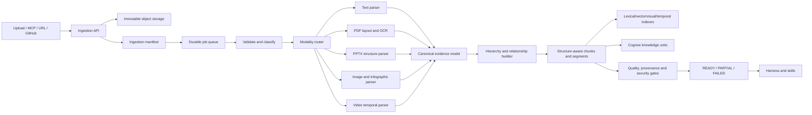

# Sudarshan 2.0 ingestion architecture

This document is the implementation contract for multimodal source ingestion.
It turns uploaded files, MCP sources, URLs, and connected repositories into
typed, provenance-preserving evidence that every Sudarshan skill can reuse.

The ingestion layer is not a request-time text dump and it is not a second
agent scheduler. It is an asynchronous evidence compiler:

```text
source -> immutable raw artifact -> modality parser -> evidence blocks
       -> structure/relationship graph -> indexes -> governed memory
       -> quality verdict -> READY/PARTIAL/FAILED
```

The attached OpenAI-style flow is treated as product context: scattered notes,
documents, messages, meetings, email, and memory become reusable project
context before a skill creates an artifact. Source content is data, not system
instructions.

## 1. Ownership boundary

| Concern | Owner | Rule |
|---|---|---|
| Upload, authentication, case ownership, size limits | Node gateway + FastAPI | Validate before temporary-file processing. |
| Ingestion job admission and status | Sudarshan control plane | Return a handle; do not block the request on OCR or video work. |
| Modality extraction | Versioned ingestion plugins | Deterministic fast path first; bounded model fallback second. |
| Evidence and source artifacts | Evidence/object-storage layer | Original files are immutable and remain the source of truth. |
| Retrieval indexes | Search/index layer | Keep lexical, vector, visual, and temporal indexes addressable by evidence ID. |
| Durable knowledge and relationships | `MemoryManager` + Cognee | Store governed summaries, entities, relationships, and evidence references. |
| Planning and skill execution | Harness/Sudarshan runtime | Retrieve evidence; do not re-parse source files. |
| UI progress and logs | Safe run projection + telemetry | Never expose prompts, credentials, raw memory, or hidden reasoning. |

Cognee must remain behind `MemoryManager`. It is not the source of truth for
raw files, live scheduler state, or artifact leases.

## 2. Target high-level design



At request time the harness receives a compact `ContextPack` containing
selected evidence references. A PPT, video, infographic, or LinkedIn skill can
request the exact page, slide, crop, diagram, or timestamped video segment
without re-running ingestion.

## 3. Canonical contracts

The first implementation must add these transport-neutral contracts under
`ingestion_pipelines/` without breaking the existing `IngestedDocument` and
`extract_text()` compatibility APIs.

### 3.1 `IngestionManifest`

```json
{
  "ingestion_id": "ing_01J...",
  "document_id": "doc_01J...",
  "source_reference": "brief.pdf",
  "source_hash": "sha256:...",
  "media_type": "application/pdf",
  "modality": "pdf",
  "user_id": "operator-1",
  "case_id": "case-42",
  "task_id": "ingest-brief-42",
  "classification_level": "RESTRICTED",
  "status": "accepted",
  "extractor_version": "pdf-layout@2.0.0",
  "model_policy": "local-first",
  "budget": {
    "tokens": 12000,
    "vision_calls": 20,
    "wall_time_seconds": 300
  }
}
```

The source hash, extractor version, model policy, configuration hash, and
authorization scope are required for idempotency and cache invalidation.

### 3.2 `EvidenceBlock`

```json
{
  "evidence_id": "slide-04-table-02",
  "document_id": "doc_01J...",
  "parent_id": "slide-04",
  "modality": "table",
  "content": "Quarterly revenue ...",
  "artifact_uri": "/objects/doc_01J/slide-04-table-02.png",
  "location": {
    "page": null,
    "slide": 4,
    "start_seconds": null,
    "end_seconds": null,
    "bbox": [0.12, 0.36, 0.88, 0.72]
  },
  "confidence": 0.94,
  "source_hash": "sha256:...",
  "extractor_version": "pptx-native@2.0.0",
  "model_version": null,
  "provenance": {
    "source_reference": "brief.pptx",
    "parser_step": "table-extraction"
  },
  "metadata": {
    "heading_path": ["Market analysis", "Revenue"]
  }
}
```

Every block must have a stable ID, source location, confidence, parser/model
versions, and a link to the original source or derived crop. Plain text is
allowed as one representation, but it must not be the only representation for
tables, diagrams, slides, images, or video.

### 3.3 `ExtractionEvent` and `QualityReport`

Each plugin emits safe lifecycle events and a final report containing:

- coverage: pages, slides, scenes, or records observed versus processed;
- extracted block count by modality;
- low-confidence and fallback counts;
- warnings and explicit failures;
- source-map completeness;
- security and prompt-injection markers;
- cache hits and estimated/provider usage;
- final status: `ready`, `partial`, or `failed`.

No plugin may silently swallow an extraction failure.

## 4. Processing stages

### Stage A: register and protect

1. Authenticate the caller and resolve User/Case/Task scope.
2. Stream to a bounded temporary or object-storage location.
3. Sniff MIME type; do not trust the filename extension alone.
4. Enforce byte, page, slide, duration, archive-depth, and decompression limits.
5. Treat source content as untrusted data and mark instruction-like text.
6. Write the immutable source hash and manifest before expensive work.

### Stage B: route and extract

Use a deterministic modality router. The router may request bounded model
fallback, but it must not delegate all parsing to an unconstrained agent.

```text
cheap/native parser -> confidence check -> targeted OCR/VLM fallback
```

### Stage C: normalize and enrich

Convert parser-specific results into `EvidenceBlock` records. Preserve
hierarchy, geometry, timestamps, table cells, visual artifacts, and parent-child
relationships. Build a document tree and cross-modal links before chunking.

### Stage D: index and remember

Create structure-aware chunks and modality-specific indexes. Write only
governed summaries, entities, relationships, and source-linked facts to
Cognee. Keep the exact evidence blocks outside Cognee so they can be opened,
audited, deleted, or re-indexed independently.

### Stage E: verify and publish

Run coverage, provenance, confidence, schema, security, and artifact checks.
Publish `READY` only when the quality policy passes. Publish `PARTIAL` only
with explicit missing evidence and allow the skill policy to decide whether
partial evidence is acceptable.

## 5. Modality plugin requirements

### Text and Markdown

Preserve headings, lists, code blocks, links, tables, citations, and heading
breadcrumbs. Do not use blind character splitting as the primary chunker.

### PDF

Use native text extraction first, then layout/reading-order detection, table
and figure detection, targeted OCR, and targeted vision analysis for ambiguous
regions. Store page images and region crops. A page with no text layer is not a
reason to send every page to a large model.

### PPTX

Capture slide number, title hierarchy, shape text, speaker notes, tables,
charts, images, connectors, geometry, theme metadata, thumbnails, and
relationships between shapes. Presentation skills need both semantic content
and layout evidence.

### Image and infographic

Produce OCR, visual description, detected regions, chart/diagram structure,
image embedding, bounding boxes, original URI, and confidence. OCR alone loses
spatial meaning.

### Video

Produce metadata, ASR segments, scene boundaries, keyframes, OCR regions,
visual descriptions, optional speaker segments, and temporal relationships.
Use adaptive scene/keyframe sampling rather than fixed periodic sampling only.
Every output must retain start/end timestamps. Re-running a video should reuse
ASR, unchanged scenes, and unchanged frame analyses.

## 6. Parallelism, retries, and waiting

Ingestion is a DAG, not one blocking function:

```text
document
  ├── page/slide/scene fan-out
  ├── modality enrichment
  ├── index construction
  └── quality and publication
```

Use bounded worker pools and shared reservations for tenant concurrency,
provider rate limits, vision calls, GPU capacity, wall time, and tokens.
Every job needs an idempotency key and cooperative cancellation. Network calls
must have timeouts; media and rendering work that cannot be safely interrupted
must run in a killable subprocess.

The public API should eventually return:

```json
{
  "ingestion_id": "ing_01J...",
  "document_id": "doc_01J...",
  "status": "accepted",
  "poll_uri": "/ingestions/ing_01J...",
  "events_uri": "/ingestions/ing_01J.../events"
}
```

Supported statuses are `accepted`, `queued`, `validating`, `parsing`,
`enriching`, `indexing`, `quality_check`, `ready`, `partial`, `failed`, and
`cancelled`.

## 7. Token budgets and cache keys

Every ingestion manifest owns a budget split into parser, OCR, vision,
summary, embedding, and wall-time reservations. Use the cheapest successful
path and spend model calls only where confidence or policy requires them.

The exact cache key is:

```text
source_hash
+ extractor_version
+ model_version
+ configuration_hash
+ model_policy
+ authorization_scope
```

Cache only verified derived artifacts and evidence references. Never cache raw
prompts, credentials, unrestricted provider payloads, or data across an
authorization boundary. A changed parser version should invalidate only the
affected derived stages.

## 8. Harness, skills, and Cognee integration

The harness starts or observes ingestion, but it does not own ingestion truth.
The request-understanding agent can ask for a source to be registered or for
evidence retrieval, but it should not receive an entire raw document by
default.

Skills consume narrow retrieval tools:

```text
search_text(query, scope)
search_visual(query, scope)
search_table(query, scope)
search_video_segment(query, scope)
get_evidence(evidence_id)
get_source_crop(evidence_id)
```

For a PPT request, the harness can create a deck plan, then the PPT skill can
retrieve slide-level evidence. If a slide needs a diagram, it invokes the
diagram skill with evidence IDs. The diagram skill does not re-ingest the
source and does not receive unrestricted Cognee access.

## 9. Current-code migration map

| Current code | Migration |
|---|---|
| `IngestedDocument.raw_text` | Keep for compatibility; add manifest and evidence references. |
| `extract_text()` | Keep as legacy wrapper around typed extraction. |
| `ingest_file()` | Add asynchronous `submit_ingestion()` and retain a test-only synchronous path. |
| `extract_pdf.py` | Preserve digital/OCR fallback; return page/region evidence and confidence. |
| `extract_pptx.py` | Preserve text/notes extraction; add shape geometry, images, tables, and relationships. |
| `extract_video.py` | Preserve ASR/frame baseline; add scene manifests, adaptive sampling, timestamps, and cache. |
| `adapter.py` | Convert approved evidence summaries into one or more `KnowledgeUnit` records with provenance. |
| `MemoryManager` | Remains the only Cognee gateway; no direct Cognee calls from plugins. |
| `/ingest` | Preserve current compatibility response while adding an ingestion handle and status endpoint. |

## 10. Research basis

The design follows the strongest relevant findings reviewed for Sudarshan:

- [MultiDocFusion, EMNLP 2025](https://aclanthology.org/2025.emnlp-main.1062/)
  combines visual parsing, OCR, hierarchy reconstruction, and hierarchical
  chunks.
- [ColPali](https://arxiv.org/abs/2407.01449) shows that visual document
  retrieval can avoid brittle text-only preprocessing and that ingestion is a
  major retrieval bottleneck.
- [EcoDoc, ACL 2025](https://aclanthology.org/2025.acl-industry.109/) supports
  dynamic text-versus-visual processing for cost and latency control.
- [Google Document AI layout parser](https://docs.cloud.google.com/document-ai/docs/layout-parse-chunk)
  demonstrates tree-preserving layout parsing and context-aware chunks.
- [SuperRAG, NAACL 2025](https://aclanthology.org/2025.naacl-industry.45/)
  preserves links between text, tables, and figures using a layout graph.
- [VideoRAG](https://arxiv.org/abs/2501.05874) supports joint visual/textual
  retrieval over video rather than transcript-only ingestion.
- [ReadAgent, ICML 2024](https://proceedings.mlr.press/v235/lee24c.html)
  supports compressed memory plus lookup of original passages.
- [REAL-MM-RAG, ACL 2025](https://aclanthology.org/2025.acl-long.1528/)
  provides evaluation patterns for table-heavy and paraphrased multimodal
  retrieval.

These sources guide hypotheses; Sudarshan must still measure quality, cost,
latency, cache reuse, and evidence faithfulness on its own fixtures.
