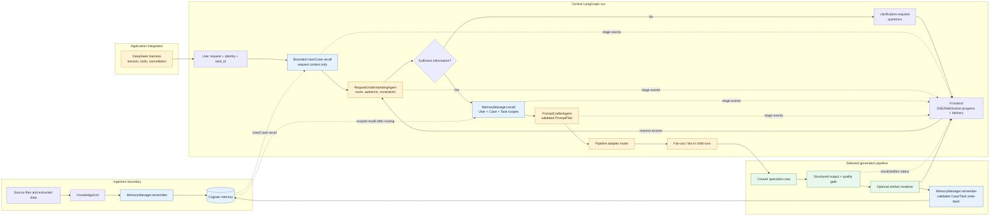
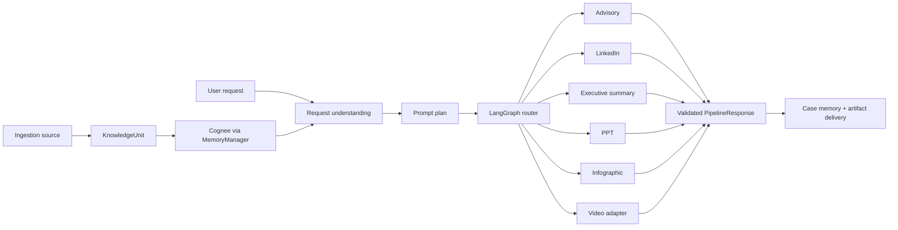
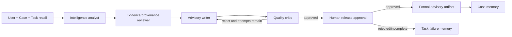
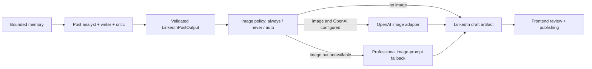
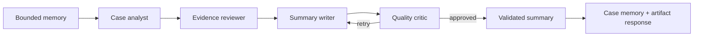
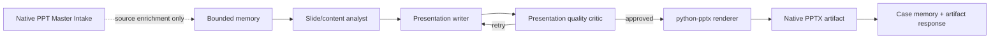
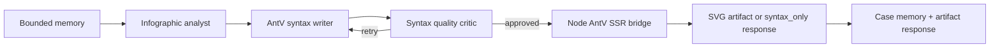
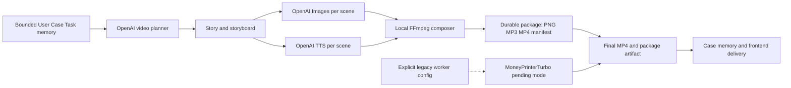
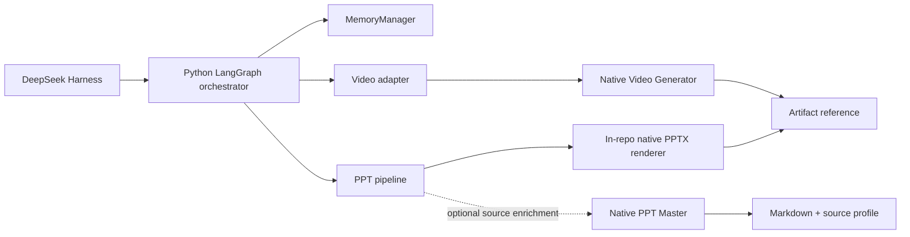

# Internal pipeline orchestration contract

This document is for the Sudarshan backend and frontend teams. It describes
the central LangGraph router added around the existing CrewAI pipelines. It is
application-specific and is not a general-purpose agent framework.

## Architecture

```text
Frontend
  │ POST /runs
  ▼
Request handler
  │ validates identity and creates task_id/run_id
  ▼
LangGraph orchestrator
  ├─ recall bounded User/Case memory for request understanding
  ├─ understand request and select one or more registered pipelines
  ├─ recall task-oriented User/Case/Task memory after routing
  ├─ craft a validated, pipeline-specific prompt plan
  ├─ fan out independent child runs to registered pipeline adapters
  ├─ pause/resume external approval when an adapter supports it
  ├─ publish frontend-safe progress events
  ├─ create a new linked task for artifact revisions
  ├─ honor frontend cancellation at safe orchestration boundaries
  └─ fan in per-pipeline results into one transport-neutral result
       │
       ├─ CrewAI pipeline (specialist agents and quality gate)
       ├─ MemoryManager (User/Case/Task memory policy)
       └─ artifact renderer/handoff
```

### Internal request and memory flow

The following diagram is the implementation boundary for backend and frontend
integration. Ingestion persists source-derived `KnowledgeUnit` objects through
the memory policy before any generation request is executed.



Memory ownership is intentionally one-directional: ingestion and validated
pipeline write-back call `MemoryManager.remember()`, while generation stages
call `MemoryManager.recall()` through the central access context. CrewAI agents
never receive a Cognee client, and the frontend receives progress metadata—not
raw recalled memory or internal model reasoning.

The router does not expose Cognee or credentials to agents. It first calls
`MemoryManager.recall()` with a User/Case-only context and a small budget so the
request-understanding stage never receives raw OCR or a full document. After a
one or more pipelines are selected, it performs a second task-oriented recall
using the full permitted User/Case/Task context and injects that bounded result
into each child pipeline. The concrete pipelines own validated outputs and
`MemoryManager.remember()` write-back. CrewAI remains the collaboration layer
inside a pipeline; LangGraph owns routing and run lifecycle.

The pre-pipeline sequence is:

```text
ingestion -> KnowledgeUnit -> MemoryManager.remember() -> Cognee
user request -> bounded User/Case recall -> RequestUnderstandingAgent
             -> task-oriented User/Case/Task recall -> PromptCrafterAgent
             -> fan-out selected CrewAI pipelines -> fan-in results
```

`RequestUnderstandingAgent` is deterministic by default. It receives bounded
User/Case context for terminology and case orientation, but memory cannot
override the explicit request or select a pipeline by itself. It resolves the
pipeline, audience, classification, distribution, explicit image policy, and
user constraints. `PromptCrafterAgent` creates a structured `PromptPlan` and
delimits recalled memory as reference context. Neither component calls Cognee
directly or emits model chain-of-thought. A future provider-backed agent may be
injected only if it returns the same validated Pydantic models.

## Internal pipeline architectures

All pipelines share the same application boundary. Ingestion converts source
files into `KnowledgeUnit` objects and writes them to Cognee under the User,
Case, and Task memory policy. The request-understanding and prompt-planning
stages then recall bounded User + Case context, classify the operation, and
send one common `AdvisoryRequest` to the selected pipeline adapter.



Every generation pipeline uses the same core lifecycle: bounded memory
recall, CrewAI specialist collaboration, structured Pydantic validation,
quality review, task-memory callbacks, and case-memory write-back only after
the pipeline's release gate. The rendering/provider step is pipeline-specific
and never becomes a second memory or routing owner.

### Advisory pipeline

The NTRO-specific advisory is the only default pipeline with a human release
gate. Its CrewAI crew runs an intelligence analyst, evidence/provenance
reviewer, advisory writer, and quality critic. Failed quality review retries
within the configured attempt budget. A valid draft pauses for authorized
human approval; only an approved draft is rendered into the formal advisory
artifact and written to Case memory.



### LinkedIn post pipeline

The LinkedIn pipeline produces a frontend-owned draft; it does not publish to
LinkedIn. The text crew creates and validates the post, then the image policy
decides `always`, `never`, or `auto`. In `auto`, the pipeline decides whether a
visual improves the post. If an image is selected, OpenAI image generation is
used when configured; otherwise the output contains a professional image
prompt fallback. The frontend owns final review and publishing.



### Executive summary pipeline

The executive-summary pipeline uses the common text-generation Flow with a
case analyst, evidence reviewer, summary writer, and quality critic. Its
structured output is written back to Case memory after quality approval. It
does not require the advisory human-release gate; the frontend or calling
workflow can request a later review when the product requires one.



### PPT/presentation pipeline

The PPT pipeline does not currently compile presentation code in a sandbox.
CrewAI generates a validated `PresentationOutput` (slide titles, narrative,
evidence, and speaker notes). The in-repo renderer then uses `python-pptx` to
write a native `.pptx` file under `artifacts/presentations/`. The quality
critic is the release gate and the artifact is then recorded in Case memory.

PPT Master is now natively integrated as an intake processor for existing PPTX files. It extracts structural markdown and slide transitions natively using `python-pptx` fallback without silently executing arbitrary slide code in a sandbox.



Other pipelines can improve a PPT, but they are not implicitly nested today.
For example, an executive summary or advisory can be requested first and its
validated Case-memory output can become PPT context; an infographic can be
generated as a companion visual. If the product requires strict dependency
ordering, the orchestrator should represent that as explicit parent/child
tasks rather than letting the PPT crew call another pipeline directly.

### Infographic pipeline

The infographic pipeline generates AntV Infographic declarative syntax rather
than drawing pixels through an LLM. The CrewAI analyst, evidence reviewer,
syntax writer, and quality critic produce a validated `InfographicOutput`.
The local Node SSR bridge calls `@antv/infographic` and writes an SVG artifact.
If Node rendering is unavailable, the validated syntax is returned as
`syntax_only` with an explicit caveat; no fake SVG is produced.



### Video pipeline

The video pipeline defaults to a native architecture running fully in-process.
OpenAI is the only supported model/media provider: the planner produces the
story and storyboard, OpenAI Images produces one PNG per scene, and OpenAI TTS
produces one MP3 per narrated scene. Local `imageio-ffmpeg` creates one MP4
segment per scene, concatenates the final MP4, and writes the complete package
to `artifacts/videos/<run_id>/`.

The durable package contains `script.txt`, `storyboard.json`, `images/`,
`audio/`, `segments/`, `final.mp4`, and `manifest.json`. A local title
card is used only when an image cannot be produced, and the manifest preserves
the asset paths and rendered-scene count. This keeps the result inspectable and
allows the frontend to deliver the whole package rather than only a final MP4.

When `MONEYPRINTERTURBO_BASE_URL` is explicitly configured, the adapter uses
the legacy asynchronous worker contract and preserves provider-pending state.
The default path does not call that worker or any stock-media service.



The DeepSeek Harness calls the application boundary only. It does not call the
OpenAI adapters, native video generation layer, or Cognee directly. Classification
metadata is validated at the request boundary and does not select a pipeline;
explicitly requested pipelines still fan out in parallel.

## Python entry point

```python
from pipelines import (
    AdvisoryRequest,
    PipelineAdapter,
    PipelineRegistry,
    InMemoryProgressSink,
    PipelineOrchestrator,
    build_default_pipeline_registry,
    create_sqlite_checkpointer,
    load_pipeline_plugins,
)
from memory import MemoryManager

memory = MemoryManager.from_env()
progress = InMemoryProgressSink()
orchestrator = PipelineOrchestrator(
    memory,
    progress_sink=progress,
    # Use a Postgres-backed saver in a multi-instance deployment.
    checkpointer=create_sqlite_checkpointer(),
)

result = orchestrator.run(AdvisoryRequest(
    query="Create an executive summary for the supplied case",
    user_id="operator-1",
    case_id="case-1",
    task_id="task-1",
))
```

For the current OpenAI-backed CrewAI setup, the local `.env` should contain:

```dotenv
OPENAI_API_KEY=your-openai-api-key
CREWAI_MODEL=openai/gpt-5.4
OPENAI_IMAGE_MODEL=gpt-image-1
```

`CREWAI_MODEL` is the text/reasoning model used by CrewAI agents. The image
model is configured separately because image generation is an optional delivery
asset, not the model used for structured CrewAI task outputs.

The graph uses `run_id` as its LangGraph `thread_id`. The caller must preserve
that ID for reconnects and approval resumes. The SQLite factory is for local
development or one backend instance; production should inject the team's
durable database checkpointer and configure encryption according to the
deployment policy.

## Routing

The router accepts `metadata.pipeline` for one explicit route or
`metadata.pipelines`/`requested_pipelines` for an explicit list. If these are
omitted, it detects every supported pipeline named in the service prompt. For
example, “create outputs A and B” creates two independent child executions;
the same mechanism works for any registered pipeline. A request naming
multiple outputs is fan-out work, not an ambiguity. Incomplete requests still pause for clarification instead of
silently selecting a consequential pipeline.

Each child receives a unique `task_id` and, for multi-pipeline runs, a unique
`run_id`, while sharing the parent's bounded memory context. Each child writes
its own Task memory and Case write-back. The parent result preserves the
backward-compatible `response` field and also exposes `responses`, keyed by
pipeline. The parent status is `succeeded` when all children succeed,
`partial` when some succeed and some fail, and `failed` when all fail.

```python
result = orchestrator.run(AdvisoryRequest(
    query="Create outputs A and B for this case",
    user_id="operator-1",
    case_id="case-1",
    task_id="task-1",
))

assert set(result.responses) == {"output_a", "output_b"}
```

Use `orchestration_result_to_dict(result)` at the HTTP boundary so the
frontend receives both the parent status and all child responses in JSON.

The parallel limit is capped at eight child pipelines per request. The
backend should add a deployment-level worker/rate limit before enabling
expensive provider calls at scale. A missing adapter becomes a failed child;
other registered children can still complete.

The default request-understanding implementation is intentionally conservative.
Backend code may inject an `intent_resolver(request) -> pipeline_name` callable,
`RequestUnderstandingAgent`, or `PromptCrafterAgent`, but each must return
validated structured data and must not access Cognee directly.

### Clarification loop

If the user has not provided enough information to select a pipeline or execute
the requested operation, the request-understanding stage does not guess. It
interrupts the graph with a `clarification.required` payload containing one or
more questions. The frontend displays those questions and sends the user's
answer to the same run's resume endpoint:

```json
{
  "answer": "Create an advisory for this case and focus on the decision needed."
}
```

The graph appends the answer to the task request, refreshes the bounded
User/Case recall, reruns request understanding, and only then proceeds to
task-oriented memory recall and generation. A backend may also
provide `metadata.requires_clarification=true`,
`metadata.missing_information`, or `metadata.clarification_questions` when its
request handler knows that additional information is required.

Register any additional pipeline implementation without changing the
frontend contract:

```python
registry = PipelineRegistry(build_default_pipeline_registry(memory))
registry.register(PipelineAdapter("output_a", run=output_a_runner))
registry.register(PipelineAdapter("output_b", run=output_b_runner))
```

The frontend should show an unavailable child as a per-pipeline failure and
must not discard successful siblings. A plugin should expose a registrar such
as `register(registry)`, then publish it under the `sudarshan.pipelines`
Python entry-point group. The backend can load approved plugins explicitly with
`load_pipeline_plugins(registry)`.

The plugin owns its CrewAI flow, schemas, rendering, and memory calls through
the existing controlled interfaces. It must not modify the central graph or
give agents a direct Cognee client.

An installable plugin package can declare:

```toml
[project.entry-points."sudarshan.pipelines"]
case_report = "case_report_plugin:register"
```

and implement:

```python
def register(registry: PipelineRegistry) -> None:
    registry.register(PipelineAdapter("case_report", run=run_case_report))
```

The backend owns the allow-list and calls `load_pipeline_plugins(registry)` at
startup. DeepSeek Harness does not need a new integration for each plugin: it
continues to submit the common request contract and consume the common result
and progress contracts.

## Frontend progress contract

`ProgressEvent` is the public event shape. The backend should publish it over
SSE for one-way progress. Use WebSocket only if the same connection must carry
interactive approval, cancellation, or other client commands.

```json
{
  "event_id": "evt-...",
  "run_id": "run-...",
  "task_id": "task-...",
  "pipeline": "executive_summary",
  "stage": "memory_recall",
  "status": "running",
  "progress": 40,
  "message": "Recalled permitted task-oriented memory",
  "requires_action": false,
  "artifact_id": null,
  "error_code": null,
  "timestamp": "2026-09-05T12:00:00+00:00"
}
```

Recommended backend endpoints:

| Endpoint | Purpose |
| --- | --- |
| `POST /runs` | Validate request, create `task_id`/`run_id`, start the graph, return initial status. |
| `GET /runs/{run_id}` | Return the latest durable graph/result state after reconnect. |
| `GET /runs/{run_id}/events` | Stream ordered `ProgressEvent` values as SSE. |
| `POST /runs/{run_id}/resume` | Submit a clarification answer or approval/revision decision. |
| `POST /runs/{run_id}/cancel` | Request cancellation from the frontend. |

Recommended stage values are `request_memory_recall`, `request_understanding`, `routing`,
`request_clarification`, `memory_recall`, `prompt_crafting`, `memory_and_generation`, `human_approval`,
`pipeline_result`, `cancellation`, `completed`, `cancelled`, and `failed`. Progress percentages are stage
estimates, not model-token percentages. The UI should primarily render
`pipeline`, `stage`, `status`, and `message`. During fan-out, multiple
`pipeline_result` events belong to the same parent `run_id`; use the event's
`pipeline` and `task_id` to render independent progress rows.

For clarification pauses, the event status is `waiting_for_input` and
`requires_action` is `true`. For approval pauses, the event status is
`waiting_for_approval`.

Do not publish raw recalled memory, private evidence, model chain-of-thought,
API keys, or unrestricted agent output in progress events. Send safe summaries,
counts, error codes, approval requirements, and artifact references only.

## Artifact revisions

A user update to an existing result is a new operation, not a resume of the
original run. The frontend submits a new `AdvisoryRequest` with:

```json
{
  "query": "Make the opening shorter but keep the facts and hashtags",
  "operation": "revise",
  "parent_artifact_id": "artifact-post-v1",
  "revision_instruction": "Make the opening shorter but keep the facts and hashtags",
  "revision_scope": ["post_text.opening"]
}
```

The backend creates a new `task_id` and `run_id`, recalls the parent artifact
and permitted memory, and routes the revision through the normal understanding,
prompt, generation, and quality-validation stages. The parent artifact is
immutable. A successful revision is a new version and is written to Case
memory only after the pipeline's normal validation and approval policy. The
revision instruction and all intermediate outcomes remain in the new Task
memory.

For a multi-output parent run, an edit targets exactly one child artifact by
sending that artifact's `parent_artifact_id` and one pipeline in
`requested_pipelines`. The router creates a new child task for that pipeline;
it does not re-run or mutate sibling artifacts. Editing the LinkedIn artifact
therefore leaves every other generated artifact unchanged.

An empty `revision_scope` means the pipeline may revise the complete output;
the instruction still controls the requested change. The quality stage should
verify that explicitly protected fields were not changed.

## Frontend cancellation

The frontend calls `POST /runs/{run_id}/cancel` with the authenticated task
identity. The backend calls `PipelineOrchestrator.cancel(run_id, task_id)`.
The response may be `requested`, `cancelled`, `already_terminal`, or
`not_found`:

```json
{
  "run_id": "run-123",
  "task_id": "task-123",
  "status": "requested"
}
```

For an active run, cancellation is cooperative. The orchestrator checks the
request before and after memory, prompt, and pipeline boundaries, then emits a
terminal `cancellation` event with status `cancelled` and records the event in
Task memory. The orchestrator will not publish a generated result after
cancellation is observed. A provider call already in progress cannot be
force-stopped by LangGraph alone; that call and any side effects it performs
may finish before the worker observes cancellation. A production job runner
may add provider-specific hard cancellation and transactional write-back.

Paused clarification or approval runs can be marked cancelled in the durable
checkpointer and cannot later be resumed as successful runs.

## Backend responsibilities

The backend team owns the application boundary around the orchestrator:

- Validate authenticated `user_id`, `case_id`, request content, and create a
  unique `task_id` and `run_id` before invoking the graph.
- Pass ingestion output through `to_knowledge_unit()` and
  `MemoryManager.remember()` with the correct User/Case/Task scope and source
  provenance. Do not write directly to Cognee.
- Construct `AdvisoryRequest` and invoke `PipelineOrchestrator.run()`; do not
  instantiate CrewAI agents or call pipeline internals from the request handler.
- For a multi-output request, pass `requested_pipelines` or
  `metadata.pipelines` when the frontend has already resolved the outputs. Read
  `result.responses` and preserve each child's artifact reference, task ID,
  and status. Do not treat the parent `response` field as the complete batch.
- For an artifact edit, send only the selected pipeline plus
  `operation="revise"`, `parent_artifact_id` (or `parent_run_id`), and the
  revision instruction/scope. This isolates the edit from sibling outputs.
- Stream `ProgressEvent` values through SSE or WebSocket. Treat
  `request_clarification` with `waiting_for_input` and `human_approval` with
  `waiting_for_approval` as actionable states.
- Persist the `run_id` and use `POST /runs/{run_id}/resume` for both user
  clarification answers and authorized approval decisions. Validate reviewer
  identity and authorization before approval resumes.
- Return only the validated `PipelineResponse` and approved artifact references
  to the frontend. Never send raw Cognee context, API keys, or model reasoning.
- Configure a durable encrypted LangGraph checkpointer and a shared progress
  sink for multi-instance deployments; SQLite and in-memory sinks are local
  development/test implementations only.
- Keep `.env` out of source control, configure `CREWAI_MODEL` separately from
  `OPENAI_IMAGE_MODEL`, and record operational failures in Task memory without
  hiding the original error.

## Test layout

The repository has a dedicated top-level `tests/` suite in addition to the
package-local tests:

```text
tests/
├── component/   # one component or contract at a time
├── pipeline/    # router-to-adapter pipeline contracts
└── system/      # end-to-end orchestration scenarios
```

The automated suite is offline and deterministic: it replaces Cognee, model
calls, renderers, and external delivery with test doubles while exercising the
real memory policy, LangGraph state transitions, request clarification, prompt
planning, progress events, and approval resume paths. Run all tests with:

```bash
uv run pytest -q
```

The three system tests cover ingestion-to-generation, clarification/resume,
and approval/resume. Provider-backed smoke tests should remain opt-in and must
never run against real case data in ordinary CI.

## Approval behavior

The graph has an interrupt/resume seam for adapters that return
`PipelineResponse(status="pending")` and provide `PipelineAdapter.resume`.
The resume decision is a JSON object such as:

```json
{
  "decision": "approved",
  "reviewer_id": "reviewer-1",
  "comment": "Approved for authorized release"
}
```

The existing `AdvisoryFlow` remains backward-compatible and currently owns its
existing CrewAI approval behavior. A follow-up change can split advisory draft
generation from approved artifact release so the central LangGraph interrupt
owns that approval completely. Until then, backend code should not register an
advisory `resume` callback unless it also owns that release operation.

## Memory and NTRO Audit Policy

- User memory stores terminology, preferences, and conventions.
- Case memory stores validated facts, insights, decisions, and final artifacts.
- Task memory stores router stages, agent task callbacks, intermediate results, failures, dependencies, and incomplete runs.

**NTRO Policy Enforcement**: All outputs are subjected to a strict sanitization pass at the `_finish` node. This pass strips any AI or model self-references (e.g. "As an AI..."), tool-specific language, and chain-of-thought metadata.
Additionally, the system enforces NTRO classification and distribution labeling, supports bilingual (English/Hindi) output, and logs all state-mutating API events to a tamper-evident local audit trail (`AuditLogger`) with cryptographic hash verification. Production deployments must provide approved at-rest encryption for the SQLite state stores.

The router's checkpointer stores serialized workflow state. It is not a replacement for Cognee and must not be treated as semantic memory.

## DeepSeek Harness boundary

The Harness should invoke the orchestrator through the application adapter and
own sessions, tools, cancellation, and runtime execution. It should not
instantiate CrewAI agents or call Cognee. The orchestrator returns the same
`PipelineResponse` envelope used by the existing flows, so Harness integration
does not need to know pipeline internals.

## PPT and video provider boundaries



PPT Master intake and the native MoneyPrinterTurbo-inspired generator run in-process by default. An external MoneyPrinterTurbo worker remains an explicit, supported deployment option for teams that need its provider ecosystem. In both modes, the orchestrator owns the application contract and prevents direct provider access from the Harness.

The Harness boundary has two supported adapters:

- `integrations/deepseek_harness/runner.py` is a thin JSONL boundary for
  local/headless execution.
- `integrations/deepseek_harness/mcp_server.py` exposes the same application
  operation as the MCP tool `run_sudarshan`, and
  `sudarshan.cordis.yml` registers it for a local Harness session.

A deployed backend exposes the same application service behind a production FastAPI backend (`api/server.py`).
The MCP server exposes explicit `run_sudarshan`, `get_sudarshan_status`, `resume_sudarshan`, `cancel_sudarshan`, `get_sudarshan_health`, `list_sudarshan_pipelines`, `remember_sudarshan_context`, and `recall_sudarshan_context` operations so the frontend can interact directly with the Harness layer securely. In every form, Harness invokes an application boundary; it does not call native pipelines or Cognee directly, and it must not receive their credentials or duplicate routing and memory policy.
