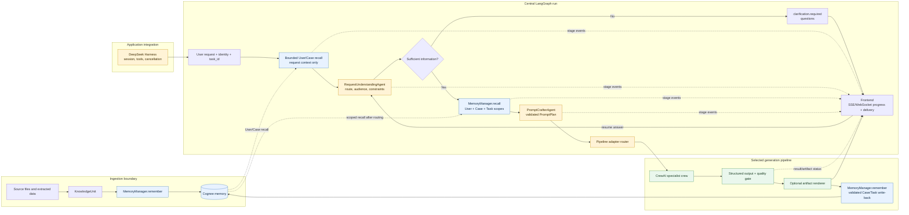

# Internal pipeline orchestration contract

This document is for the Sudarshan backend and frontend teams. It describes
the central LangGraph router added around the existing CrewAI pipelines. It is
application-specific and is not a general-purpose agent framework.

## Architecture

```text
Frontend
  │ POST /runs
  ▼
Request handler
  │ validates identity and creates task_id/run_id
  ▼
LangGraph orchestrator
  ├─ recall bounded User/Case memory for request understanding
  ├─ understand request and select one registered pipeline
  ├─ recall task-oriented User/Case/Task memory after routing
  ├─ craft a validated, pipeline-specific prompt plan
  ├─ invoke one registered pipeline adapter
  ├─ pause/resume external approval when an adapter supports it
  ├─ publish frontend-safe progress events
  └─ return one transport-neutral result
       │
       ├─ CrewAI pipeline (specialist agents and quality gate)
       ├─ MemoryManager (User/Case/Task memory policy)
       └─ artifact renderer/handoff
```

### Internal request and memory flow

The following diagram is the implementation boundary for backend and frontend
integration. Ingestion persists source-derived `KnowledgeUnit` objects through
the memory policy before any generation request is executed.



Memory ownership is intentionally one-directional: ingestion and validated
pipeline write-back call `MemoryManager.remember()`, while generation stages
call `MemoryManager.recall()` through the central access context. CrewAI agents
never receive a Cognee client, and the frontend receives progress metadata—not
raw recalled memory or internal model reasoning.

The router does not expose Cognee or credentials to agents. It first calls
`MemoryManager.recall()` with a User/Case-only context and a small budget so the
request-understanding stage never receives raw OCR or a full document. After a
pipeline is selected, it performs a second task-oriented recall using the full
permitted User/Case/Task context and injects that bounded result into the
selected pipeline. The concrete pipeline owns validated output and
`MemoryManager.remember()` write-back. CrewAI remains the collaboration layer
inside a pipeline; LangGraph owns routing and run lifecycle.

The pre-pipeline sequence is:

```text
ingestion -> KnowledgeUnit -> MemoryManager.remember() -> Cognee
user request -> bounded User/Case recall -> RequestUnderstandingAgent
             -> task-oriented User/Case/Task recall -> PromptCrafterAgent
             -> selected CrewAI pipeline
```

`RequestUnderstandingAgent` is deterministic by default. It receives bounded
User/Case context for terminology and case orientation, but memory cannot
override the explicit request or select a pipeline by itself. It resolves the
pipeline, audience, classification, distribution, explicit image policy, and
user constraints. `PromptCrafterAgent` creates a structured `PromptPlan` and
delimits recalled memory as reference context. Neither component calls Cognee
directly or emits model chain-of-thought. A future provider-backed agent may be
injected only if it returns the same validated Pydantic models.

## Python entry point

```python
from pipelines import (
    AdvisoryRequest,
    PipelineAdapter,
    InMemoryProgressSink,
    PipelineOrchestrator,
    build_default_pipeline_registry,
    create_sqlite_checkpointer,
)
from memory import MemoryManager

memory = MemoryManager.from_env()
progress = InMemoryProgressSink()
orchestrator = PipelineOrchestrator(
    memory,
    progress_sink=progress,
    # Use a Postgres-backed saver in a multi-instance deployment.
    checkpointer=create_sqlite_checkpointer(),
)

result = orchestrator.run(AdvisoryRequest(
    query="Create an executive summary for the supplied case",
    user_id="operator-1",
    case_id="case-1",
    task_id="task-1",
))
```

For the current OpenAI-backed CrewAI setup, the local `.env` should contain:

```dotenv
OPENAI_API_KEY=your-openai-api-key
CREWAI_MODEL=openai/gpt-5.4
OPENAI_IMAGE_MODEL=gpt-image-1
```

`CREWAI_MODEL` is the text/reasoning model used by CrewAI agents. The image
model is configured separately because image generation is an optional delivery
asset, not the model used for structured CrewAI task outputs.

The graph uses `run_id` as its LangGraph `thread_id`. The caller must preserve
that ID for reconnects and approval resumes. The SQLite factory is for local
development or one backend instance; production should inject the team's
durable database checkpointer and configure encryption according to the
deployment policy.

## Routing

The first router accepts `metadata.pipeline` for an explicit route. If it is
omitted, it uses conservative keyword routing for `advisory`, `linkedin_post`,
`executive_summary`, `infographic`, `ppt`, and `video`. Ambiguous or incomplete
requests pause for clarification instead of silently selecting a consequential
pipeline.

The default request-understanding implementation is intentionally conservative.
Backend code may inject an `intent_resolver(request) -> pipeline_name` callable,
`RequestUnderstandingAgent`, or `PromptCrafterAgent`, but each must return
validated structured data and must not access Cognee directly.

### Clarification loop

If the user has not provided enough information to select a pipeline or execute
the requested operation, the request-understanding stage does not guess. It
interrupts the graph with a `clarification.required` payload containing one or
more questions. The frontend displays those questions and sends the user's
answer to the same run's resume endpoint:

```json
{
  "answer": "Create an advisory for this case and focus on the decision needed."
}
```

The graph appends the answer to the task request, refreshes the bounded
User/Case recall, reruns request understanding, and only then proceeds to
task-oriented memory recall and generation. A backend may also
provide `metadata.requires_clarification=true`,
`metadata.missing_information`, or `metadata.clarification_questions` when its
request handler knows that additional information is required.

Register future PPT/video implementations without changing the frontend
contract:

```python
registry = build_default_pipeline_registry(memory)
registry["ppt"] = PipelineAdapter("ppt", run=ppt_runner)
registry["video"] = PipelineAdapter("video", run=video_runner)
```

## Frontend progress contract

`ProgressEvent` is the public event shape. The backend should publish it over
SSE for one-way progress. Use WebSocket only if the same connection must carry
interactive approval, cancellation, or other client commands.

```json
{
  "event_id": "evt-...",
  "run_id": "run-...",
  "task_id": "task-...",
  "pipeline": "executive_summary",
  "stage": "memory_recall",
  "status": "running",
  "progress": 40,
  "message": "Recalled permitted task-oriented memory",
  "requires_action": false,
  "artifact_id": null,
  "error_code": null,
  "timestamp": "2026-09-05T12:00:00+00:00"
}
```

Recommended backend endpoints:

| Endpoint | Purpose |
| --- | --- |
| `POST /runs` | Validate request, create `task_id`/`run_id`, start the graph, return initial status. |
| `GET /runs/{run_id}` | Return the latest durable graph/result state after reconnect. |
| `GET /runs/{run_id}/events` | Stream ordered `ProgressEvent` values as SSE. |
| `POST /runs/{run_id}/resume` | Submit a clarification answer or approval/revision decision. |

Recommended stage values are `request_memory_recall`, `request_understanding`, `routing`,
`request_clarification`, `memory_recall`, `prompt_crafting`, `memory_and_generation`, `human_approval`,
`pipeline_result`, `completed`, and `failed`. Progress percentages are stage
estimates, not model-token percentages. The UI should primarily render
`stage`, `status`, and `message`.

For clarification pauses, the event status is `waiting_for_input` and
`requires_action` is `true`. For approval pauses, the event status is
`waiting_for_approval`.

Do not publish raw recalled memory, private evidence, model chain-of-thought,
API keys, or unrestricted agent output in progress events. Send safe summaries,
counts, error codes, approval requirements, and artifact references only.

## Backend responsibilities

The backend team owns the application boundary around the orchestrator:

- Validate authenticated `user_id`, `case_id`, request content, and create a
  unique `task_id` and `run_id` before invoking the graph.
- Pass ingestion output through `to_knowledge_unit()` and
  `MemoryManager.remember()` with the correct User/Case/Task scope and source
  provenance. Do not write directly to Cognee.
- Construct `AdvisoryRequest` and invoke `PipelineOrchestrator.run()`; do not
  instantiate CrewAI agents or call pipeline internals from the request handler.
- Stream `ProgressEvent` values through SSE or WebSocket. Treat
  `request_clarification` with `waiting_for_input` and `human_approval` with
  `waiting_for_approval` as actionable states.
- Persist the `run_id` and use `POST /runs/{run_id}/resume` for both user
  clarification answers and authorized approval decisions. Validate reviewer
  identity and authorization before approval resumes.
- Return only the validated `PipelineResponse` and approved artifact references
  to the frontend. Never send raw Cognee context, API keys, or model reasoning.
- Configure a durable encrypted LangGraph checkpointer and a shared progress
  sink for multi-instance deployments; SQLite and in-memory sinks are local
  development/test implementations only.
- Keep `.env` out of source control, configure `CREWAI_MODEL` separately from
  `OPENAI_IMAGE_MODEL`, and record operational failures in Task memory without
  hiding the original error.

## Test layout

The repository has a dedicated top-level `tests/` suite in addition to the
package-local tests:

```text
tests/
├── component/   # one component or contract at a time
├── pipeline/    # router-to-adapter pipeline contracts
└── system/      # end-to-end orchestration scenarios
```

The automated suite is offline and deterministic: it replaces Cognee, model
calls, renderers, and external delivery with test doubles while exercising the
real memory policy, LangGraph state transitions, request clarification, prompt
planning, progress events, and approval resume paths. Run all tests with:

```bash
uv run pytest -q
```

The three system tests cover ingestion-to-generation, clarification/resume,
and approval/resume. Provider-backed smoke tests should remain opt-in and must
never run against real case data in ordinary CI.

## Approval behavior

The graph has an interrupt/resume seam for adapters that return
`PipelineResponse(status="pending")` and provide `PipelineAdapter.resume`.
The resume decision is a JSON object such as:

```json
{
  "decision": "approved",
  "reviewer_id": "reviewer-1",
  "comment": "Approved for authorized release"
}
```

The existing `AdvisoryFlow` remains backward-compatible and currently owns its
existing CrewAI approval behavior. A follow-up change can split advisory draft
generation from approved artifact release so the central LangGraph interrupt
owns that approval completely. Until then, backend code should not register an
advisory `resume` callback unless it also owns that release operation.

## Memory and audit policy

- User memory stores terminology, preferences, and conventions.
- Case memory stores validated facts, insights, decisions, and final artifacts.
- Task memory stores router stages, agent task callbacks, intermediate results,
  failures, dependencies, and incomplete runs.
- The live progress stream is a delivery mechanism; Task memory remains the
  audit record and recovery source.

The router's checkpointer stores serialized workflow state. It is not a
replacement for Cognee and must not be treated as semantic memory.

## DeepSeek Harness boundary

The Harness should invoke the orchestrator through the application adapter and
own sessions, tools, cancellation, and runtime execution. It should not
instantiate CrewAI agents or call Cognee. The orchestrator returns the same
`PipelineResponse` envelope used by the existing flows, so Harness integration
does not need to know pipeline internals.
