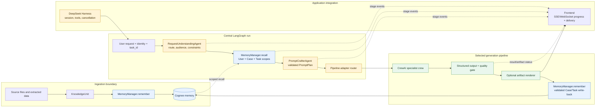

# Internal pipeline orchestration contract

This document is for the Sudarshan backend and frontend teams. It describes
the central LangGraph router added around the existing CrewAI pipelines. It is
application-specific and is not a general-purpose agent framework.

## Architecture

```text
Frontend
  │ POST /runs
  ▼
Request handler
  │ validates identity and creates task_id/run_id
  ▼
LangGraph orchestrator
  ├─ understand request and select one registered pipeline
  ├─ recall task-oriented User/Case/Task memory once
  ├─ craft a validated, pipeline-specific prompt plan
  ├─ invoke one registered pipeline adapter
  ├─ pause/resume external approval when an adapter supports it
  ├─ publish frontend-safe progress events
  └─ return one transport-neutral result
       │
       ├─ CrewAI pipeline (specialist agents and quality gate)
       ├─ MemoryManager (User/Case/Task memory policy)
       └─ artifact renderer/handoff
```

### Internal request and memory flow

The following diagram is the implementation boundary for backend and frontend
integration. Ingestion persists source-derived `KnowledgeUnit` objects through
the memory policy before any generation request is executed.



Memory ownership is intentionally one-directional: ingestion and validated
pipeline write-back call `MemoryManager.remember()`, while generation stages
call `MemoryManager.recall()` through the central access context. CrewAI agents
never receive a Cognee client, and the frontend receives progress metadata—not
raw recalled memory or internal model reasoning.

The router does not expose Cognee or credentials to agents. It calls
`MemoryManager.recall()` once with the request's `AccessContext`, then injects
the bounded result into the selected pipeline. The concrete pipeline owns
validated output and `MemoryManager.remember()` write-back. CrewAI remains the
collaboration layer inside a pipeline; LangGraph owns routing and run lifecycle.

The pre-pipeline sequence is:

```text
ingestion -> KnowledgeUnit -> MemoryManager.remember() -> Cognee
user request -> RequestUnderstandingAgent -> MemoryManager.recall()
             -> PromptCrafterAgent -> selected CrewAI pipeline
```

`RequestUnderstandingAgent` is deterministic by default. It resolves the
pipeline, audience, classification, distribution, explicit image policy, and
user constraints. `PromptCrafterAgent` creates a structured `PromptPlan` and
delimits recalled memory as reference context. Neither component calls Cognee
directly or emits model chain-of-thought. A future provider-backed agent may be
injected only if it returns the same validated Pydantic models.

## Python entry point

```python
from pipelines import (
    AdvisoryRequest,
    PipelineAdapter,
    InMemoryProgressSink,
    PipelineOrchestrator,
    build_default_pipeline_registry,
    create_sqlite_checkpointer,
)
from memory import MemoryManager

memory = MemoryManager.from_env()
progress = InMemoryProgressSink()
orchestrator = PipelineOrchestrator(
    memory,
    progress_sink=progress,
    # Use a Postgres-backed saver in a multi-instance deployment.
    checkpointer=create_sqlite_checkpointer(),
)

result = orchestrator.run(AdvisoryRequest(
    query="Create an executive summary for the supplied case",
    user_id="operator-1",
    case_id="case-1",
    task_id="task-1",
))
```

The graph uses `run_id` as its LangGraph `thread_id`. The caller must preserve
that ID for reconnects and approval resumes. The SQLite factory is for local
development or one backend instance; production should inject the team's
durable database checkpointer and configure encryption according to the
deployment policy.

## Routing

The first router accepts `metadata.pipeline` for an explicit route. If it is
omitted, it uses conservative keyword routing for `advisory`, `linkedin_post`,
`executive_summary`, `infographic`, `ppt`, and `video`. Ambiguous requests fail
with a routing error instead of silently selecting a consequential pipeline.

The default request-understanding implementation is intentionally conservative.
Backend code may inject an `intent_resolver(request) -> pipeline_name` callable,
`RequestUnderstandingAgent`, or `PromptCrafterAgent`, but each must return
validated structured data and must not access Cognee directly.

Register future PPT/video implementations without changing the frontend
contract:

```python
registry = build_default_pipeline_registry(memory)
registry["ppt"] = PipelineAdapter("ppt", run=ppt_runner)
registry["video"] = PipelineAdapter("video", run=video_runner)
```

## Frontend progress contract

`ProgressEvent` is the public event shape. The backend should publish it over
SSE for one-way progress. Use WebSocket only if the same connection must carry
interactive approval, cancellation, or other client commands.

```json
{
  "event_id": "evt-...",
  "run_id": "run-...",
  "task_id": "task-...",
  "pipeline": "executive_summary",
  "stage": "memory_recall",
  "status": "running",
  "progress": 40,
  "message": "Recalled permitted task-oriented memory",
  "requires_action": false,
  "artifact_id": null,
  "error_code": null,
  "timestamp": "2026-09-05T12:00:00+00:00"
}
```

Recommended backend endpoints:

| Endpoint | Purpose |
| --- | --- |
| `POST /runs` | Validate request, create `task_id`/`run_id`, start the graph, return initial status. |
| `GET /runs/{run_id}` | Return the latest durable graph/result state after reconnect. |
| `GET /runs/{run_id}/events` | Stream ordered `ProgressEvent` values as SSE. |
| `POST /runs/{run_id}/resume` | Submit an approval or revision decision. |

Recommended stage values are `request_understanding`, `routing`, `memory_recall`,
`prompt_crafting`, `memory_and_generation`, `human_approval`,
`pipeline_result`, `completed`, and `failed`. Progress percentages are stage
estimates, not model-token percentages. The UI should primarily render
`stage`, `status`, and `message`.

Do not publish raw recalled memory, private evidence, model chain-of-thought,
API keys, or unrestricted agent output in progress events. Send safe summaries,
counts, error codes, approval requirements, and artifact references only.

## Approval behavior

The graph has an interrupt/resume seam for adapters that return
`PipelineResponse(status="pending")` and provide `PipelineAdapter.resume`.
The resume decision is a JSON object such as:

```json
{
  "decision": "approved",
  "reviewer_id": "reviewer-1",
  "comment": "Approved for authorized release"
}
```

The existing `AdvisoryFlow` remains backward-compatible and currently owns its
existing CrewAI approval behavior. A follow-up change can split advisory draft
generation from approved artifact release so the central LangGraph interrupt
owns that approval completely. Until then, backend code should not register an
advisory `resume` callback unless it also owns that release operation.

## Memory and audit policy

- User memory stores terminology, preferences, and conventions.
- Case memory stores validated facts, insights, decisions, and final artifacts.
- Task memory stores router stages, agent task callbacks, intermediate results,
  failures, dependencies, and incomplete runs.
- The live progress stream is a delivery mechanism; Task memory remains the
  audit record and recovery source.

The router's checkpointer stores serialized workflow state. It is not a
replacement for Cognee and must not be treated as semantic memory.

## DeepSeek Harness boundary

The Harness should invoke the orchestrator through the application adapter and
own sessions, tools, cancellation, and runtime execution. It should not
instantiate CrewAI agents or call Cognee. The orchestrator returns the same
`PipelineResponse` envelope used by the existing flows, so Harness integration
does not need to know pipeline internals.
