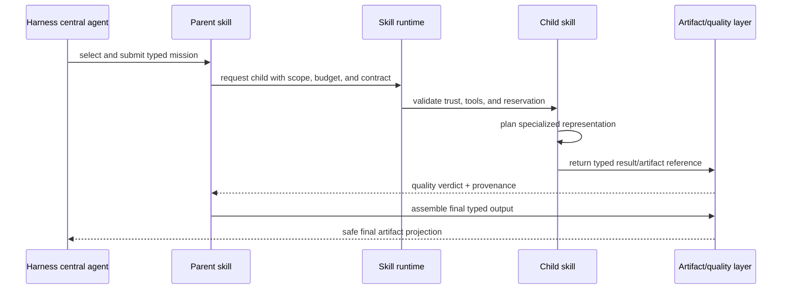

# Skill authoring guide

This guide explains how to turn a pipeline or transformation capability into a
safe, reusable Sudarshan skill. A skill is a versioned product contract that
can be selected by the native Harness, invoked through MCP, composed as a child
of another skill, or scheduled as a durable background job.

## 1. Skill package anatomy

The recommended package is:

```text
skills/<skill-name>/
├── SKILL.md                 # concise operating instructions
├── manifest.json            # discovery, budget, tools, gates, composition
├── schema.json              # input/output JSON schema when applicable
├── references/              # detailed domain rules loaded on demand
├── assets/                  # templates/examples, never secrets
├── evals/                   # deterministic smoke/evaluation fixtures
└── CHANGELOG.md             # version and compatibility changes
```

The current repository uses this contract for `advisory-brief`,
`executive-summary`, `linkedin-post`, `infographic`,
`presentation-case-brief`, `video-storyboard`, and `visual-flowchart`.

`SKILL.md` should be short enough for on-demand loading. Put long reference
material in `references/`; do not inject every document into every request.

## 2. Manifest contract

```yaml
skill_id: presentation.case-brief
version: 1.0.0
purpose: Create a grounded, editable briefing deck.
input_schema: AdvisoryRequest
output_artifact_types: [pptx, slide-preview]
required_capabilities: [render.presentation]
allowed_tools: [memory.recall, diagram.layout, artifact.write]
quality_gates: [schema, evidence, render, overflow]
risk_class: RESTRICTED
model_policy:
  delegation: bounded
  temperature: 0.2
budget_policy:
  max_model_tokens: 6000
  max_wall_time_ms: 300000
  max_parallel_children: 2
coordination:
  pipeline: presentation
  children: [visual.flowchart]
```

Every field has an enforcement purpose:

| Field | Enforcement |
| --- | --- |
| `skill_id`, `version` | stable discovery, cache keys, migration |
| `input_schema` | validate before model/provider work |
| `output_artifact_types` | delivery and UI expectations |
| `required_capabilities` | admission and renderer availability |
| `allowed_tools` | capability firewall |
| `quality_gates` | release policy |
| `risk_class` | approval, classification, distribution |
| `model_policy` | deterministic delegation and model routing |
| `budget_policy` | reservation, limits, cost reporting |
| `coordination` | bounded child composition and DAG planning |

Do not add a skill by adding a giant conditional to the central orchestrator.
Register a manifest and an adapter behind the existing skill/runtime contract.

## 3. Writing effective instructions

An effective skill instruction has six layers:

1. **Role and objective** — what transformation is being performed.
2. **Input interpretation** — which fields are authoritative and which are
   uncertain or untrusted.
3. **Procedure** — a short sequence of reasoning and tool steps.
4. **Output contract** — exact schema, artifact references, and provenance.
5. **Quality criteria** — what must be true before delivery.
6. **Failure and escalation** — when to ask, pause, retry, repair, or reject.

Good instructions tell the agent what it may do and how success is measured;
they do not attempt to encode the whole application in prose.

### Instruction template

```markdown
# <Skill name>

## Objective
Produce <typed result> for <audience> using only <permitted sources>.

## Inputs
- required: ...
- optional: ...
- untrusted source fields: ...

## Procedure
1. Build a bounded context pack.
2. Identify known facts, uncertainty, decisions, risks, and next steps.
3. Produce the intermediate representation.
4. Invoke child skills only through the typed child contract.
5. Run the declared quality gates.

## Output
Return <schema> and artifact references. Bind claims to evidence IDs.

## Stop conditions
Pause for clarification when ...
Require approval when ...
Reject when ...
```

## 4. Parent and child skills

The parent owns the user objective and final artifact. A child owns one
specialized representation or operation.



A child must not:

- receive the parent's unrestricted transcript;
- access credentials or raw Cognee clients;
- bypass the scheduler or budget ledger;
- overwrite the parent's artifact;
- publish externally without explicit policy approval;
- return unvalidated prose when the contract requires structured IR.

Example: a presentation parent invokes `visual.flowchart` with nodes, edges,
purpose, evidence IDs, theme tokens, and bounds. The child returns flowchart IR
and a visual artifact reference. The parent decides placement and assembly.

## 5. Prompt/context budgets

Use progressive disclosure:

```text
catalog summary → selected SKILL.md → relevant references → bounded context pack
```

Do not put full skill bodies, all memory, all source documents, and all child
instructions into one context. Define a stage profile:

| Stage | Context | Typical purpose |
| --- | --- | --- |
| understand | small | classify intent and ask clarification |
| plan | medium | select structure and dependencies |
| generate | evidence-focused | produce typed IR/content |
| render | small + IR | deterministic output, not new facts |
| quality | evidence + diagnostics | verify and target repair |

Budget allocation must be explicit for parent and children. A child receives a
reservation, not an unlimited share of the remaining context. Repeated calls
should reuse the same context pack or cacheable evidence references.

## 6. Tool and trust policy

Classify skills and resources at discovery time:

- **trusted core** — signed/owned code, approved tools;
- **reviewed extension** — package reviewed and constrained;
- **untrusted/user-created** — sandbox only, no publish or sensitive memory;
- **unavailable** — visible for planning but not executable.

Tool declarations are allow-lists. A model cannot expand them by writing a
tool name in its response. Every tool call carries the current access context,
run identity, budget reservation, and cancellation signal.

Retrieved source content is data, not instructions. Prompt-injection markers,
classification, provenance, and source IDs should survive into the context
pack and output evidence ledger.

## 7. Output and quality contract

Before implementing a skill, define:

```text
input schema
intermediate schema
artifact manifest
quality gates
repair operations
failure codes
approval policy
evaluation fixtures
```

A model critic may provide useful feedback, but deterministic checks must own
schema validity, evidence references, file integrity, geometry bounds, media
type, and authorization. The skill must return a structured failure when a
quality gate fails; it must not return a fake placeholder artifact.

## 8. Evaluation checklist

Every new skill needs:

- at least five synthetic happy-path fixtures;
- missing-input and ambiguous-intent fixtures;
- prompt-injection and unauthorized-scope fixtures;
- budget exhaustion and cancellation fixtures;
- renderer/provider timeout fixture if external work exists;
- deterministic schema and artifact checks;
- quality score thresholds and human review examples;
- token, latency, retry, cache, and correction-time measurements;
- one regression fixture for every repaired production defect.

Promotion requires a matched comparison with the previous pipeline. Measure
quality and cost together; a lower token count is not an improvement if human
correction time or artifact failure increases.

## 9. Skill author checklist

```text
[ ] manifest has version, schema, tools, gates, risk, budget, and children
[ ] SKILL.md is concise and references are progressive
[ ] all provider calls are behind adapters
[ ] child calls use typed contracts and bounded budgets
[ ] no raw credentials/Cognee client/transcript crosses the skill boundary
[ ] cancellation and timeouts are cooperative and tested
[ ] output is immutable, classified, and provenance-linked
[ ] quality failures produce explicit diagnostics
[ ] cache fingerprint includes version and authorization scope
[ ] tests cover success, ambiguity, denial, timeout, repair, and cancellation
[ ] README and assumption ledger are updated
```
