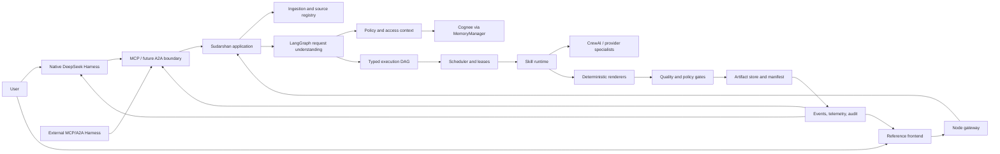
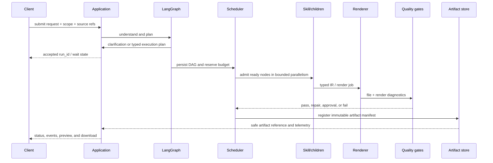
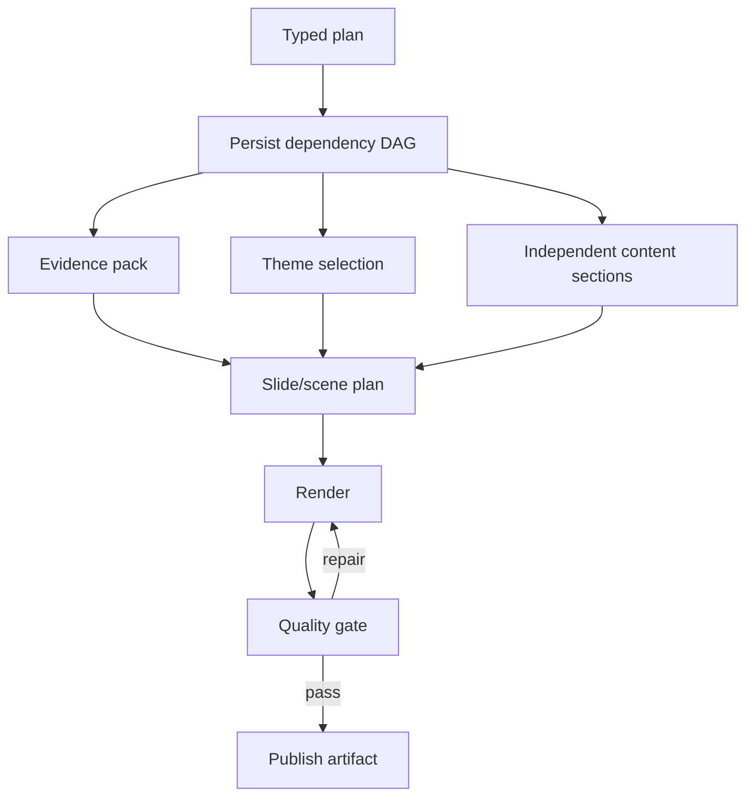

# Sudarshan 2.0 engineering handbook

This is the implementation-oriented guide for building, operating, extending,
and evaluating Sudarshan. It is the connective document between the source
tree, the execution plan, the API contracts, the DeepSeek Harness integration,
and the team workflow.

It describes the system as it exists on the `Sudarshan2.0` branch. Statements
marked **planned**, **local-only**, or **production gap** must not be presented
as completed production capabilities.

## 1. Product boundary

Sudarshan is an evidence-aware artifact-production platform. A user supplies
scattered context and asks for one or more transformations such as a briefing,
presentation, infographic, video, executive summary, or LinkedIn draft.
Sudarshan turns that request into a bounded execution graph, calls specialized
skills, produces typed intermediate representations, renders artifacts through
deterministic workers, evaluates the result, and returns an authorized artifact
manifest.

The product is not one large prompt and it is not a collection of independent
chatbots. It is a layered system:

```text
Harness / HTTP / MCP / future A2A client
        │  intent, skill selection, status, approval, delivery
        ▼
Sudarshan application boundary
        │  identity, policy, memory scope, run contract
        ▼
Durable control plane
        │  LangGraph lifecycle, DAG, scheduler, leases, budgets, events
        ▼
Skill runtime and specialist pipelines
        │  typed tasks, bounded child skills, CrewAI where useful
        ▼
Renderers, validators, artifact store, audit and telemetry
        │
        ▼
Cognee through MemoryManager
```

### Ownership rule

| Concern | Owner | Important constraint |
| --- | --- | --- |
| Conversation and interactive clarification | Harness agent or API client | It may propose intent; the server validates authority. |
| Authentication, ownership, quotas | Node gateway and application boundary | Never trust browser fields alone. |
| Request understanding and routing | LangGraph orchestration layer | The model proposes; typed routing decides. |
| Run truth, retries, leases, cancellation | Sudarshan control plane | Cognee and the Harness are not job databases. |
| Memory scope and recall | `MemoryManager` | Agents never receive a raw Cognee client or credential. |
| Specialist collaboration | Selected skill and bounded children | CrewAI is local collaboration, not a second global scheduler. |
| Rendering | Deterministic renderer worker | Models describe visual intent; workers create files. |
| Quality decision | Structural, evidence, semantic, visual, and policy gates | A model critic cannot be the only approver. |
| Artifact delivery | Artifact manifest and authorization policy | Files are delivered only after validation. |
| Native operator experience | DeepSeek Harness plugins | Product UI must remain replaceable and portable. |

## 2. High-level architecture



### Request lifecycle

Every request follows the same conceptual lifecycle, even when the entry point
is a direct Python call or an MCP tool:

1. **Authenticate and scope** — establish `user_id`, `case_id`, `task_id`,
   classification, operation, and allowed capabilities.
2. **Ingest or reference sources** — validate type, size, ownership, checksum,
   and provenance; store durable source references rather than passing large
   blobs through every prompt.
3. **Understand intent** — identify requested outputs, audience, constraints,
   uncertainty, and clarification needs.
4. **Recall bounded context** — retrieve only permitted User/Case/Task context
   through `MemoryManager`; rank, deduplicate, and budget it in
   `ContextBuilder`.
5. **Create a typed plan** — select skills, dependencies, budgets, tools,
   quality gates, approval policy, and expected artifact types.
6. **Admit the run** — assign a durable `run_id`, reserve budget, persist the
   graph, and return quickly with an accepted/running projection.
7. **Execute independent work in parallel** — the scheduler admits ready DAG
   nodes subject to concurrency, token, provider, and tenant limits.
8. **Render and verify** — convert typed IR to files, run structural/evidence/
   visual/policy checks, and repair only the failed component when possible.
9. **Publish** — register immutable artifact manifests only for quality-passed
   outputs; apply human approval when the risk policy requires it.
10. **Project and remember** — emit safe progress/telemetry/audit records and
    write validated case memory through the lifecycle policy.



## 3. Low-level contracts

### Identity and correlation

The following identifiers must remain stable across HTTP, Harness, MCP, logs,
events, child calls, and artifacts:

| Identifier | Meaning |
| --- | --- |
| `user_id` | authenticated owner or operator identity |
| `case_id` | durable case/workspace boundary |
| `task_id` | user-visible transformation request and audit boundary |
| `run_id` | one orchestrated execution, including revisions |
| `parent_run_id` | revision or parent execution relationship |
| `child_id` / `skill_call_id` | bounded specialist node identity |
| `artifact_id` | immutable deliverable reference |
| `event_cursor` | monotonic reconnect position for progress |
| `correlation_id` | cross-service trace/log correlation |

Do not use an artifact path, a model response ID, or a browser session ID as a
run identity. A revision creates a new artifact and normally a new run while
retaining the parent reference.

### Run state

The application exposes a frontend-safe projection, not raw model state. A
projection may contain status, stage, progress, wait reason, safe error,
quality summary, artifact manifests, usage counters, and event cursor.

Typical lifecycle states are:

```text
accepted → planning → waiting_for_input
                    ↘ running → quality_check → approval_required
                                          ↘ publishing → succeeded
                                          ↘ needs_revision / failed
                    ↘ cancelled
```

`provider_pending` means external work is still running. It is not the same as
`waiting_for_input`; the UI must show both distinctly.

### Artifact manifest

An artifact is delivered through a verified manifest containing stable identity,
media type, size, checksum, classification, quality verdict, provenance, and a
safe download/preview reference. The manifest must not expose raw filesystem
paths, provider credentials, raw prompts, hidden reasoning, or unrestricted
memory.

The old artifact is never overwritten during revision. A new artifact must
pass the same integrity and quality checks before it becomes deliverable.

## 4. Parallel execution and waiting

### How parallelism works

The central agent creates a plan; it does not directly manage thread lifetimes.
The persisted DAG and scheduler do that work.



The scheduler admits a node only when:

- all declared dependencies succeeded;
- the run is not cancelled or expired;
- the tenant/run/parent child limit has capacity;
- the token and wall-time reservation is available;
- the skill trust tier and tool allow-list permit the operation;
- the node has an idempotency key.

Independent nodes may run concurrently. Dependent nodes wait for durable
results, not in-memory Python objects. On restart, the bridge reconstructs
ready dependents from persisted job payload and DAG state.

### How waiting works

The user-facing request returns an accepted handle quickly. Long work is
observed with one of these mechanisms:

| Mechanism | Use |
| --- | --- |
| `GET /runs/{run_id}` | bounded status snapshot |
| SSE progress stream | low-latency live updates |
| event cursor | replay after reconnect or refresh |
| `wait_sudarshan` | bounded MCP wait with timeout/cursor |
| resume endpoint/tool | clarification or approval continuation |
| artifact lookup | final immutable delivery |

Waits must be bounded. A timeout returns a safe snapshot and a reason such as
`provider_pending`, `approval_required`, `capacity_wait`, or `retry_scheduled`;
it does not mark a run failed. The UI can reconnect using the last cursor.

Cancellation is cooperative. Python threads cannot be forcibly killed, so
every provider adapter needs network/process timeouts and cancellation checks.
Subprocess work must have a killable process boundary. A cancelled node must
not publish a partial artifact as a successful artifact.

## 5. Token and cost budgeting

Budgeting is hierarchical:

```text
request budget
  ├── planning reservation
  ├── memory/context budget
  ├── child-skill reservations
  │     ├── model tokens
  │     ├── tool calls
  │     └── wall time
  └── rendering / provider cost allowance
```

The budget ledger must distinguish:

- reserved versus consumed tokens;
- estimated versus provider-reported usage;
- input versus output tokens;
- child usage versus parent aggregate;
- cache savings versus actual generation;
- model cost versus media/rendering cost.

Budget policy is part of the skill manifest. For example, the presentation
skill currently declares a maximum model budget, wall-time limit, and bounded
parallel children. A child cannot silently exceed the parent reservation.

Cost controls:

1. Use compact skill summaries during discovery; load full instructions only
   after selection.
2. Store source documents and evidence as references, not repeated prompt text.
3. Build one bounded context pack per stage and reuse it across children.
4. Cache deterministic or exact-match work using skill/version/input/provider/
   authorization fingerprints.
5. Never cache raw prompts, private memory, or credentials in shared metadata.
6. Reserve budget before fan-out and release unused reservation after completion.
7. Stop or degrade gracefully at limits; never silently switch to an unsafe
   provider or unbounded model call.

## 6. Skills and child skills

A skill is a versioned, governed capability—not merely a prompt. Its package
must define purpose, input/output schema, tools, trust tier, budgets, quality
gates, failure behavior, and evaluation fixtures.

The central Harness agent discovers compact manifests, selects a skill, and
submits a typed mission. The skill may invoke specialized child skills through
the bounded skill runtime. A child returns a typed result/artifact reference;
it does not edit the parent artifact directly.

Example presentation composition:

```text
presentation.case-brief
  ├── evidence/context skill
  ├── narrative/slide-plan stage
  ├── visual.flowchart child when graph structure is required
  ├── chart/table child when quantitative structure is required
  ├── deterministic PPTX/SVG renderer
  └── structural + evidence + visual quality gates
```

The current canonical skill packages live under `skills/`:

| Skill | Output | Current role |
| --- | --- | --- |
| `advisory.brief` | reviewed Markdown/advisory | structured case advisory |
| `executive.summary` | validated summary | concise evidence-grounded text |
| `linkedin.post` | draft post and optional visual prompt/asset | human review before publishing |
| `infographic` | AntV/SVG artifact | syntax validation and renderer QA |
| `presentation.case-brief` | editable PPTX and preview | deck planning and visual children |
| `video.storyboard` | video package | native scene/audio/render workflow |
| `visual.flowchart` | SVG/PPTX-compatible visual IR | reusable child visual skill |

`available=false` in the catalog means discovery is allowed but execution is
not installed. The application must reject unavailable execution rather than
route it to an unrelated pipeline.

See the complete authoring contract in [Skill authoring](skill-authoring.md).

## 7. Rendering and quality

Artifact generation is deliberately split into four representations:

```text
source/evidence → semantic IR → layout/render IR → artifact files
                                      │
                                      └→ previews and diagnostics
```

The model decides meaning, narrative, and visual intent. Deterministic code
decides geometry, connector routing, file encoding, and integrity checks.

### PPT

The presentation path should generate `PresentationSpec`, `SlideSpec`, and
visual child IR before writing PPTX. Flowcharts use a graph schema with nodes,
edges, constraints, evidence bindings, and normalized geometry. The renderer
creates editable PowerPoint shapes/connectors and preview SVG where supported.

Quality gates include schema validity, evidence binding, overlap/off-canvas/
overflow diagnostics, render success, readability, and policy. Actual slide
rasterization and projector-scale visual regression remain production work.

### Infographic

The Python pipeline validates AntV syntax and provenance, then delegates only
SSR rendering to the Node bridge. The bridge must have an explicit timeout and
must return renderer mode and warnings. A valid SVG file alone is not a quality
verdict; layout, text overflow, contrast, and visual regression are separate
checks.

### Video

The native video path persists a storyboard and scene manifest, renders scenes
with bounded parallel workers, resumes successful scenes by exact fingerprint,
and composes the ordered package through FFmpeg. Provider adapters must be
cooperatively cancellable and have network/process timeouts. The legacy
MoneyPrinterTurbo adapter is compatibility mode only and must stay behind its
provider boundary.

### LinkedIn

LinkedIn output is draft-only. The humanizer preserves claims and uncertainty;
it must not invent statistics or erase source attribution. If a visual is
requested or justified, the parent skill can invoke `visual.flowchart` or an
image child through a typed child call. Publishing is outside the current
pipeline and requires an explicit external approval/integration.

See [Artifact rendering and quality](artifact-rendering-and-quality.md) for
renderer contracts, failure handling, and evaluation criteria.

## 8. Memory and Cognee

`MemoryManager` is the only application memory boundary. It maps the logical
scope hierarchy to one Cognee dataset and explicit node sets:

```text
system
  └── user
       └── case
            └── task
```

Recall uses the current scope plus permitted ancestors. It does not expose all
child cases to a user-level query. `ContextBuilder` then ranks, deduplicates,
preserves provenance, applies stage-specific token budgets, and emits a typed
`ContextPack` plus retrieval trace.

Cognee is useful for graph/vector retrieval, entity relationships, session
memory, improvement, and forgetting. It is not authoritative for:

- job status or leases;
- access-control decisions;
- binary artifacts;
- provider credentials;
- classification policy;
- unrestricted chain-of-thought or raw transcripts.

Memory lifecycle states are `active`, `pending_review`, `superseded`,
`retracted`, and `expired`. Only active records are recalled. Case-memory
write-back occurs only after the pipeline contract, quality policy, and any
required approval succeed.

## 9. Harness, MCP, and portability

DeepSeek Harness is the native operator host. It provides session/runtime
composition, skill discovery, MCP client behavior, approvals, jobs, and the
richest UI. Sudarshan remains the application/control plane.

The native web surface loads:

- `client-ui-sudarshan` for brand slot occupants;
- `client-ui-sudarshan-theme` for product presentation CSS;
- the existing Harness UI plugins for conversation, renderer, sidebar, jobs,
  artifacts, and settings.

The official Harness brand package is not relabeled or forked. Product UI is a
replaceable composition layer.

The MCP server exposes the same application boundary to another Harness. The
important rule is one source of truth:

```text
native Harness / external MCP client / future A2A client
                         │
                         ▼
                 same run_id and event store
                         │
                         ▼
              same artifacts, quality, audit, memory policy
```

MCP tools currently include run start, status, bounded wait, resume, cancel,
artifact lookup, health, usage, pipeline/skill discovery, local skill invoke,
background skill start, memory remember, and memory recall. External clients
must receive safe projections, not raw Cognee results or provider secrets.

A future A2A adapter should map its task ID to `run_id`; it must not create a
second scheduler or database.

## 10. Frontend and operator experience

The reference frontend is gateway-first and currently provides:

- Google OAuth entry and HttpOnly-cookie session handling;
- case selection/creation and source upload;
- pipeline selection and idempotent run submission;
- SSE progress with polling fallback and cursor recovery;
- clarification, approval, provider-pending, retry, and cancellation states;
- artifact manifests, preview/open/download, quality status, and safe telemetry;
- development-only one-time API-key setup when enabled by the backend.

The native Harness UI should progressively add:

1. run card with stage, status, owner, budget, and wait reason;
2. parent/child execution lanes with parallel branches;
3. evidence drawer showing source IDs and claim bindings;
4. artifact versions and quality verdicts;
5. approval and revision controls;
6. safe event/audit timeline;
7. renderer previews and targeted repair actions.

No frontend may display raw memory, hidden reasoning, provider credentials, or
filesystem paths. Every view should consume the canonical safe projection.

## 11. Security model

Security is enforced at boundaries, not by prompt instructions alone.

- authenticate before case/task/artifact access;
- propagate access context to children;
- enforce trust tiers and tool allow-lists;
- mark retrieved prompt-injection candidates as untrusted source content;
- redact secrets recursively in audit and telemetry;
- hash sensitive audit queries rather than storing raw content;
- include authorization scope in cache fingerprints;
- classify artifacts and prevent unauthorized delivery;
- require approval for high-risk publication;
- use subprocess sandboxes for untrusted render/provider work;
- never commit `.env`, `.dsh-preview`, credentials, sessions, or generated
  machine-specific profiles.

The current implementation is a local security slice. Signed skill packages,
distributed authorization, OS/container sandboxing, secret-scanning CI, and
multi-worker security tests remain deployment gates.

## 12. Deployment model

### Local development

Local development uses SQLite, filesystem artifacts, local Harness state, and
optional local providers. This is appropriate for deterministic tests and a
single operator process.

### Staging

Staging must add:

- shared database/queue and lease fencing;
- object storage with checksum and retention policy;
- controlled telemetry collector and access roles;
- live OAuth/MongoDB/Cognee/provider smoke tests with synthetic data;
- kill-9, host-loss, duplicate-worker, and abandoned-artifact tests;
- actual packaged Harness preview and white-label plugin test;
- renderer font/raster/visual QA.

### Production

Do not claim multi-host scale until queue, DAG state, budget reservations,
progress, cache coordination, and artifact storage are shared and durable.
Process-local SQLite is not sufficient for production worker fleets.

## 13. Developer workflow

Before changing code:

1. Read `docs/README.md`, this handbook, and the relevant subsystem README.
2. Check the assumption ledger and current status.
3. Inspect `git status`; preserve unrelated work and friend changes.
4. Identify the contract and tests that should fail before the change.

During implementation:

1. Keep backend truth in the application boundary.
2. Keep model/provider calls behind adapters.
3. Use typed schemas at every skill boundary.
4. Add cancellation, timeout, retry, and failure semantics with the feature.
5. Add safe progress/telemetry fields without raw prompts or memory.
6. Update docs and assumptions when a public behavior changes.

Before handoff:

```powershell
.\.venv\Scripts\python.exe -m pytest -q --basetemp .pytest-tmp-current
node --test .\frontend\tests\api-projection.test.mjs
node --check .\frontend\script.js
node --check .\frontend\api.js
node --check .\frontend\login.js
git diff --check
```

For Harness changes, also run the relevant TypeScript project build, package
bundle, plugin test, and web snapshot/e2e gate when dependencies are installed.

## 14. Current status and explicit gaps

Implemented locally: typed orchestration, scoped memory, skill catalog,
bounded child runtime, local scheduler/DAG, progress replay, cache metadata
policy, audit/telemetry projections, native video scene recovery, infographic
SSR bridge, PPT flowchart IR/renderer slice, frontend dashboard, MCP boundary,
and replaceable Harness brand/theme plugins.

Still required before production claims: shared control plane, object storage,
distributed budget/cache/telemetry, signed packages, sandbox enforcement,
actual visual regression, live provider smoke tests, full PPT child execution,
LinkedIn visual-child reconciliation, and T29/T30 matched evaluations and
release rollback sign-off.

The [current status](current-status.md), [assumption ledger](sudarshan-2.0-assumptions.md),
[full execution plan](sudarshan-2.0-full-execution-plan.md), and
[operations guide](operations.md) are the source of truth when this handbook
and implementation diverge.

## 15. Research and references

Research citations, competitor comparisons, protocol references, and the
paper-to-design decisions are intentionally centralized in the [full 2.0
execution plan](sudarshan-2.0-full-execution-plan.md) and the [Harness research
companion](sudarshan-2.0-harness-research.md). Do not create another copied
reference list in a pipeline README. When adding a new external reference,
record its title, URL/identifier, date accessed, relevant claim, and the
implementation decision it supports in the full plan.
