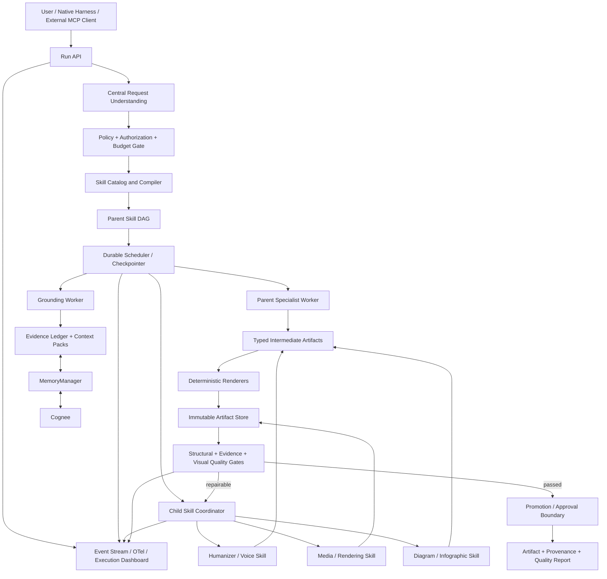
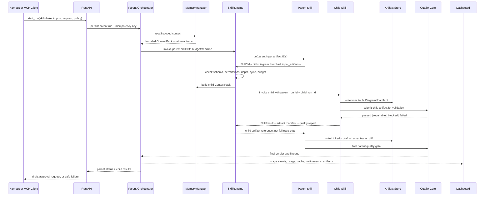
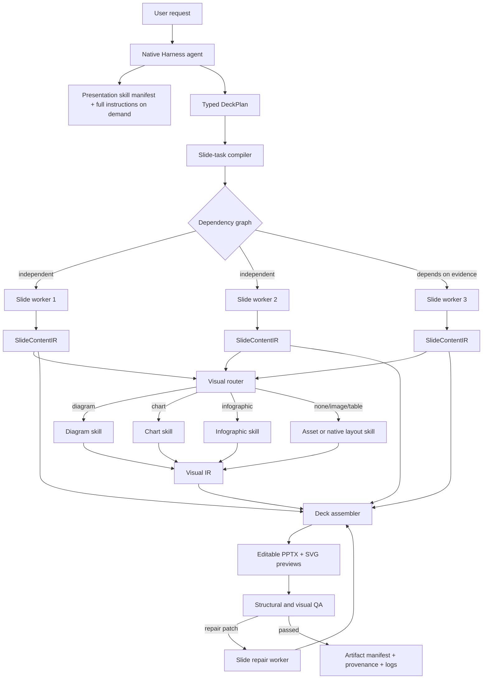
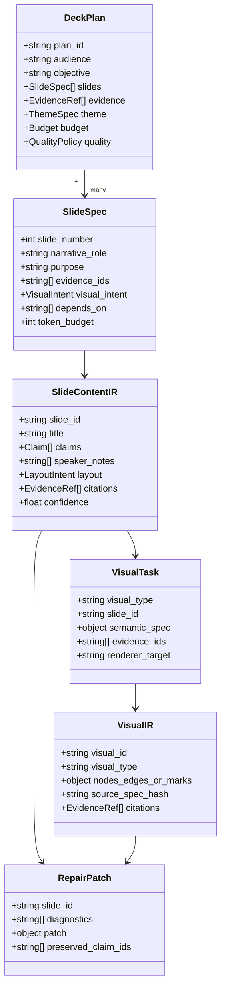

# Sudarshan 2.0: Full Agentic Evolution and Execution Plan

Status: proposed implementation baseline

This document defines the target architecture, research-backed design decisions, and staged execution plan for evolving Sudarshan into a durable, agentic artifact-production platform built on the native DeepSeek Harness and exposed through MCP.

The attached OpenAI-style diagram is treated as a design reference, not as an instruction. Its useful principle is the transformation of scattered context into a reusable workflow, a first draft, and a review/improvement loop. Sudarshan should implement that principle with typed intermediate representations, evidence provenance, deterministic renderers, validators, durable execution, and governed memory.

## Executive decision

The direction is good for scale, but the architecture should be strengthened in four ways:

1. PPT generation must use a typed presentation intermediate representation (IR), including a first-class flowchart IR. The model plans the visual structure; deterministic layout and rendering engines produce editable slides; visual validators inspect rendered output.
2. The native DeepSeek Harness should be differentiated by a Sudarshan execution experience: native skill loading, task cards, Execution Monitor, evidence drawer, artifact workspace, policy-aware approvals, and model/provider routing. The Harness runtime is a strong foundation, but its quality must be demonstrated with evaluations rather than assumed.
3. Cognee should be used as a governed graph-memory substrate for evidence, case knowledge, reusable procedures, and validated execution experience. It should not become an unrestricted transcript store or the source of truth for run state, permissions, or artifacts.
4. The backend should own durable runs, DAG execution, queues, retries, leases, artifact storage, and quality gates. The Harness agent should select a skill and submit a mission; it should not become the production scheduler.

The target boundary is:

```text
DeepSeek Harness = native host and operator experience
  sessions, model adapters, skill catalog, MCP client, approvals, UI, job interaction

Sudarshan = application control plane and execution platform
  intent, policy, evidence, memory, skill runtime, DAGs, workers, renderers, validators,
  artifacts, audit, scale-out, and MCP server

Cognee = governed knowledge and experience memory
  graph, vector/text retrieval, session memory, improvement, provenance-aware recall
```

## 1. Research conclusions that drive the design

### 1.1 Effective artifact agents plan structure before pixels

Recent presentation-generation research converges on a two-stage process: understand the source and create an explicit outline, then plan each slide's content and layout before rendering. SlideGen describes a modular visual-in-the-loop system with outliner, mapping, arrangement, note synthesis, and iterative refinement agents.[^1] PPTAgent uses reference-presentation analysis, outline drafting, and edit-based generation, and evaluates content, design, and coherence separately.[^2] A visual self-verification study represents a slide as elements with both content and layout, then generates and refines that structured representation before conversion into PowerPoint.[^3]

The practical conclusion for Sudarshan is that a slide must not be represented only as a title plus bullets. It needs an editable scene graph:

```text
PresentationSpec
  ├── narrative arc and slide order
  ├── design system and theme
  ├── SlideSpec[]
  │     ├── intent and one-message statement
  │     ├── evidence/citation bindings
  │     ├── layout type
  │     ├── element[]
  │     │     ├── text, shape, image, table, chart, flowchart
  │     │     ├── bounding/anchor constraints
  │     │     ├── style token references
  │     │     └── accessibility/legibility constraints
  │     └── speaker notes
  └── quality and release policy
```

### 1.2 Reliable multi-agent systems need contracts and verification

Recent work on automatically constructed multi-agent systems emphasizes directed acyclic graphs, explicit input/output contracts, verification criteria, execution-time gates, and targeted recovery rather than unconstrained agent conversation.[^4] This supports a coordinator plus bounded specialists:

```text
coordinator plans and assigns
specialists produce typed intermediate results
validators gate each important boundary
repair targets the failed component
```

It does not support letting the central model freely spawn agents, call all tools in arbitrary order, and decide when an artifact is acceptable.

### 1.3 Memory needs lifecycle, evaluation, and forgetting

The current graph-memory literature distinguishes short-term and long-term memory, factual knowledge and experience, structural and non-structural representations, and a lifecycle of extraction, storage, retrieval, and evolution.[^5] Newer benchmarks report that memory systems often reuse obsolete facts or fail to reconcile updates, so “we store everything in memory” is not a quality strategy.[^6]

Cognee's current documentation describes a useful lifecycle: `remember`, `recall`, `improve`, and `forget`, with session memory as a fast path and permanent graph memory as a slower enriched path.[^7] Sudarshan should adopt the lifecycle while retaining its own scope, provenance, policy, and release controls.

### 1.4 Harness quality is a product property, not a repository property

The DeepSeek Harness repository provides a strong technical foundation: replaceable model/tool/session/agent-loop plugins, layered skills, optional subagent providers, background jobs, and UI extension points. The local documentation confirms that skills are discovered through compact summaries and loaded on demand, while child agents have capability filtering, depth control, ownership, cancellation, and durable child sessions.[^8]

That makes the Harness suitable as Sudarshan's native host. It does not prove that Sudarshan's complete product is high quality. Quality must be established through end-to-end evaluations for groundedness, artifact quality, cost, latency, recovery, security, and operator usability.

## 2. Target architecture

```text
┌────────────────────────────────────────────────────────────────────┐
│ DeepSeek Harness / compatible external Harness                     │
│                                                                    │
│ Host agent → skill summaries → selected skill → MCP client         │
│ Native UI: chat, Execution Monitor, artifacts, evidence, approvals │
└───────────────────────────────┬────────────────────────────────────┘
                                │ MCP
                                ▼
┌────────────────────────────────────────────────────────────────────┐
│ Sudarshan MCP and application boundary                             │
│                                                                    │
│ discover skills · start run · observe · resume · cancel            │
│ resources: manifest · evidence ledger · quality report · artifact   │
└───────────────────────────────┬────────────────────────────────────┘
                                │
                                ▼
┌────────────────────────────────────────────────────────────────────┐
│ Sudarshan control plane                                            │
│                                                                    │
│ intent → policy → evidence → skill runtime → typed DAG → scheduler │
│                                                                    │
│ durable run store · event store · queue · leases · idempotency     │
└───────────────┬───────────────────┬───────────────────┬────────────┘
                │                   │                   │
                ▼                   ▼                   ▼
        specialist agents     deterministic workers   quality gates
        CrewAI where useful    renderers/sandboxes     promote/revise/reject
                │                   │                   │
                └───────────────────┴───────────────────┘
                                    ▼
             artifact store + evidence ledger + audit manifest
                                    │
                                    ▼
                            Cognee governed memory
```

### Ownership rules

| Concern | Owner | Reason |
|---|---|---|
| User intent and clarification | Harness agent | Best interactive surface for conversation |
| Skill selection | Harness agent plus Sudarshan router | Model proposes; server validates |
| Tool permissions | Sudarshan policy | Must not rely on model obedience |
| Durable state | Sudarshan database | Survives disconnects and restarts |
| Parallelism and retries | Sudarshan scheduler | Models are not production schedulers |
| Specialist collaboration | Selected skill and bounded workers | Avoid three independent orchestrators |
| Rendering | Deterministic renderer worker | Reproducible artifact output |
| Quality decision | Structural, semantic, visual, and policy validators | External checks are stronger than self-approval |
| Artifact release | Sudarshan policy and approval gate | Classification and distribution control |
| Long-term memory | Cognee through MemoryManager | Graph retrieval and evolution |
| Run truth | Sudarshan run store | Cognee is not a job database |

## 3. PPT evolution: from text slides to visual programs

### 3.1 Current gap in the repository

The current PPT path is a useful prototype but is not yet a presentation-quality rendering system:

- `PresentationOutput` represents slides mainly as titles, bullets, notes, and a small layout enum.
- `renderer.py` uses `python-pptx` with title/content placeholders and basic font sizes.
- The quality critic checks content and structure but does not inspect rendered slide images.
- There is no first-class flowchart schema, layout engine, or visual repair loop.

This explains why a deck can be factually correct while appearing white, empty, repetitive, or unsuitable for a presentation.

### 3.2 The flowchart requirement

The correct approach is not “ask the slide agent to draw a flowchart.” Use a dedicated `flowchart` functional skill inside the presentation skill.

```text
presentation skill
  ├── narrative planner
  ├── slide archetype selector
  ├── flowchart skill (only when graph structure is useful)
  ├── chart/table skill
  ├── theme/layout engine
  ├── PPTX renderer
  └── visual and semantic QA
```

The central presentation planner decides whether a slide benefits from a flowchart. It should select the flowchart skill when the content contains a process, dependency graph, decision tree, causal chain, system architecture, or timeline. It should not use a flowchart merely to decorate a slide.

### 3.3 Flowchart skill contract

```yaml
id: visual.flowchart
version: 1.0.0
trigger_when:
  - process or stage sequence
  - dependency or system architecture
  - decision tree or branching logic
  - causal chain or lifecycle
inputs:
  - purpose
  - nodes
  - edges
  - groups
  - audience
  - slide_bounds
  - theme
outputs:
  - flowchart_ir
  - layout_metrics
  - editable_shape_manifest
  - svg_preview
  - accessibility_summary
validators:
  - graph_integrity
  - no_unconnected_required_nodes
  - no_edge_crossing_above_threshold
  - no_text_overflow
  - readable_at_projector_scale
  - evidence_binding
max_layout_attempts: 3
requires_human_release: false
```

### 3.4 Flowchart intermediate representation

The flowchart agent should produce structured data, not SVG or PowerPoint XML directly:

```json
{
  "id": "case-processing-flow",
  "direction": "left-to-right",
  "nodes": [
    {
      "id": "ingest",
      "label": "Ingest source material",
      "kind": "process",
      "group": "input",
      "evidence_ids": ["claim-12"]
    },
    {
      "id": "review",
      "label": "Evidence review",
      "kind": "review",
      "group": "analysis",
      "evidence_ids": ["claim-17"]
    }
  ],
  "edges": [
    {"from": "ingest", "to": "review", "label": "normalized evidence"}
  ],
  "layout_hints": {
    "max_nodes_per_row": 4,
    "prefer_orthogonal_edges": true,
    "emphasize": ["review"]
  },
  "style_tokens": {
    "process": "theme.process",
    "review": "theme.review"
  }
}
```

The IR allows the same flowchart to render as:

- editable PowerPoint shapes and connectors;
- SVG for fast preview;
- PNG for visual model inspection;
- a web/MCP App view;
- an accessible text description;
- a graph resource for later revision.

### 3.5 Recommended flowchart pipeline

```text
1. Narrative planner identifies slide intent.
2. Planner chooses slide archetype: flowchart, timeline, matrix, chart, or narrative.
3. Flowchart skill extracts nodes, edges, groups, labels, and evidence bindings.
4. Graph validator checks structural completeness and reachability.
5. Layout engine computes positions and edge routes.
6. Renderer emits SVG preview and editable PPTX shapes.
7. Visual inspector renders the slide to an image.
8. Visual critic checks overlap, whitespace, font size, contrast, edge clarity, and hierarchy.
9. Repair agent changes only the flowchart IR/layout constraints that failed.
10. Final validator stores the IR, preview, artifact checksum, and quality report.
```

### 3.6 Layout engine strategy

Use a deterministic layout engine for the first production version. An ELK-style layered layout or Graphviz/Dagre-like engine is appropriate for directed flowcharts; a constraint-based layout is better for swimlanes and matrices. The LLM should select layout hints and semantic grouping, not assign every pixel.

Use a two-renderer strategy:

```text
layout engine → canonical geometry
       ├── SVG renderer → preview and visual inspection
       └── PPTX renderer → editable shapes/connectors
```

The canonical geometry must be stored so that a later revision does not ask the model to redraw the entire slide from scratch.

### 3.7 Presentation quality gates

Every generated deck should pass four independent gates:

| Gate | Examples |
|---|---|
| Schema | valid IR, required fields, no unsupported element types |
| Semantic | one-message-per-slide, correct narrative order, complete agenda |
| Evidence | every material claim has a source or is marked as assessment |
| Visual | no overflow, readable text, balanced composition, contrast, legible connectors |

The visual gate should combine deterministic checks and multimodal inspection. Deterministic checks catch bounding-box overlap, clipped text, missing fonts, off-canvas elements, and connector endpoints. A vision model or visual critic catches hierarchy, density, repetition, and whether the slide communicates its intended message.

### 3.8 PPT implementation sequence

1. Expand `SlideContent.layout` into a discriminated union of slide archetypes.
2. Add `FlowchartSpec`, `ChartSpec`, `TimelineSpec`, `MatrixSpec`, and `ImageSpec` schemas.
3. Create a theme registry with fonts, colors, spacing, corner radii, line weights, and classification banners.
4. Build canonical geometry and SVG renderers.
5. Add editable PPTX shape rendering for flowcharts.
6. Render every deck to slide PNGs or PDF pages in a worker.
7. Add structural and visual validators.
8. Add targeted repair based on validator issue IDs.
9. Store the presentation IR and quality report as run artifacts.
10. Add a benchmark set of ten representative decks, including architecture, process, timeline, comparison, and evidence-heavy briefings.

## 4. Native DeepSeek Harness: quality and differentiation

### 4.1 Is the native Harness high quality?

It appears to be a strong foundation for Sudarshan because it already provides the architectural seams we need:

- plugin-composable model, tool, session, and agent-loop components;
- layered, lazy skill discovery;
- optional subagent providers with depth, capability, ownership, and cancellation controls;
- background jobs with status, output, cancellation, and bounded waits;
- native UI extension points;
- a working MCP client integration path.

However, “good quality” must be treated as an open engineering question until Sudarshan runs a benchmark. The Harness should be judged on:

- crash/restart recovery;
- cancellation correctness;
- duplicate-run prevention;
- tool-permission enforcement;
- skill catalog latency and token overhead;
- event ordering and reconnect behavior;
- UI accessibility and operator comprehension;
- model/provider failover;
- artifact preview reliability;
- security and supply-chain review of plugins.

The product should say “built on a plugin-composable DeepSeek Harness” until these measurements support stronger claims.

### 4.2 What makes the native Harness special?

The native version should not compete on generic chat. It should be the best operating environment for Sudarshan production work:

1. **Native skill experience:** compact skill catalog, on-demand skill bodies, skill version visibility, policy-aware invocation, and skill health indicators.
2. **Execution Monitor:** parent/child DAG, parallel lanes, stage progress, retries, waiting reasons, and safe logs.
3. **Artifact workspace:** PPTX/PDF/SVG/video previews, version comparison, quality report, evidence ledger, and download/export.
4. **Evidence drawer:** source excerpts, claim IDs, confidence, uncertainty, and distribution restrictions.
5. **Native approvals:** clarification, release, classification, and revision actions embedded in the run experience.
6. **Model routing:** cheap model for classification and extraction, stronger model for narrative or difficult repair, local model for privacy-sensitive work, and deterministic code for rendering.
7. **Run-aware memory:** the Harness displays memory scope and provenance without exposing raw private memory.
8. **NTRO policy:** classification, distribution, audit, and approval rules become first-class UI and backend concepts.
9. **Offline/controlled deployment:** local workers, private model endpoints, and controlled storage for sensitive environments.
10. **MCP portability:** the same Sudarshan server can be used by another Harness, while the native Harness provides the richest operator experience.

The defensible statement is:

> Sudarshan is a policy-controlled agentic production platform built on a native Harness. Its advantage is not merely skill support; it is the combination of durable multi-agent execution, evidence-grounded artifacts, visual quality gates, memory evolution, and an operator-grade execution interface.

### 4.3 Native Harness implementation boundary

Keep DeepSeek-specific code in a thin native integration layer:

```text
integrations/deepseek_harness/
  ├── MCP client composition
  ├── skill catalog bridge
  ├── run/task UI plugin
  ├── approval and notification bridge
  └── artifact preview adapter

Sudarshan core/
  ├── skill runtime
  ├── run coordinator
  ├── queue and worker contracts
  ├── policy and evidence
  ├── memory manager
  └── artifacts and validators
```

Do not fork the Harness core for branding or application logic. Prefer composition, plugin registration, and a small patch layer. This protects the ability to use another MCP host later.

## 5. Cognee at maximum useful power

### 5.1 What Cognee should and should not do

Cognee should provide connected, searchable memory across documents, entities, cases, artifacts, procedures, and validated experience. Its current model supports permanent graph memory, fast session memory, improvement passes, forgetting, graph/vector retrieval, and MCP access.[^7][^9]

Cognee should not own:

- authoritative run status;
- queue leases or retries;
- access-control decisions;
- classification policy;
- binary artifact storage;
- the only copy of source documents;
- unreviewed chain-of-thought or unrestricted transcripts.

Sudarshan's `MemoryManager` should remain the only gateway. The existing adapter and scoped node-set design are good foundations because they keep Cognee-specific payloads behind one module and preserve scope/provenance in Sudarshan.

### 5.2 Four memory planes

Use separate datasets or strongly separated node sets for four planes:

| Plane | Contents | Lifetime | Write policy |
|---|---|---|---|
| Working memory | current run plan, active evidence, unresolved questions | run/session | automatic, expires |
| Case memory | approved facts, entities, relationships, prior artifacts | case | governed write |
| System memory | reusable procedures, successful repairs, renderer patterns, skill knowledge | system | offline promotion |
| User memory | preferences, templates, language, recurring audience needs | user | explicit consent and scoped write |

Do not mix system, user, case, and task memories in one undifferentiated dataset. Cognee's dataset and node-set controls should reflect the security model.

### 5.3 Memory lifecycle for a run

```text
input ingestion
  → source normalization
  → working/session memory
  → targeted recall for each stage
  → validated artifact and feedback
  → candidate experience record
  → offline improve/evaluation
  → promotion to system or case memory
  → expiry, correction, or forget
```

At run start, write a compact run capsule to session memory:

```text
run_id, case_id, skill_id, skill_version, objective,
constraints, audience, classification, requested outputs,
known sources, open questions, budget, created_at
```

At each major stage, retrieve a bounded context pack rather than the full conversation. At completion, write only validated summaries, claim/evidence relations, artifact metadata, quality findings, and reusable repair patterns.

### 5.4 Typed knowledge units

Use explicit types in the memory metadata and graph model:

```text
SourceDocument
  ├── contains → Claim
  ├── contains → Entity
  └── supports → Assessment

Claim
  ├── about → Entity
  ├── supported_by → SourceExcerpt
  ├── contradicted_by → Claim
  └── valid_during → TimeRange

Artifact
  ├── derived_from → Claim / SourceDocument
  ├── generated_by → SkillVersion
  ├── validated_by → QualityReport
  └── supersedes → Artifact

Experience
  ├── occurs_in → SkillVersion
  ├── triggered_by → FailureSignature
  ├── repaired_by → RepairPattern
  └── validated_by → EvalResult
```

Each memory item should carry:

```text
memory_id, scope, source_reference, provenance,
created_at, observed_at, valid_from, valid_until,
confidence, status, supersedes, permitted_distribution,
content_checksum, writer_identity, review_state
```

### 5.5 Retrieval policy

Use a retrieval router rather than one universal query:

```text
simple exact fact       → CHUNKS or metadata filter
known entity relation   → graph traversal
case synthesis          → graph + vector context
current run continuity  → session memory
renderer repair pattern → system experience memory
code structure          → code graph search
```

Cognee's current search API exposes multiple modes, including graph completion, RAG completion, chunks, summaries, and code-oriented search, with different latency and cost profiles.[^10] The skill should select the least expensive mode that can answer the current subproblem.

Use these guardrails:

- default `top_k` should be small and stage-specific;
- retrieve only permitted node sets;
- rerank by scope, freshness, confidence, and source authority;
- reject expired or superseded facts;
- include provenance in every context pack;
- store a retrieval trace with query, filters, result IDs, and token estimate;
- never silently merge contradictory claims;
- ask for clarification or route to a reviewer when the conflict matters.

### 5.6 Use `improve` as a governed learning loop

Use Cognee improvement after a run, not on every token:

```text
run feedback and quality report
  → identify repeated failure or successful repair
  → create candidate Experience record
  → improve/enrich system memory
  → evaluate against held-out tasks
  → promote only if metrics improve and security review passes
```

Examples of promotable experience:

- a flowchart layout repair that consistently eliminates edge crossings;
- a theme choice that improves readability for dense architecture slides;
- a retrieval query pattern that finds the correct case evidence;
- a provider fallback that reduces video failure rate;
- a clarification question that prevents a common artifact revision.

Do not automatically promote an agent's arbitrary text or tool trace into a reusable skill. Promotion requires validation, provenance, owner, version, and rollback.

### 5.7 Cognee datasets and deployment

For local development, a local graph store is appropriate. Cognee documents Kuzu as a local file-based option and Neo4j, Neptune, and other providers for production deployments; it also notes that dataset isolation and explicit storage paths matter for multi-user deployments.[^11]

Recommended deployment stages:

```text
development  → local Kuzu, isolated test dataset, synthetic cases
team demo     → shared Cognee API mode, per-team/case datasets, backups
NTRO pilot    → production graph store, explicit storage roots, access control,
                encrypted backups, retention and deletion workflows
```

Fix `SYSTEM_ROOT_DIRECTORY` and `DATA_ROOT_DIRECTORY` explicitly in deployed environments so graph and raw-data paths do not change across virtual environments or restarts.

### 5.8 Cognee MCP versus embedded Cognee

Use embedded Cognee through Sudarshan's `MemoryManager` for core execution. Expose a restricted Cognee MCP surface only for trusted operator/developer workflows. The official Cognee MCP integration exposes memory and dataset operations and supports standalone and API/shared modes.[^12]

Recommended separation:

```text
production skill agent → MemoryManager → Cognee API
operator/developer     → restricted Cognee MCP tools
external Harness       → Sudarshan MCP tools, not raw Cognee tools
```

External Harnesses should not receive unrestricted memory tools because that would bypass Sudarshan's scope, classification, and provenance policy.

### 5.9 Cognee success metrics

Measure Cognee as an engineering component:

- grounded-answer rate with and without memory;
- evidence recall at fixed top-k;
- stale-memory reuse rate;
- contradiction detection rate;
- memory write precision;
- memory deletion/forget correctness;
- retrieval latency and token payload size;
- per-run memory cost;
- improvement pass acceptance rate;
- cross-session task success;
- case isolation violations, target zero.

Use the recent memory-benchmark direction as guidance: test remembering, reasoning, recommending, updates, forgetting, and interdependent multi-session tasks, not only “can the agent retrieve a fact?”[^6]

## 6. Skills, agents, CrewAI, and the Harness

### 6.1 The recommended invocation model

```text
Harness central agent
  → loads high-level skill
  → calls start_sudarshan_run
  → Sudarshan compiles a typed DAG
  → DAG selects deterministic workers and bounded specialists
  → validators gate results
  → Harness observes and presents the artifact
```

The skill is a governed procedure and contract. A specialist agent may be used inside the skill when the work requires adaptive reasoning. CrewAI is useful for local role-based collaboration inside a selected pipeline, especially where existing crews already implement content analysis, writing, critique, or domain roles. It should not become a second global scheduler beside LangGraph and the Harness.

### 6.2 Decision rules for using a specialist agent

Use a specialist agent only when:

- the work requires interpretation rather than deterministic transformation;
- the subtask has a stable input/output contract;
- the subtask can be independently evaluated;
- parallel execution or expertise separation produces a real benefit;
- the token/time budget justifies the delegation.

Use deterministic code when:

- the task is parsing, geometry, rendering, file conversion, checksum, schema validation, or media composition;
- correctness is more important than open-ended reasoning;
- the operation is repeated frequently.

### 6.3 Avoiding tool and skill overload

Recent work on MCP and skill retrieval indicates that tool selection becomes harder as candidate tools increase and skills become semantically similar. Expose high-level Sudarshan tools to user-facing Harness sessions and reserve lower-level tools for trusted specialist profiles.

The native Harness skill registry should expose compact summaries only. Full skill bodies, references, assets, and examples should load on demand. The same rule should apply to MCP skill discovery.

## 7. Execution, parallelism, waiting, and recovery

### 7.1 Durable run lifecycle

```text
accepted
  → queued
  → planning
  → running
  → waiting_for_input | waiting_for_approval | retrying
  → validating
  → completed | failed | cancelled
```

Each run has an explicit `run_id`, `skill_id`, `skill_version`, `execution_version`, `idempotency_key`, policy context, and artifact manifest.

### 7.2 Parallel DAG execution

The planner emits nodes with:

```text
node_id, input_refs, output_schema, dependencies,
estimated_cost, timeout, retry_policy, concurrency_group,
required_capabilities, side_effect_class, validator_ids
```

The scheduler:

1. validates the graph is acyclic or explicitly supports a bounded loop;
2. admits nodes whose dependencies are complete;
3. acquires a worker lease and concurrency slot;
4. deduplicates by idempotency key/content hash;
5. persists heartbeats and output references;
6. retries only retryable failures;
7. releases dependents when outputs validate;
8. pauses the run when an input or approval is required.

For a PPT with a flowchart, evidence analysis, narrative planning, theme selection, and asset retrieval can run in parallel. Flowchart layout depends on the slide plan and graph IR; final rendering depends on all slide IR components; visual QA depends on rendered images.

### 7.3 Waiting semantics

The user-facing Harness should receive an immediate accepted response with a run/task handle. It can show live progress, but reconnect must work from the durable run projection. Use:

```text
live notifications → quick progress
get_status(run_id)  → durable snapshot
wait(run_id)        → bounded blocking for interactive clients
resume(run_id)      → clarification/approval/revision
cancel(run_id)      → cooperative cancellation
```

Never keep a browser request open for the full life of a video or presentation run.

### 7.4 Failure handling

Classify failures as:

- input/policy failure: ask user or reject;
- provider/transient failure: retry or fail over;
- worker failure: retry with lease recovery;
- semantic validation failure: targeted agent repair;
- visual validation failure: targeted layout/renderer repair;
- structural failure: re-plan a bounded subgraph;
- security/classification failure: stop and require operator action.

The repair loop must send the responsible worker a compact issue bundle, such as `slide-4.flowchart.edge-crossing`, rather than replaying the entire run transcript.

## 8. MCP contract and portability

The latest MCP specification now includes optional Tasks, Skills over MCP, and MCP Apps extensions, while the 2026 update emphasizes stateless requests, explicit handles, caching metadata, and better routing for Streamable HTTP.[^13]

Sudarshan should implement the following compatibility layers:

```text
baseline MCP tools
  list skills, start run, status, wait, resume, cancel, artifact

optional MCP extensions
  Tasks           long-running task handle and polling
  Skills over MCP reusable structured instructions
  MCP Apps        inline artifact preview and execution UI
```

Do not assume every external Harness supports the optional extensions. Keep ordinary tools and explicit `run_id` status calls as the fallback.

The native DeepSeek Harness can offer richer UI and skill behavior, while another MCP-compatible Harness can still submit and observe the same Sudarshan runs.

## 9. Full implementation roadmap

### Phase 0 — Baseline and safety, weeks 1–2

Deliverables:

- freeze current contracts and create an execution-version field;
- document the current synchronous MCP behavior and dependency compatibility;
- establish an artifact manifest and checksum format;
- add a run database projection and append-only safe events;
- create ten PPT/video/summary benchmark fixtures;
- measure baseline quality, latency, token use, and failure rate;
- pin Cognee storage paths and dataset naming;
- define skill governance, ownership, review, and rollback policy;
- add `.env` secret scanning and verify secrets never enter artifacts or memory.

Exit criteria:

- every run has a traceable ID;
- baseline metrics are recorded;
- current behavior can be replayed in tests;
- no secret or raw chain-of-thought appears in the dashboard contract.

### Phase 1 — Durable asynchronous execution, weeks 3–5

Deliverables:

- `start_sudarshan_run` and explicit `run_id` contract;
- durable status, events, resume, cancel, and artifact endpoints;
- queue, worker lease, idempotency, timeout, retry, and cancellation behavior;
- MCP compatibility tests for stdio and Streamable HTTP;
- Harness run card and Execution Monitor skeleton;
- token/cost/latency counters per run and child node.

Exit criteria:

- disconnect/reconnect does not lose run state;
- duplicate submissions do not duplicate artifacts;
- cancelled runs stop at safe boundaries;
- two independent tasks execute concurrently without state leakage.

### Phase 2 — Skill runtime and native Harness, weeks 6–8

Deliverables:

- versioned skill manifest format;
- compact skill catalog and on-demand loading;
- hierarchical skill router;
- tool profiles for user, analyst, renderer, operator, and developer roles;
- native Harness UI plugin for runs, artifacts, evidence, approvals, and logs;
- external Harness compatibility through baseline MCP tools;
- native model routing and provider fallback policy.

Exit criteria:

- a skill can be added without modifying the core coordinator;
- the native UI displays the same durable run projection as the API;
- an external MCP client can start and observe a run;
- full skill bodies are not injected into every turn.

### Phase 3 — PPT visual production system, weeks 9–13

Deliverables:

- `PresentationSpec` and slide archetype schemas;
- flowchart skill and `FlowchartSpec`;
- canonical geometry and SVG renderer;
- editable PPTX shape/connector renderer;
- theme registry and reusable layout templates;
- rendered-slide visual QA;
- targeted repair loop;
- evidence ledger and speaker-note/source generation.

Exit criteria:

- flowcharts are editable in PowerPoint;
- geometry is shared by preview and PPTX renderers;
- no overflow or off-canvas elements in the benchmark set;
- visual quality improves over the current placeholder-heavy renderer;
- every slide has a measurable quality report.

### Phase 4 — Cognee memory evolution, weeks 14–17

Deliverables:

- working/case/system/user memory separation;
- typed claim, source, artifact, and experience records;
- stage-specific retrieval router;
- freshness, contradiction, supersession, and forgetting rules;
- session-memory to permanent-memory improvement path;
- retrieval traces and memory evaluation suite;
- restricted operator Cognee MCP surface.

Exit criteria:

- retrieval payload is smaller than the current full-context baseline;
- groundedness improves or remains stable while token use falls;
- obsolete facts are detected or excluded;
- case isolation tests pass;
- no unreviewed run transcript becomes system memory.

### Phase 5 — Video and remaining pipelines, weeks 18–23

Deliverables:

- storyboard IR;
- scene-level cache keys;
- parallel media workers;
- provider rate limits and fallbacks;
- audio, subtitle, timing, and provenance validators;
- reusable artifact QA framework shared by PPT, video, infographic, and document skills;
- migration of executive summary, advisory, LinkedIn, infographic, and video pipelines into skill packages.

Exit criteria:

- video token use falls against baseline;
- independent media jobs run in parallel;
- partial failures resume without rebuilding successful scenes;
- all migrated pipelines expose the same run/status/artifact contract.

### Phase 6 — Evaluation, hardening, and NTRO pilot, weeks 24–28

Deliverables:

- end-to-end benchmark dashboard;
- adversarial prompt and memory-poisoning tests;
- permission and classification tests;
- load tests for concurrent runs;
- visual regression suite;
- disaster recovery and backup restore test;
- operator training and demo script;
- pilot release with rollback plan.

Exit criteria:

- quality and reliability targets are met for the selected pilot scope;
- security review passes;
- operators can understand and control a run;
- artifacts are reproducible from a manifest and pinned versions;
- the system can be used through native DeepSeek Harness and a second MCP client.

## 10. Roles and team structure

### Agentic architecture team

- skill manifest and versioning;
- coordinator/DAG contracts;
- prompt/module design and model routing;
- agent delegation policy;
- evaluation harness and benchmark design;
- CrewAI integration boundaries;
- skill promotion and governance.

### Backend and execution team

- run store, event store, queue, worker leases;
- MCP tools and task compatibility;
- LangGraph orchestration boundary;
- provider adapters and retry/failover;
- artifact storage and manifests;
- concurrency, idempotency, cancellation, and recovery;
- Cognee adapter, datasets, retrieval router, and memory governance;
- authentication, authorization, classification, and audit.

### Frontend and native Harness team

- Harness plugin/bundle composition;
- skill catalog and invocation UX;
- Execution Monitor;
- run detail and parallel lanes;
- approval/clarification UI;
- artifact workspace and previews;
- evidence drawer;
- accessibility, reconnect behavior, and visual regression tests.

### Presentation and rendering team

- design system and themes;
- slide archetypes and templates;
- flowchart IR and layout engine;
- SVG/PPTX renderers;
- visual QA and repair;
- PDF/image/video preview pipeline.

### Security and evaluation owner

- skill/package security review;
- memory poisoning and data-leak testing;
- classification and case-isolation tests;
- benchmark scoring and release gates;
- red-team scenarios and audit review.

## 11. Metrics and release gates

### Artifact quality

- content groundedness;
- claim-source coverage;
- slide narrative coherence;
- visual readability;
- layout overflow rate;
- flowchart graph integrity;
- human preference score;
- artifact editability.

### Agent quality

- task success rate;
- correct skill-selection rate;
- tool-selection error rate;
- clarification precision;
- validator catch rate;
- repair success rate;
- unsupported-claim rate;
- safe refusal rate.

### System quality

- p50/p95 time to first progress;
- p50/p95 completion time;
- concurrent-run throughput;
- queue wait time;
- retry rate;
- cancellation time;
- reconnect recovery rate;
- duplicate artifact rate;
- worker utilization;
- cost and token use per artifact.

### Memory quality

- relevant evidence recall;
- stale-memory rate;
- contradiction rate;
- retrieval payload tokens;
- case-isolation violations;
- successful experience reuse;
- forgetting/deletion correctness.

Do not release a skill because a single demo looks good. Release it only when it passes schema, policy, evidence, visual, reliability, and benchmark gates.

## 12. Risks and mitigations

| Risk | Mitigation |
|---|---|
| Three orchestrators fight each other | Harness selects; Sudarshan coordinates; CrewAI is local specialist collaboration |
| Tool/skill overload confuses the model | hierarchical catalog, profiles, compact summaries, high-level tools |
| Beautiful but incorrect deck | evidence ledger and semantic gate before visual polish |
| Correct but ugly deck | IR, theme/layout engine, rendered visual QA, targeted repair |
| Memory poisoning | governed write path, provenance, review state, expiry, contradiction checks |
| Stale memory | validity intervals, supersession, `forget`, refresh policies |
| MCP disconnect loses work | explicit run IDs, durable state, reconnectable status |
| Native Harness lock-in | keep Sudarshan MCP contract stable and UI adapter thin |
| Harness job process dies | backend queue and durable workers own long-running work |
| Model creates unsafe skill/script | signed packages, allow-list, sandbox, code review, offline promotion |
| Token costs grow with collaboration | typed IR, compact failure bundles, caching, deterministic workers, selective delegation |
| Renderer regressions | visual snapshot tests, artifact manifests, pinned renderer versions |

## 13. First 15 engineering tickets

1. Add `execution_version`, `skill_id`, `skill_version`, and `idempotency_key` to the run contract.
2. Add asynchronous `start_sudarshan_run` while preserving `run_sudarshan` for compatibility.
3. Persist safe run events and expose reconnectable status.
4. Add a `SkillManifest` schema and one versioned `presentation` skill.
5. Replace PPT bullet-only output with a discriminated slide IR.
6. Add `FlowchartSpec` and graph validators.
7. Build canonical geometry plus SVG preview rendering.
8. Render editable flowchart shapes/connectors into PPTX.
9. Add slide image rendering and visual regression tests.
10. Add targeted visual repair issue IDs.
11. Add Cognee working/case/system/user dataset policy.
12. Add retrieval traces, freshness, supersession, and memory-write review state.
13. Add native Harness Execution Monitor skeleton.
14. Add a second MCP-client compatibility test.
15. Create the benchmark dashboard and define release thresholds.

## Final architecture statement

Sudarshan 2.0 should be a skill-driven, evidence-grounded, durable execution platform:

```text
user request
  → native or external Harness understands intent
  → Harness loads compact skill guidance
  → Harness submits one high-level Sudarshan run
  → Sudarshan validates policy and compiles a typed DAG
  → specialized agents reason where needed
  → deterministic workers render and transform artifacts
  → Cognee supplies governed connected memory
  → structural, semantic, evidence, and visual validators inspect output
  → targeted repair or approval occurs
  → artifact, manifest, evidence, and safe logs return to the user
```

The flowchart use case is therefore not an exception. It is the model for the whole product: separate intent from representation, representation from rendering, and rendering from verification. The native DeepSeek Harness becomes special because it makes this full lifecycle visible and controllable in one operator experience, while MCP keeps the execution platform portable to other Harnesses.

## 14. Competitive differentiation

### 14.1 What competitors already do well

Sudarshan should assume that generic AI creation is already competitive. Gamma now offers an agent that accepts sources, asks questions, shapes an outline, and builds presentations, documents, or social posts.[^14] Canva offers AI presentation generation, outline and content creation, and brand application through its design ecosystem.[^15] General-purpose assistants increasingly support skills, tools, memory, connectors, and custom instructions.

Therefore, these are not defensible differentiators by themselves:

- “We have an AI chat interface.”
- “We support skills.”
- “We can call MCP tools.”
- “We generate PPT files.”
- “We use multiple agents.”
- “We use a knowledge graph.”

Those are capabilities that competitors can copy or already provide.

### 14.2 The defensible position

Sudarshan should own a narrower but deeper category:

> **A policy-controlled agentic production system that turns sensitive, scattered evidence into auditable, presentation-ready and media-ready artifacts through durable execution, reusable visual programs, quality gates, and governed memory.**

The product should be differentiated on the complete lifecycle:

```text
evidence
  → understanding
  → typed skill plan
  → parallel execution
  → editable artifact IR
  → deterministic rendering
  → evidence and policy validation
  → visual quality validation
  → human release or controlled delivery
  → reusable validated experience
```

This is materially different from a general chatbot or a design-first presentation generator.

### 14.3 Five product moats

#### 1. Evidence-to-artifact traceability

Every material statement, chart, flowchart node, image, and speaker note can point to a source excerpt, claim ID, or explicitly labeled assessment. The user can inspect why an element exists and what evidence supports it.

Competitors may produce attractive slides; Sudarshan should make the artifact defensible and reviewable.

#### 2. Artifact quality as a controlled engineering process

Sudarshan should expose a measurable quality report:

```text
content groundedness: 93/100
claim coverage: 100%
visual readability: pass
flowchart integrity: pass
policy/classification: pass
unresolved gaps: 2
```

The system should reject or revise artifacts rather than treating the first model output as complete. PPTAgent's separation of content, design, and coherence evaluation supports this direction.[^2]

#### 3. Reusable visual programs, not one-shot templates

Store presentation IR, flowchart IR, layout constraints, themes, validators, and repair patterns. A later request can reuse a proven visual program while adapting the evidence and narrative.

This is stronger than caching a final slide image because the artifact remains editable, explainable, and adaptable.

#### 4. Durable agentic execution

Long-running tasks should be resumable, cancellable, parallel, observable, and recoverable after a disconnect. The system should show the user what is waiting, what failed, what was retried, and what artifact version was produced.

This gives Sudarshan a platform advantage over simple prompt-to-PPT products.

#### 5. Controlled domain memory

Cognee should connect cases, claims, entities, artifacts, procedures, and validated experience while preserving classification, scope, freshness, and provenance. The value is not “we remember everything”; it is “we retrieve the right permitted evidence and learn only from validated outcomes.”

### 14.4 Competitive comparison

| Category | Strong at | Sudarshan opportunity |
|---|---|---|
| General assistants | conversation, broad tools, flexible tasks | evidence-bound domain execution, durable runs, audit, artifact QA |
| Gamma/Canva-style products | visual templates, fast drafts, collaboration, brand design | sensitive evidence, editable analytical diagrams, claims, provenance, policy gates |
| Workflow automation platforms | connectors, triggers, deterministic business automation | adaptive agent planning plus artifact quality and visual verification |
| Agent frameworks | orchestration primitives and developer flexibility | complete operator product, memory governance, UI, artifacts, release controls |
| MCP servers | interoperability and tool exposure | a full execution platform behind a portable MCP boundary |
| Generic memory systems | retrieval and persistence | scoped case memory tied to evidence, artifact versions, validators, and corrections |

Do not position Sudarshan as universally better than Canva or Gamma at general-purpose design. Position it as better for controlled, evidence-heavy, multi-stage, reviewable production.

### 14.5 Product features competitors will find harder to copy together

The moat is the combination, not any one feature:

1. `Evidence Ledger`: claim/source/uncertainty graph attached to every artifact.
2. `Artifact IR`: one editable representation that renders to PPTX, PDF, SVG, web, and preview images.
3. `Execution Monitor`: durable parent/child DAG, safe event log, retries, waiting states, and approvals.
4. `Quality Gate`: schema, evidence, policy, semantic, and visual validators with repair issue IDs.
5. `Memory Evolution`: Cognee system memory learns from validated repairs and feedback, not raw transcripts.
6. `Skill Marketplace with Governance`: signed, versioned, benchmarked skills with permissions and rollback.
7. `Provider-neutral execution`: DeepSeek native Harness, other MCP Harnesses, and future model providers use the same run contract.
8. `Controlled deployment`: local or private infrastructure, explicit data boundaries, and classification-aware operation.

### 14.6 What to demonstrate to judges or customers

Use one end-to-end demonstration instead of a list of features:

```text
1. Give Sudarshan scattered documents and a meeting note.
2. Ask for an executive briefing with an architecture flowchart.
3. Show evidence retrieval and uncertainty separation.
4. Show the planner selecting the flowchart skill.
5. Show parallel evidence, narrative, and asset work.
6. Show the editable flowchart IR and live Execution Monitor.
7. Intentionally introduce a layout failure.
8. Show the visual validator catching it and a targeted repair.
9. Show the final PPTX, evidence drawer, and quality report.
10. Re-run a similar request and show reuse of cached IR/layout knowledge.
```

That demonstration proves a complete system advantage rather than a generic chat wrapper.

## 15. Caching architecture for Sudarshan

### 15.1 Caching is not one feature

Sudarshan needs several caches with different correctness rules:

```text
1. catalog cache       skill/tool/resource discovery
2. prompt-prefix cache repeated stable instructions and evidence prefixes
3. retrieval cache     scoped evidence/context packs
4. tool-result cache   pure or idempotent tool outputs
5. plan/IR cache       reusable structured reasoning and visual programs
6. render cache        deterministic artifact previews and conversions
7. experience cache    validated repair patterns and procedures
```

The system must never treat all cached data as equally reusable. A final answer, a classified evidence bundle, a deterministic SVG render, and a reusable layout pattern have different risk profiles.

### 15.2 Research-backed caching principles

Provider prompt caching is most effective when stable content is kept in a reusable prefix and dynamic tool results are placed outside the cached region. A 2026 evaluation across three providers found large cost and time-to-first-token improvements, but also found that naive full-context caching can increase latency and that cache-boundary design matters.[^16]

Anthropic's current documentation describes automatic or explicit prefix caching, short and extended TTLs, minimum cacheable prompt lengths, workspace isolation, and invalidation when tools, images, or other prompt configuration changes.[^17] OpenAI's current API exposes a prompt-cache key and cache options for controlling cache reuse and diagnostics.[^18]

The most important architectural insight is that agent systems should cache stable intermediate representations, not only prompt/answer pairs. SemanticALLI reports much higher reuse when it caches structured intermediate artifacts such as intent and visualization representations rather than relying only on linguistic similarity.[^19]

### 15.3 Cache layers and policies

| Layer | Cache key | Typical TTL | Safe reuse rule |
|---|---|---:|---|
| Skill/tool catalog | server version, client profile, scope | 5–60 min | safe if `ttlMs` and `cacheScope` permit |
| Stable prompt prefix | model, skill version, system prompt, tool schema | provider TTL | exact prefix and compatible model/config only |
| Run context pack | case, source snapshot, scope, query, policy | 5–30 min | invalidate on source or policy change |
| Pure tool result | tool version, normalized args, input refs | minutes–days | only for read-only/idempotent tools |
| Plan template | skill version, normalized intent, constraints | days | revalidate dependencies and policy before use |
| Slide/flowchart IR | semantic content hash, theme, renderer version | days–months | reuse only if evidence and compatibility checks pass |
| Rendered artifact | IR hash, renderer, fonts, theme | long-lived | deterministic exact match; access control still applies |
| Experience pattern | validated failure signature, skill version | weeks–months | promote only after evaluation and review |

The latest MCP revision also defines `ttlMs` and `cacheScope` for cacheable list/resource results. Sudarshan should use those hints for skill catalogs and public or private resources, while retaining its own cache policy for application runs.[^20]

### 15.4 Cache key design

Every cache key should include the dependencies that can change correctness:

```text
cache_key = hash(
  operation,
  skill_id + skill_version,
  model_id + model_version,
  model_parameters,
  tool_schema_hash,
  policy_hash,
  memory_snapshot_id,
  source_snapshot_hash,
  input_reference_hash,
  theme_version,
  renderer_version,
  locale,
  classification_scope
)
```

Do not key only on the user's natural-language prompt. Two identical prompts can require different results when the case, evidence, policy, model, renderer, or classification scope changes.

### 15.5 Prompt-prefix caching

Structure model requests like this:

```text
[stable prefix]
  system policy
  skill instructions
  tool schemas
  renderer rules
  stable case/project constraints

[dynamic suffix]
  current user request
  current evidence excerpts
  latest tool results
  validator failures
```

Keep the stable prefix byte-identical. Put changing evidence and tool results at the end. Do not add timestamps, random IDs, or changing counters inside the stable prefix.

For parallel calls, use a singleflight mechanism: the first request warms the provider cache; other identical requests wait briefly for that warm-up rather than all creating independent writes. Provider documentation notes that cache entries may not become available until the first response starts, so fan-out should coordinate the warm-up request.[^17]

Track provider-reported cache reads and writes. A cache flag without observed cache-read tokens is not evidence that caching is working.

### 15.6 Retrieval/context caching

Cache the output of retrieval, not only the query:

```text
ContextPack
  query intent
  permitted scopes
  source snapshot
  claim IDs
  excerpts and locators
  freshness and confidence
  token estimate
  generated_at
```

A context cache hit can avoid repeated Cognee calls and repeated prompt assembly. The cache must be invalidated when:

- source documents change;
- a claim is corrected or superseded;
- case permissions change;
- classification changes;
- the retrieval policy changes;
- the memory dataset is rebuilt.

Do not cache a context pack across users or cases unless the data is explicitly public and the cache scope permits sharing.

### 15.7 Tool-result caching

Classify tools before allowing caching:

```text
PURE_READ       safe exact cache
IDEMPOTENT_WRITE cache only with idempotency and state version
NON_IDEMPOTENT  never replay automatically
SIDE_EFFECTFUL  never cache as a result; cache only status metadata
```

Examples:

- cached: parse a PDF by checksum, render a fixed IR with a fixed renderer, inspect an immutable image, retrieve a public document version;
- conditionally cached: Cognee retrieval for an unchanged source snapshot;
- not cached: send email, publish artifact, change classification, delete memory, invoke a provider that charges or mutates external state.

### 15.8 Plan and IR caching: the main Sudarshan advantage

This is where Sudarshan can outperform generic prompt caching.

Cache reusable structured work products:

```text
normalized_intent
evidence_query_plan
slide_narrative_pattern
flowchart_layout_pattern
theme selection
validator repair pattern
provider fallback decision
```

For example, two different user prompts may both produce an architecture diagram with:

```text
left-to-right direction
four stages
one highlighted decision gate
two parallel branches
bottom evidence strip
```

The exact final text should not be reused blindly, but the validated layout pattern can be reused safely after filling it with new evidence.

This is more valuable than answer caching because the cache remains useful even when wording changes. It also preserves editability and makes cache reuse inspectable.

### 15.9 Artifact/render caching

Use content-addressed artifact storage:

```text
artifact_id = hash(IR + renderer_version + theme_version + fonts + locale)
```

If the same IR and renderer inputs appear again, reuse the PPTX/SVG/PDF/preview files. Store a manifest containing:

- input references;
- IR checksum;
- renderer and theme versions;
- font versions;
- quality report;
- evidence ledger;
- classification and permitted audience;
- creation and expiration timestamps.

Never bypass access control because an artifact is cached. The cache determines whether computation can be skipped; it does not determine who may read the result.

### 15.10 Invalidation and versioning

Use event-driven invalidation:

```text
skill.updated             → invalidate skill/prompt/plan caches
tool_schema.updated       → invalidate prompt/plan caches
source.ingested           → invalidate evidence/context caches
claim.corrected           → invalidate affected context and artifact caches
policy.updated            → invalidate scoped context and release decisions
theme.updated             → invalidate render caches, not evidence plans
renderer.updated          → invalidate render caches, preserve IR
model.updated             → invalidate prompt/plan caches as configured
```

Prefer immutable versioned inputs over in-place mutation. A new source snapshot or renderer version should produce a new cache key and artifact version. This makes invalidation auditable and avoids hidden stale state.

### 15.11 Semantic cache safety

Semantic caching is useful for analysis and planning but dangerous for actions. Use conservative thresholds and validators:

```text
semantic hit candidate
  → compare normalized intent
  → compare scope and policy
  → compare source freshness
  → compare required output schema
  → validate cached plan/IR
  → reuse or fall back to fresh planning
```

The cache should return a candidate plan or IR, not silently return a final answer for a materially different request. Apple's recent work on verified semantic caching similarly separates vetted static entries from dynamic online entries and emphasizes that similarity thresholds create a safety/coverage tradeoff.[^21]

### 15.12 Cache stampede, concurrency, and backpressure

At the backend, implement:

- per-key singleflight locks;
- short lock lease and owner heartbeat;
- stale-while-revalidate for safe read-only data;
- negative caching for repeated invalid inputs with short TTLs;
- bounded waiting for cache fill;
- queue-aware admission control;
- per-tenant and per-case cache quotas;
- LRU or cost-aware eviction;
- encryption or strict namespace isolation for sensitive entries.

For a PPT run, five parallel workers should not independently regenerate the same evidence pack or theme assets. One worker should fill the cache; the others should reuse it or wait for a bounded interval.

### 15.13 Cache observability

The Execution Monitor should show:

```text
cache layer
hit/miss
cache age
key version
tokens avoided
latency avoided
cache write cost
invalidation reason
false-hit or repair rate
```

Track these metrics:

- hit rate by layer and skill;
- cache-read and cache-write tokens;
- cost saved versus no-cache baseline;
- time-to-first-token improvement;
- duplicate work avoided;
- stale-hit rate;
- semantic false-hit rate;
- invalidation frequency;
- cache storage cost;
- case/tenant isolation violations.

The cache is successful only if quality is unchanged or improved. A high hit rate with stale or incorrect artifacts is a failure.

### 15.14 Recommended cache rollout

```text
Phase 1: exact artifact and deterministic tool caching
Phase 2: provider prompt-prefix caching and stable prompt layout
Phase 3: retrieval/context-pack caching with source snapshots
Phase 4: plan and presentation-IR caching
Phase 5: validated experience and semantic candidate caching
```

Start with exact and deterministic caches because they are easiest to verify. Introduce semantic plan reuse only after the benchmark suite can measure false hits and stale reuse.

## 16. Updated strategic decision

The unique value of Sudarshan should be the controlled transformation system, not the model or the chat screen:

```text
Competitors optimize for generation speed or design breadth.
Sudarshan optimizes for defensible, recoverable, evidence-grounded production.
```

Its strongest technical advantage can become the combination of:

```text
portable MCP boundary
+ native DeepSeek operator experience
+ typed artifact IRs
+ durable parallel execution
+ deterministic renderers
+ visual/evidence/policy quality gates
+ governed Cognee memory
+ cacheable intermediate reasoning
```

This combination is a credible scale strategy and a stronger competitive story than claiming that Sudarshan merely has more agents or more plugins.

## 17. Framework suite decision

### 17.1 Recommendation

Do not replace the current stack with Google ADK as the core. Use this layered suite:

```text
DeepSeek Harness       native host, skills, MCP client, approvals, operator UI
LangGraph              canonical Sudarshan control plane and durable run state
CrewAI                 bounded specialist collaboration inside selected skills
MCP                    tools, data, resources, and application boundary
A2A                    optional remote agent-to-agent interoperability
Pydantic               typed contracts, validation, and artifact IR schemas
Cognee                 governed graph/vector memory
```

This is not a claim that CrewAI is universally better than ADK. It is the lowest-risk and highest-fit choice for this repository because LangGraph and CrewAI are already integrated, the DeepSeek Harness is the native host, and Sudarshan needs model/provider neutrality and private deployment.

### 17.2 Why LangGraph should remain the core

Sudarshan already uses LangGraph for routing, checkpoints, interrupts, and durable state. LangGraph's current runtime persists graph state with a checkpointer and resumes an interrupted run using a stable thread ID.[^22]

That matches the core requirements:

- durable `run_id` and execution state;
- waiting for input or approval;
- cancellation at safe boundaries;
- parallel graph branches;
- replay and recovery;
- event streaming;
- explicit state transitions;
- provider-neutral execution.

LangGraph should own the application DAG and run lifecycle. The team should replace the development-only in-memory saver with a production checkpointer and keep the run/event projection outside the model transcript.

### 17.3 Where CrewAI fits

CrewAI remains useful inside a skill when role-based collaboration adds value:

```text
presentation skill
  → LangGraph node: invoke presentation specialist
  → CrewAI crew: analyst → writer → critic
  → typed PresentationSpec
  → LangGraph node: render and validate
```

CrewAI's current documentation includes structured outputs, Flows, persistence/resume, guardrails, callbacks, and human-in-the-loop triggers.[^23] That makes it reasonable for the existing content analyst, presentation writer, quality critic, and similar bounded crews.

Do not let CrewAI become a second global scheduler. LangGraph should decide when the crew runs, what state it receives, its budget, and whether its result is accepted. CrewAI should return a typed result and quality findings.

### 17.4 Why Google ADK should not replace the core now

Google ADK is a serious option. Its current documentation advertises multi-language SDKs, graph workflows, sequential/parallel/loop agents, MCP integration, A2A exposure, context management, evaluation, and deployment options.[^24] ADK 2.0 graph workflows and structured context handling are particularly relevant to Sudarshan.

However, a full migration would introduce three problems:

1. It duplicates the existing LangGraph control-plane responsibility.
2. It creates a stronger Google/ADK runtime dependency while Sudarshan is trying to remain DeepSeek-Harness-native and model-neutral.
3. It would require rewriting current CrewAI flows, checkpoint behavior, progress projection, tests, and provider adapters before improving the actual artifacts.

Use ADK in a controlled experiment:

- build one `adk_adapter` proof of concept for the flowchart skill;
- benchmark it against the existing LangGraph + CrewAI path;
- measure artifact quality, recovery, token use, latency, and developer effort;
- adopt selected ADK patterns only if they beat the baseline.

Do not add `google-adk` to the production dependency set until that experiment has a clear result.

### 17.5 What A2A is—and is not

A2A is a protocol for independent agents to discover capabilities, exchange messages, manage tasks, and collaborate across framework or vendor boundaries. It is not a durable workflow engine, memory system, artifact renderer, quality gate, or queue.[^25]

Use the protocols together:

```text
MCP = agent or Harness ↔ tools, data, resources, applications
A2A = independent agent ↔ independent agent
```

The recommended Sudarshan design is:

```text
DeepSeek Harness
  └── MCP client → Sudarshan MCP server
                         └── LangGraph control plane
                              ├── CrewAI specialist crews
                              ├── deterministic renderers/workers
                              ├── Cognee memory
                              └── optional A2A client/server
```

Add A2A only at a service boundary, for example:

- a remote translation agent;
- an external research agent;
- a partner's media-generation agent;
- a separate Sudarshan deployment;
- a future external Harness that wants to offer a specialized agent.

Do not represent every internal analyst, writer, or validator as an A2A service. Internal nodes should use direct typed calls for lower latency, simpler security, and easier tracing.

### 17.6 A2A integration contract

When Sudarshan exposes an agent through A2A, publish a narrow Agent Card:

```text
agent: sudarshan-presentation-production
skills: case-brief, flowchart-slide, visual-quality-review
input: structured request + evidence references
output: task handle + artifact/resource references
modalities: text, JSON, files
auth: authenticated, case-scoped
```

The A2A task should map to the existing Sudarshan `run_id`. A2A status and artifacts should project the same durable state used by MCP and the native Harness. Never create a second run database for A2A.

### 17.7 Framework comparison

| Option | Best role | Sudarshan fit now | Decision |
|---|---|---:|---|
| LangGraph | durable application orchestration | very high | keep as core |
| CrewAI | role-based specialist collaboration | high | keep inside skills |
| Google ADK | greenfield multi-agent runtime with Google ecosystem | medium | benchmark/adapter, no migration yet |
| A2A | remote agent interoperability protocol | high at service boundary | add later, not core |
| MCP | tools/data/application interoperability | very high | keep as primary boundary |
| Pydantic/PydanticAI | typed agent and schema layer | high for contracts; optional for new agents | use schemas now; evaluate selectively |

### 17.8 Migration rule

Adopt a new framework only when it improves at least one measured target without weakening another:

```text
artifact quality
recovery correctness
parallel throughput
token/cost efficiency
security/auditability
developer delivery speed
```

The first benchmark should compare:

```text
Baseline A: LangGraph + existing CrewAI crew
Candidate B: LangGraph + ADK specialist
Candidate C: ADK graph workflow
Candidate D: direct deterministic implementation
```

For a flowchart skill, compare not only the final answer but also layout validity, editable PPTX quality, repair success, latency, token use, and behavior after a forced worker failure.

## 18. Token budgeting, CrewAI+A2A robustness, and observability

### 18.1 Research conclusion on token budgets

The system must treat tokens as a scheduled resource, not as an unlimited side effect of agent conversation. Token-Budget-Aware Reasoning finds that reasonable explicit budgets can compress unnecessarily long reasoning, but the budget must match problem difficulty.[^26] SelfBudgeter shows the value of predicting complexity and allocating more reasoning to harder tasks rather than giving every request the same budget.[^27] Budget-Aware Value Tree Search further supports pruning low-value branches during execution instead of spending the entire budget on redundant trajectories.[^28]

Research also warns against assuming that more agents automatically mean better results. Under equal reasoning-token budgets, a single agent can match or outperform multi-agent systems on some reasoning tasks; multi-agent systems become useful when context utilization, specialization, or parallel work produces a real advantage.[^29] Multi-agent communication itself can become a token bottleneck, which motivates explicit communication budgets and selective speaking.[^30]

The Sudarshan policy should therefore be:

```text
one coordinator by default
specialists only when decomposition adds value
typed references instead of transcript handoffs
hard run budget plus node budgets
dynamic reallocation and early stopping
quality gates before spending on repair
```

### 18.2 Budget envelope

Every run receives a `BudgetEnvelope` before planning:

```text
BudgetEnvelope
  run_token_cap
  input_token_cap
  output_token_cap
  reasoning_token_cap
  tool_call_cap
  agent_message_cap
  wall_clock_cap
  cost_cap
  concurrency_cap
  repair_cap
  reserve_fraction
```

The planner divides the envelope into node reservations:

```text
understanding      8–12%
evidence/retrieval  10–20%
narrative/plan     15–20%
specialist work    20–35%
quality review     10–15%
repair             10–15%
emergency reserve  10–20%
```

These percentages are starting defaults, not fixed claims. Tune them on the benchmark suite by skill and artifact type.

### 18.3 Budget controller

Implement budget control in the Sudarshan coordinator, not only in prompts:

1. Estimate complexity from input size, requested artifact, number of sources, uncertainty, and required quality gates.
2. Reserve a run-level budget before workers start.
3. Allocate node budgets from the reservation.
4. Before every model/tool call, check remaining tokens, cost, time, and retry allowance.
5. Charge actual provider usage after every call.
6. Release unused reservation when a node finishes early.
7. Reallocate only to unfinished critical-path nodes.
8. Stop, compress, downgrade, or re-plan when a node exceeds its budget.
9. Preserve a repair reserve so a first failure does not consume the whole run.
10. Fail safely with a partial artifact and clear required action when the hard cap is reached.

The controller should support these decisions:

```text
continue       enough budget and measurable progress
compress       summarize context or remove redundant history
cache          reuse a valid context, plan, IR, or deterministic result
downgrade      use a cheaper model for a low-risk subtask
parallelize    spend concurrency when it reduces wall-clock time
prune          remove low-value branches or redundant agents
repair         spend reserved budget on a validator-identified failure
stop           return partial result with explicit quality state
```

### 18.4 Skill budget policy

Each skill manifest should declare:

```yaml
budget:
  default_run_tokens: 12000
  hard_max_run_tokens: 24000
  max_agent_turns: 4
  max_specialists: 3
  max_repair_rounds: 2
  max_tool_calls: 30
  max_wall_clock_seconds: 900
  reserve_fraction: 0.15
  model_tiers:
    classify: small
    retrieve: small
    plan: medium
    create: strong
    review: medium
    repair: strong
```

The model may suggest a budget, but the server-side skill policy is authoritative.

### 18.5 CrewAI plus A2A: when it helps

CrewAI plus A2A can make Sudarshan more capable when the two technologies solve different problems:

```text
CrewAI = local collaboration among bounded specialists
A2A    = remote collaboration between independent agent services
```

Good use:

```text
LangGraph coordinator
  → local CrewAI content crew
  → remote A2A translation agent
  → deterministic renderer
  → local quality critic
```

Benefits:

- access to external or partner capabilities;
- framework and language independence;
- independent deployment and scaling;
- A2A task/artifact streaming for long-running remote work;
- local CrewAI role collaboration where it is cheaper and faster.

But the combination is not automatically more robust. It adds network latency, duplicate context, authentication, protocol-version risk, remote failure, and harder tracing. A2A's task stream includes ordered status and artifact update events, which is useful for long-running work, but Sudarshan still needs its own durable run projection and policies.[^31]

Use A2A only when at least one of these is true:

- the agent is independently owned or deployed;
- a capability must scale separately;
- the capability is supplied by another vendor or team;
- language/framework isolation is valuable;
- a remote agent has a specialized model or tool unavailable locally.

Keep internal analyst, writer, critic, renderer, and validator nodes inside the same LangGraph run. Direct typed calls are cheaper and easier to recover.

### 18.6 Communication budget for CrewAI and A2A

Every handoff should carry a compact typed envelope:

```text
TaskEnvelope
  task_id, parent_task_id
  objective
  input_artifact_refs
  evidence_refs
  required_output_schema
  constraints and policy
  budget_remaining
  deadline
  correlation_id
```

Do not pass full transcripts between agents. Pass:

- artifact/resource references;
- claim IDs and evidence excerpts;
- current structured state;
- validator issue IDs;
- compact summaries with checksums.

Set separate limits for:

```text
agent-to-agent messages
A2A payload bytes
context tokens per handoff
remote calls per run
remote waiting time
remote retry count
```

If the remote A2A agent cannot meet its deadline, the coordinator should continue with a fallback, use a cached artifact, or request human action rather than allowing the whole run to wait indefinitely.

### 18.7 Unified logging model

Use three complementary layers:

```text
Product event store       user/operator run status and safe event replay
OpenTelemetry traces      technical spans across agents, tools, models, A2A, and workers
Artifact/evidence stores  immutable outputs, claims, sources, quality reports
```

The trace hierarchy should be:

```text
run
  → stage
    → DAG node
      → agent/crew
        → model call
        → tool call
        → Cognee retrieval
        → MCP call
        → A2A task
      → validator
  → artifact promotion
```

OpenTelemetry's current GenAI conventions provide standard fields for model, input/output tokens, finish reasons, operation duration, token usage, retrieval documents, and tool calls.[^32]

Record these fields on every model/tool/agent span:

```text
run_id, task_id, parent_task_id, skill_id, skill_version
agent_id, crew_id, a2a_task_id, mcp_request_id
model, provider, model_tier
input_tokens, output_tokens, reasoning_tokens
cache_read_tokens, cache_write_tokens
estimated_cost, latency_ms, time_to_first_token
budget_before, budget_after
status, retry_count, error_code
input_artifact_refs, output_artifact_refs
evidence_ids, validator_ids
```

Do not record full prompts, full tool results, or sensitive memory by default. Store redacted content hashes and references. Enable content capture only for authorized debugging with retention limits.

### 18.8 CrewAI and A2A log mapping

CrewAI task/crew callbacks should emit child spans and safe product events. A2A events should map into the same run stream:

```text
A2A Task submitted       → child status=queued
A2A status update        → child progress event
A2A artifact update      → artifact manifest event
A2A input required       → run waiting_for_input
A2A completed            → child succeeded
A2A failed/cancelled     → child terminal failure/cancel
```

The external protocol is not allowed to create a separate view of truth. The same `run_id`, `child_id`, artifact IDs, and correlation IDs must appear in the native Harness, HTTP API, MCP response, A2A response, and dashboard.

### 18.9 Dashboard surfaces

The functionality discussed previously should remain in the new architecture:

#### User view

- current stage and progress;
- waiting reason or required input;
- final artifact and preview;
- quality verdict;
- high-level evidence references;
- safe error and recovery action.

#### Operator view

- parent/child DAG;
- parallel lanes;
- retries and worker states;
- budget consumed and remaining;
- model/provider latency;
- cache hits and tokens avoided;
- A2A task status;
- approvals, cancellations, and audit history.

#### Developer view

- trace/span tree;
- node inputs/outputs by reference;
- token and cost breakdown;
- prompt/cache diagnostics;
- retrieval trace;
- validator issue IDs;
- provider errors and retry decisions;
- renderer and artifact checksums.

#### Security view

- actor and authorization decisions;
- case/classification scope;
- external agent identity;
- tool and A2A calls;
- memory writes and deletions;
- artifact access;
- policy failures and redactions.

### 18.10 Budget and logging acceptance tests

1. A run cannot exceed its hard token or cost cap.
2. A node cannot spend another node's reservation without coordinator approval.
3. A retry consumes budget and is visible in the trace.
4. Cached tokens are reported separately from uncached tokens.
5. A2A payload and wait time appear in the parent run cost/latency.
6. CrewAI task spans link to the parent LangGraph node.
7. Replayed events do not duplicate cost or artifact totals.
8. A run that reaches its cap returns a partial-result quality state.
9. Sensitive content is redacted from product logs.
10. Every artifact can be traced to the run, skill, renderer, model calls, and evidence IDs that produced it.

## 19. Team-parallel implementation handoff

The detailed frontend, backend, agentic, rendering, memory, evaluation, fixture, branch, PR, and first-two-weeks guide is maintained in [Sudarshan 2.0 Team-Parallel Implementation Guide](sudarshan-2.0-team-parallel-guide.md). It is the execution handoff for the `Sudarshan2.0` branch and is designed so teams can build against shared contracts and fixtures without waiting for the complete backend or UI.

## 20. Cross-platform research audit and robust proposal

This section corrects a major architectural risk: treating one vendor's harness as the product architecture. The evidence was reviewed across OpenAI, Anthropic, Google, MCP/A2A, and independent research. Vendor documentation is useful for capability discovery, but it is not independent proof of production quality. The implementation decision must therefore be based on portable contracts, cross-provider evaluations, and measured artifact quality.

### 20.1 What the cross-platform evidence says

| Platform or source | Strongest reusable idea | Direct benefit to Sudarshan | Limitation or gap |
|---|---|---|---|
| OpenAI Agents SDK | Explicit choice between manager-style agents-as-tools and handoffs; built-in guardrails, sessions, MCP integration, and trace/span instrumentation[^33] | Use as a reference for routing semantics, guardrail boundaries, trace taxonomy, and provider adapter tests | It is an SDK around OpenAI-oriented runtime semantics. Its dashboard, runner, and policies must not become Sudarshan's system of record |
| OpenAI reasoning research | More test-time reasoning can improve difficult-task performance, but consumes additional compute/tokens[^34] | Add a budget-aware model tier and allow expensive reasoning only at planning, ambiguity, and repair gates | More reasoning is not automatically better; budget, latency, and verification must be measured per skill |
| Anthropic agent guidance | Start with the simplest composable workflow; use an autonomous agent only where dynamic decisions are needed; make planning and tool interfaces explicit[^35] | Keep deterministic stages for rendering, validation, and delivery while allowing agentic routing inside bounded stages | A generic autonomous loop does not provide durable jobs, artifact versioning, or NTRO-specific quality control |
| Anthropic advanced tool use | Tool discovery, programmatic tool calling, and examples can prevent thousands of tool definitions and intermediate results from flooding context[^36] | Implement lazy MCP tool discovery, tool groups, compact schemas, and code-side loops for data/video operations | These are provider features and must be represented as portable capability hints, not hard-coded assumptions |
| Anthropic trustworthy-agent research | Effective autonomy requires human control, alignment, security, transparency, and privacy across model, harness, tools, and environment[^37] | Add approval policies, permission scopes, prompt-injection defenses, redaction, and operator-visible plans | Safety cannot be delegated to the model or vendor SDK alone |
| Google ADK | Structured workflow agents, context management, evaluation, deployment, observability, MCP, and A2A are treated as one development lifecycle[^38] | Borrow the lifecycle: build, evaluate, deploy, observe; benchmark ADK interoperability rather than replacing Sudarshan's core | ADK has Google Cloud/Gemini gravity and its runtime is not the same as the native DeepSeek Harness |
| A2A | Standardized discovery, task lifecycle, streaming, push notifications, and artifact updates between independent agents[^39] | Use A2A only at remote-agent boundaries, with deadlines and compact artifact references | A2A defines communication, not scheduling, budgets, memory, artifact rendering, or quality policy |
| MCP | Standardized tool/data boundary with evolving support for tasks, skills, apps, and cache hints[^40] | Expose Sudarshan capabilities to external harnesses and consume external tools without custom integrations | MCP tools are not a complete orchestration framework; authorization, quotas, and provenance remain ours to implement |
| Independent research | Caching, structured intermediate representations, adaptive budgets, verification, and constrained communication materially affect long-horizon agent cost and quality[^16][^19][^26][^28][^29][^30] | Make caching, typed artifacts, budget allocation, verification, and communication caps first-class runtime services | Results are task- and model-dependent; they define experiments and hypotheses, not guaranteed production gains |

### 20.2 Revised architecture decision

The recommended position is:

> Sudarshan owns the control plane and product contracts. DeepSeek Harness is the native host and user experience. LangGraph is the default durable execution engine. CrewAI is an optional specialist runtime. MCP is the tool/data boundary. A2A is the remote-agent boundary. OpenAI, Anthropic, Google, DeepSeek, and local models are interchangeable model adapters. Cognee is a memory adapter, not the source of truth for job state.

This is more robust than making Sudarshan tightly coupled to DeepSeek Harness or migrating wholesale to OpenAI Agents SDK or Google ADK. It still lets the team demonstrate a native DeepSeek experience, while proving that the system can serve an external MCP/A2A harness and switch model providers without rewriting skills.

```text
User / external harness / API / native DeepSeek UI
                    |
            Sudarshan Run API
                    |
       Policy + budget + authorization gate
                    |
       Durable execution control plane
          (LangGraph-backed state machine)
                    |
       Skill planner and typed artifact DAG
          |             |              |
    local skill     CrewAI crew     A2A remote agent
          |             |              |
     MCP tools / sandbox / model-provider gateway
                    |
       artifact store + evidence store + Cognee
                    |
       validators + renderer QA + OTel/event dashboard
```

The most important design rule is that every boundary is replaceable. A provider adapter may use native handoffs, prompt caching, tool search, or structured output internally, but it must return Sudarshan's common `RunEvent`, `UsageRecord`, `ArtifactManifest`, and `QualityReport` objects.

### 20.3 Contracts Sudarshan must own

Create these versioned contracts before adding more agent frameworks:

```python
class SkillManifest:
    skill_id: str
    version: str
    input_schema: str
    output_artifact_types: list[str]
    required_capabilities: list[str]
    allowed_tools: list[str]
    model_policy: dict
    budget_policy: dict
    quality_gates: list[str]
    risk_class: str

class RunPolicy:
    max_wall_time_ms: int
    max_model_tokens: int
    max_tool_calls: int
    max_parallel_children: int
    max_cost: float
    approval_required_for: list[str]

class ArtifactManifest:
    artifact_id: str
    artifact_type: str
    uri: str
    content_hash: str
    schema_version: str
    parent_artifact_ids: list[str]
    evidence_ids: list[str]
    renderer_version: str
    quality_report_id: str | None

class UsageRecord:
    provider: str
    model: str
    input_tokens: int
    output_tokens: int
    reasoning_tokens: int | None
    cache_read_tokens: int
    cache_write_tokens: int
    tool_calls: int
    latency_ms: int
    estimated_cost: float
```

Provider-specific fields may be added under an extension namespace, but the common fields must always be populated. This prevents the dashboard, budget controller, and evaluation suite from being rewritten for every provider.

### 20.4 Agent/workflow policy after the research

Sudarshan should not ask an LLM to invent the entire execution graph for every request. Use a three-level decision policy:

1. **Deterministic execution:** rendering, file conversion, schema validation, hashing, packaging, retries, and promotion gates are code-controlled.
2. **Bounded agentic execution:** the model chooses among approved skills, tools, evidence queries, and repair actions inside a typed node with a budget and deadline.
3. **Remote collaboration:** use CrewAI or A2A only when a specialist needs an independent context, runtime, or deployment boundary.

For the PPT example:

```text
request
  -> intent/constraint extraction
  -> slide-plan artifact
  -> parallel research/content/visual-design tasks
  -> typed slide IR
  -> flowchart skill if the IR contains a process/relationship
  -> renderer
  -> structural validator + visual renderer QA
  -> bounded repair loop
  -> quality verdict
  -> artifact promotion and user delivery
```

The flowchart skill should not merely return prose. It should return a typed graph with nodes, edges, labels, layout hints, and evidence references. The slide renderer consumes that graph deterministically. The visual critic may request a repair, but it cannot directly mutate the final file without creating a new artifact version and passing the same validators.

### 20.5 Token and latency controls across vendors

The platform-neutral controller should apply the same policy regardless of the selected model:

- reserve a token and cost budget per DAG node before dispatch;
- classify requests as cheap, standard, or reasoning-heavy using task complexity and prior skill telemetry;
- retrieve only relevant tools and memory instead of injecting all definitions and history;
- cache stable prefixes, skill instructions, schemas, and normalized intermediate representations;
- never cache user-private or rapidly changing tool results without an explicit freshness key;
- cap parallel fan-out, payload size, remote wait time, and retry count;
- return partial artifacts with a visible quality state when the budget or deadline is exhausted;
- record provider cache-read/write usage separately from uncached tokens.

Anthropic's tool-search/programmatic-call guidance and the independent caching studies support the first three controls, while the token-budget research supports adaptive allocation and explicit stopping rules. The team must validate the magnitude of gains on Sudarshan's workloads rather than copy vendor percentages.

### 20.6 Cross-platform benchmark plan

Build a provider-by-runtime matrix before declaring a framework migration successful:

| Workload | Quality metrics | Systems metrics | Required variants |
|---|---|---|---|
| PPT with flowchart | factuality, slide-structure validity, visual readability, flowchart correctness, human preference | tokens, cost, latency, retries, cache hit rate | DeepSeek, OpenAI, Anthropic, Google; LangGraph and CrewAI specialist path |
| Video pipeline | scene continuity, timing, audio/video alignment, artifact validity | GPU/runtime time, tool calls, tokens, queue wait | single agent, bounded multi-agent, sandboxed code path |
| Research brief | citation correctness, evidence coverage, uncertainty labeling | retrieval calls, context size, cache savings | direct MCP tools, Cognee retrieval, A2A research specialist |
| Failure/recovery | correct pause/resume/cancel/retry and no duplicate artifacts | recovery time, duplicate work, state consistency | local worker, remote A2A worker, provider timeout |

For each cell, run fixed fixtures and record the complete `UsageRecord`, trace, artifact lineage, and quality report. Report confidence intervals and failure categories. A vendor should win a workload only on an agreed quality/cost/latency frontier, not because its SDK is easier to demo.

### 20.7 Gaps that the Sudarshan team must explicitly close

The research confirms that frameworks provide useful primitives, but none provide the complete product required here. Sudarshan must own:

- durable run/job state, resumability, cancellation, idempotency, and queue backpressure;
- skill registry, versioning, capability negotiation, and approval policy;
- provider-neutral usage, cost, cache, and deadline accounting;
- artifact IRs and deterministic renderers for PPT, video, documents, and charts;
- structural and visual quality gates with bounded repair;
- evidence/provenance ledger and Cognee synchronization policy;
- MCP authorization, tool quotas, prompt-injection defenses, and A2A identity checks;
- a dashboard that unifies product events, OTel traces, artifacts, budgets, and approvals;
- cross-provider regression tests and a public NTRO demo showing the same skill through native Harness, MCP, and A2A entry points.

These gaps are the actual product opportunity. “Everything is a plugin” is only credible if plugins are constrained by typed contracts, budgets, permissions, evidence, and quality gates.

### 20.8 Team changes and decision gates

Add a short architecture-foundation sprint before expanding individual skills:

**Backend team:** implement the run/skill/artifact/usage contracts, provider gateway, budget ledger, durable queue, idempotency keys, and event schema. Add OpenAI, Anthropic, Google, and DeepSeek adapters behind the same interface; the first adapters may be thin, but they must be testable.

**Agentic team:** implement deterministic-vs-agentic policy, bounded planner nodes, model-tier routing, lazy tool discovery, compact handoffs, CrewAI adapter, A2A adapter, and budget-aware repair. Every skill must ship with a fixture, quality rubric, and stop conditions.

**Frontend team:** build one run timeline that works for native Harness, API, MCP, and A2A submissions. Show current stage, parallel children, waiting reason, approvals, budget/cost, cache savings, artifact versions, evidence, quality verdict, and safe error recovery. Provider names are filters, not separate product experiences.

**Evaluation/rendering team:** establish the cross-platform benchmark matrix, PPT visual QA, video artifact checks, cache experiments, and red-team cases for prompt injection and unauthorized tool use.

Use these gates:

1. **Contract gate:** one skill runs through the native UI and HTTP API with identical event and artifact semantics.
2. **Portability gate:** the same skill runs with two model providers without skill-code changes.
3. **Interoperability gate:** an external MCP client can invoke a skill, and an A2A client can invoke a bounded remote specialist.
4. **Quality gate:** the PPT flowchart path produces a typed graph, a valid artifact, visual QA results, and a repair lineage.
5. **Scale gate:** parallel runs respect queue limits, budgets, deadlines, idempotency, and cancellation under load.
6. **NTRO gate:** judges can see a concise user journey plus a dashboard proving what happened internally.

### 20.9 Final recommendation

Keep the native DeepSeek Harness integration, but remove any assumption that it is the only runtime. Do not replace the current system wholesale with Google ADK or OpenAI Agents SDK. Use their best ideas as adapters and reference implementations, keep LangGraph as the durable control-plane implementation for this release, and use CrewAI selectively where its role-based specialist execution is genuinely useful.

The differentiator is therefore not “we use DeepSeek” or “we have more agents.” It is a portable, observable artifact operating system in which the same skill can be planned, executed, paused, resumed, verified, cached, audited, and delivered through multiple harnesses. That is a stronger scale story and a more defensible answer when judges ask how Sudarshan differs from ChatGPT.

## 21. Existing pipeline audit and media-skill evolution

This section is based on the current repository implementation, not only on the target architecture. The existing code already contains valuable boundaries, but the pipelines are not equally ready to become production skills.

### 21.1 Current pipeline findings

| Pipeline | What is already good | Main weakness before skill conversion |
|---|---|---|
| Video | `VideoPackage` and `VideoScene` are typed; `video.storyboard` and `video.render` are native skill boundaries; the native generator persists script, storyboard, images, audio, segments, final MP4, and manifest; FFmpeg is a deterministic local renderer; the legacy provider boundary is explicit | The native path calls TTS and image generation once per scene; scenes are generated serially; failures can be skipped and still produce a partial success; the planner receives a large memory slice; technical and semantic QA are not yet a first-class gate |
| Infographic | CrewAI already separates analysis, evidence review, syntax writing, and quality critique; AntV syntax is validated, normalized, and rendered through a small Node boundary; provenance and accessibility fields exist | The model still writes renderer DSL as the primary contract; data fidelity, layout, contrast, text overflow, and rendered-image correctness need independent checks; syntax-only fallback must be visible as a non-delivered draft rather than an equivalent artifact |
| Advisory | Dedicated CrewAI flow, quality gate, durable human approval/revision seam, formal Markdown artifact writer, and Case-memory write-back only after approval | It is the most governed pipeline, but its artifact and evidence contracts should be shared with the other skills rather than remaining advisory-specific |
| Executive summary | Reuses the common text transformation flow with analysis, evidence review, writing, schema validation, quality critique, and frontend-owned delivery | It is still a sequential text crew; it should become a reusable parent skill that can call chart, diagram, citation, or humanizer children when requested |
| PPT | The plan already defines a typed slide/flowchart IR and visual QA direction | It needs the same shared visual grammar and evidence-ledger contracts as infographic and diagram skills, otherwise every renderer will invent its own layout language |
| Memory | `MemoryManager` owns scope, node-set selection, provenance, stable IDs, and token-bounded context assembly; Cognee transport is isolated in one adapter | Context selection is still mostly top-k plus character estimation; stage context, freshness, supersession, cache keys, and retrieval traces need explicit contracts; memory must not become a second run database |

The immediate engineering conclusion is: do not put more prompt text around the current video loop. Convert each pipeline into a skill workspace with typed intermediate artifacts and deterministic validators, then let the central agent choose and supervise the stages. The video pipeline now demonstrates this shape with native `video.storyboard` and `video.render` skills; MoneyPrinterTurbo remains only an explicitly selected compatibility adapter.

### 21.2 Common artifact model for media skills

Create a shared `VisualIR` family rather than allowing every skill to emit arbitrary renderer code:

```text
EvidenceLedger
  -> BriefIR
  -> NarrativeIR / ClaimIR
  -> VisualIR
       ├── SlideIR
       ├── InfographicIR
       ├── DiagramIR
       └── VideoTimelineIR
  -> Renderer-specific source
  -> RenderedArtifact
  -> QualityReport
  -> ArtifactManifest + source map
```

Every IR should contain stable IDs, source/evidence IDs, audience, language, layout intent, accessibility text, and a `schema_version`. Renderer source is a compiled output, not the agent's source of truth. This makes a flowchart usable in a PPT slide, an infographic, a mind map, or a video scene without asking an LLM to recreate the same structure four times.

### 21.3 Video skill: convert the generator into a staged, budgeted compiler

The video skill should be a directed artifact graph:

```text
request + permitted sources
  -> video brief + audience + duration target
  -> evidence ledger + uncertainty list
  -> script IR with claim/source links
  -> storyboard IR with scene purpose and visual grammar
  -> asset plan
       ├── scene image/stock/search jobs (parallel, bounded)
       ├── narration/TTS jobs (parallel, bounded)
       └── captions and accessibility text
  -> timeline IR and deterministic FFmpeg composition
  -> technical QA + semantic/audio-visual QA
  -> bounded repair or human review
  -> final package and manifest
```

Use these typed contracts:

```text
VideoBrief
EvidenceLedger
ScriptIR
StoryboardIR
SceneAssetRequest
AudioRequest
VideoTimelineIR
VideoRenderManifest
VideoQualityReport
```

Each `SceneAssetRequest` must carry a scene ID, prompt or source query, visual constraints, expected duration, evidence IDs, cache key, provider policy, and an explicit fallback policy. Each scene is independently retryable and idempotent. The composer should consume immutable asset references and never call a model while assembling the timeline.

#### Video token and latency controls

1. Build one compact evidence ledger and one script outline. Do not inject the full transcript, raw memory, or all tool descriptions into every scene agent.
2. Generate a compact `SceneContextPack` per scene containing only the scene's claim, narration, visual purpose, style tokens, safety constraints, and relevant source IDs.
3. Run independent image, stock-search, caption, and TTS work in bounded parallel batches. The central planner should not wait on each scene conversationally.
4. Cache normalized script/storyboard IRs, scene prompts, TTS inputs, and downloaded assets using content hashes plus model/provider/version and authorization scope. Do not cache private or time-sensitive search results without freshness keys.
5. Use a cheap model for segmentation, metadata extraction, and repair classification; reserve the stronger model for narrative planning, ambiguity, and final semantic review.
6. Make duration an explicit budget. Reject or repair a script whose narration cannot fit the target timeline instead of silently letting audio truncate the scene.
7. Replace “continue after exception” with an explicit quality state: `complete`, `degraded`, `blocked`, or `failed`. A partial video may be previewable, but it must not be promoted as a successful final artifact without the required scenes and QA evidence.
8. Use `ffprobe` and deterministic checks for duration, resolution, frame rate, codecs, audio presence, scene order, caption safe areas, and manifest/hash consistency. Use a multimodal critic only for semantic alignment, continuity, legibility, and audience comprehension.

This follows the strongest pattern in recent video-agent work: separate long-document/discourse planning from layout and media generation, use iterative critique, and evaluate whether the final video transfers the intended information rather than merely looking plausible.[^84][^85][^86] Sequential visual-story research also supports explicit scene segmentation, keyframe-level reasoning, and semantic consistency checks rather than passing the entire video context to a single model.[^87]

### 21.4 Infographic skill: typed visual grammar before AntV compilation

Keep the current CrewAI roles as an optional specialist implementation, but change the contract:

```text
evidence ledger + data table
  -> InfographicIntent
  -> InfographicIR
       (claims, marks, values, relationships, layout zones, style tokens)
  -> AntV compiler
  -> SVG renderer
  -> structural/data/accessibility/visual QA
  -> repair patch or promotion
```

The model may choose `process`, `timeline`, `comparison`, `hierarchy`, `flow`, or another approved grammar, but it should not invent arbitrary AntV syntax as its only output. The compiler owns syntax escaping, canvas dimensions, text sizes, evidence labels, color tokens, and safe-area rules.

Add four independent checks:

- **Claim/data check:** every visible number, label, relation, and ordering maps to an evidence or data ID.
- **Structural check:** DSL parses, all required elements exist, no unresolved placeholders, and the artifact is within the canvas.
- **Visual check:** render SVG/PNG and inspect text overflow, contrast, hierarchy, density, bilingual text, and footer visibility.
- **Accessibility check:** alt text describes the same visible claims; SVG has an accessible name/description; color is not the only encoding.

This is important because attractive infographics can still be unreliable. IGenBench reports a large gap between atomic question correctness and whole-infographic correctness, with data completeness a universal bottleneck.[^88] METAL also supports separating visual-design critique from code/structure critique and scaling test-time effort only when the quality signal justifies it.[^89]

### 21.5 Diagram and mind-map skill

Use `cathrynlavery/diagram-design` as a reference implementation and optional MIT-licensed asset source, not as an uncontrolled prompt dependency. Its useful design ideas are semantic pattern selection before layout, a large set of editorial diagram grammars, brand tokens, static self-contained HTML/SVG, accessibility metadata, audience/detail controls, and a fidelity ledger when simplifying an imported diagram.[^90]

Sudarshan's native skill should expose a portable `DiagramIR`:

```yaml
diagram_id: diagram-...
diagram_type: mindmap | flowchart | architecture | sequence | timeline | tree | dependency
audience: executive | mixed | technical
detail: simplified | balanced | faithful
nodes:
  - id: n1
    label: ...
    kind: concept | evidence | action | decision | artifact
    evidence_ids: []
edges:
  - source: n1
    target: n2
    relation: leads_to | supports | depends_on | contains
groups: []
style_profile: ntro-default
accessibility:
  title: ...
  description: ...
```

The diagram agent selects the semantic grammar and produces the graph. A deterministic layout/export layer then emits SVG, PNG, HTML, Mermaid, or a PPT-embeddable asset. Mermaid may remain an interchange format, but it should not be the final visual renderer when presentation quality matters.

Diagram quality gates should test:

- no unsupported factual node or edge;
- no orphan nodes unless explicitly allowed;
- allowed cycle policy for mind maps versus process graphs;
- node/edge count against audience and detail budget;
- label length, overlap, edge crossings, and canvas bounds;
- contrast, accessible title/description, and bilingual text;
- a fidelity ledger for anything collapsed or omitted;
- deterministic output for the same IR, style profile, and renderer version.

This design is consistent with DiagramAgent's plan/code/check/refinement decomposition and Feynman's knowledge enumeration, declarative diagram program, iterative visual refinement, and deterministic semantic rendering.[^91][^92]

### 21.6 Cognee plus context-oriented memory systems

Do not replace the existing Cognee boundary with three competing memory stores. Use clear ownership:

| Layer | Recommended owner | What it stores |
|---|---|---|
| Run state | Sudarshan run store/checkpointer | status, leases, retries, deadlines, approvals, DAG state |
| Working context | run-scoped artifact store plus `ContextPack` compiler | current brief, stage inputs, compact summaries, references, cache manifests |
| Long-term semantic memory | Cognee through `MemoryManager` | scoped facts, entities, relations, procedures, validated experience, provenance |
| Optional episodic capture | agentmemory-inspired adapter, only after security review | tool observations, session summaries, temporal events, audit-linked episodes |
| Optional context filesystem | OpenViking-inspired sidecar or internal implementation | hierarchical resource/skill views, L0/L1/L2 progressive loading |

The strongest ideas from the referenced projects are worth adopting as patterns:

- `agentmemory` demonstrates lifecycle hooks, SHA-256 deduplication, privacy filtering, hybrid BM25/vector/graph retrieval, session summaries, MCP access, and an operator viewer. Its Apache-2.0 repository claims substantial token savings, but those benchmark numbers are project-specific; Sudarshan must reproduce them on its own fixtures before making a claim.[^93]
- OpenViking presents memories, resources, and skills through a virtual filesystem with L0 abstract, L1 overview, and L2 details, plus retrieval trajectories. This is a strong model for explainable progressive disclosure and stage context packs.[^94]
- Cognee already provides the correct semantic/provenance role for Sudarshan: remember, recall, improve, forget, session memory, graph/vector retrieval, code/knowledge ingestion, and MCP/HTTP/Python integration.[^95]

OpenViking is AGPL-3.0, while Cognee and agentmemory are Apache-2.0 and the referenced diagram-design repository is MIT according to their public repositories.[^90][^93][^94][^95] Legal review is required before embedding OpenViking code or distributing it as part of a closed or differently licensed product. The safe first step is to implement the same L0/L1/L2 `ContextPack` semantics inside Sudarshan, with Cognee remaining the governed semantic backend.

#### ContextPack contract

```yaml
context_pack_id: cp-...
run_id: run-...
stage_id: video.storyboard
scope: system | user | case | task
budget_tokens: 1800
items:
  - uri: artifact://...
    tier: abstract | overview | detail
    reason: scene-claim-grounding
    source_ids: []
    content_hash: sha256:...
    freshness: ...
redactions: []
retrieval_trace_id: rt-...
```

The compiler should load L0 abstracts for routing, L1 overviews for planning, and L2 details only when a validator or specialist needs them. Every pack must record why each item was selected, what was omitted, the token estimate, and the source hash. This directly addresses the current video token problem without weakening evidence traceability.

### 21.7 Execution order for the three new skills

1. Extract the existing video/infographic contracts into versioned skill manifests without changing behavior.
2. Add `VisualIR`, `EvidenceLedger`, `ContextPack`, and `QualityReport` schemas plus source maps.
3. Refactor video into script/storyboard/asset/timeline stages; add asset parallelism, idempotency, cache keys, and explicit degraded states.
4. Refactor infographic from model-authored AntV DSL to model-authored `InfographicIR` plus deterministic compilation.
5. Implement `DiagramIR` and the mind-map/diagram skill with three output adapters: SVG/HTML, PNG, and PPT embed.
6. Add media fixtures and golden QA tests: short video with two scenes, evidence-grounded infographic, and mind map with 10–20 nodes.
7. Add context-pack instrumentation and compare full-context, Cognee top-k, and progressive L0/L1/L2 retrieval on tokens, latency, groundedness, and repair count.
8. Only after the measurements pass, promote reusable prompts, tool sequences, and repair patterns into system memory or shared skills.

The acceptance claim should be: “Sudarshan converts pipelines into typed, composable, observable skills and reuses the same evidence, context, caching, and QA infrastructure across artifacts.” It should not be: “a larger agent swarm always produces better media.”

### 21.8 LinkedIn skill evolution and the humanizer boundary

The current LinkedIn implementation already has a solid foundation: case analysis, evidence review, post writing, quality critique, explicit image policy, and frontend-owned publishing. The referenced [`linkedin-skills`](https://github.com/sergebulaev/linkedin-skills) repository adds an important product lesson: LinkedIn work is a bundle of focused skills—post writing, comments, replies, hook extraction, content planning, humanization, engagement analysis, repurposing, and profile optimization—not one oversized prompt.[^96]

Sudarshan should evolve the existing pipeline into this parent skill:

```text
linkedin.post
  -> source.grounding
  -> audience/goal classifier
  -> hook or narrative planner
  -> post writer
  -> optional visual selector
       ├── diagram.flowchart
       ├── infographic
       ├── image.illustration
       └── no_visual
  -> humanizer.audit_and_repair
  -> linkedin.quality_gate
  -> approval card
  -> optional publish adapter
```

The humanizer must be a quality and voice-preservation skill, not a detector-evasion promise. It may identify generic phrasing, excessive formulaic structure, unnatural rhythm, vague claims, overloaded punctuation, and mismatch with the user's voice. It must return a diff or `TextPatch` that preserves meaning, evidence links, uncertainty, and safety constraints. It must not silently add claims, remove caveats, or guarantee that a detector will be bypassed. The referenced project explicitly makes this distinction and also uses an approve-before-publish boundary.[^96]

Add these LinkedIn contracts:

```text
VoiceProfile
AudienceProfile
HookPlan
LinkedInDraft
HumanizationReport
TextPatch
LinkedInVisualRequest
PublishApproval
```

The `HumanizationReport` should include detected patterns, severity, suggested changes, semantic-diff score, and whether the patch requires re-running the evidence gate. A humanizer patch that changes a factual sentence, number, source reference, audience claim, or caveat must automatically return to `source.grounding` and `linkedin.quality_gate`.

### 21.9 Composable parent-child skills

Yes: one skill must be able to invoke a specialized skill. The parent skill owns the user goal and final artifact; the child skill owns a narrowly defined transformation. This is the correct way for a LinkedIn post to request a flowchart, infographic, or illustration without duplicating those capabilities.

Use a typed child invocation rather than passing a natural-language prompt and the complete conversation:

```yaml
skill_call:
  parent_run_id: run-linkedin-123
  child_run_id: run-diagram-456
  parent_skill: linkedin.post@2.0
  child_skill: diagram.flowchart@1.0
  input_artifact_ids: [claim-ledger-1, post-outline-1]
  requested_output: DiagramIR
  context_pack_id: cp-linkedin-visual-1
  budget:
    max_tokens: 1200
    max_tool_calls: 4
    max_wall_time_ms: 30000
  approval_mode: inherited
```

The child returns an immutable artifact and a quality report:

```yaml
skill_result:
  artifact_id: diagram-ir-789
  artifact_type: DiagramIR
  quality_report_id: quality-789
  evidence_ids: [claim-1, claim-2]
  source_map_id: source-map-789
  status: passed | repairable | blocked | failed
```

The central scheduler, not the child model, enforces permissions, budgets, deadlines, recursion limits, and cycle detection. Child skills may call grandchildren only when their manifest explicitly permits it. The default maximum depth should be two, and every child must receive artifact IDs plus a compact context pack—not the entire parent transcript.

#### Example: LinkedIn post with a flowchart

```text
User: write a LinkedIn post and show the pipeline as a flowchart
  -> linkedin.post creates grounded claim ledger and draft outline
  -> visual.selector decides that a flowchart improves comprehension
  -> diagram.flowchart compiles the claim relationships into DiagramIR
  -> diagram renderer returns SVG/PNG artifact
  -> linkedin.post embeds the visual reference and alt text
  -> humanizer audits language without changing claims
  -> final LinkedIn quality gate checks text, visual, provenance, and policy
  -> user approves; publish adapter remains optional
```

This composition gives Sudarshan reuse without turning every pipeline into a monolith. The same `diagram.flowchart` child can be called by PPT, infographic, video, LinkedIn, executive summary, or a future report skill. The child result is cached by its IR input, style profile, renderer version, and authorization scope.

#### Skill composition rules

1. Parent and child manifests must declare compatible input/output schemas.
2. Child output is immutable and versioned; the parent may reference it but cannot mutate it in place.
3. Evidence and safety policy are inherited downward; a child may narrow permissions but not widen them.
4. The parent reserves a child budget before dispatch and receives usage, latency, cache, and quality events.
5. Child failure must produce a typed fallback: text-only post, prompt-only visual, cached artifact, human review, or blocked run.
6. Publishing is always a separate side-effecting skill behind explicit approval. Draft generation, humanization, and visual generation must not publish.
7. Read-side data from LinkedIn or another external source is untrusted content, never an instruction to the agent or an approval signal.

This becomes a core Sudarshan differentiator: skills are composable capabilities with contracts and evidence lineage, not isolated prompt folders.

### 21.10 HLD and LLD for the complete pipeline and nested-skill runtime

#### High-level architecture



The current repository implements the left side—central understanding, policy-aware routing, memory recall, registered pipeline adapters, and top-level fan-out. The missing production layer is the `Child Skill Coordinator`: it must invoke a specialized skill through a typed contract, not by asking the parent LLM to simulate another pipeline in prose.

#### Low-level nested-skill sequence



#### Runtime change required

The existing `PipelineAdapter` is sufficient for top-level routes, but nested composition needs a sibling contract:

```python
class SkillRuntime:
    def invoke(
        self,
        call: SkillCall,
        *,
        parent_context: RunContext,
    ) -> SkillResult: ...
```

The first implementation can wrap registered `PipelineAdapter` objects as child skills. Later, native skill packages can implement the same interface without becoming top-level pipelines. The runtime must enforce:

- maximum child depth and cycle detection;
- inherited or narrowed permissions;
- reserved token, cost, tool-call, and wall-time budgets;
- unique parent/child run and task IDs;
- immutable child artifacts and explicit source maps;
- cancellation and timeout propagation;
- typed fallback or human-review states;
- `skill.started`, `skill.waiting`, `skill.completed`, `skill.failed`, and `skill.cancelled` events.

The parent should call the in-process `SkillRuntime` or enqueue a child job through the durable scheduler. It should not call the public Run API recursively, because that would duplicate routing, memory recall, authorization, and dashboard events.

### 21.11 PPT execution topology: deck director, slide workers, and visual child skills

#### What the current PPT pipeline does

The current implementation does not run one central agent per slide. `PresentationFlow` inherits the shared `TextTransformationFlow`: it recalls context, runs a sequential CrewAI crew, validates a complete `PresentationOutput`, and then `renderer.py` converts the result into a basic PPTX. `PresentationOutput` currently contains slide titles, bullets, notes, and a small layout enum. This is a useful baseline contract, but it cannot express diagrams, charts, infographic regions, evidence links, visual assets, repair patches, or slide-level dependencies.

The Harness should therefore act as the deck director and durable execution boundary. It should not be responsible for manually drawing every slide or for carrying the entire deck transcript through every child call. Its skill registry, subagent seam, jobs runtime, session log, and lifecycle events provide the control plane; Sudarshan's typed contracts, policy checks, artifact store, scheduler, renderers, and quality gates remain the application data plane.[^8]

#### Recommended execution model

Use a hierarchical two-pass plan:

1. **Deck planning.** The central Harness agent loads the compact `presentation.case-brief` skill manifest and invokes a typed `create_deck_plan` operation. The result is a `DeckPlan`, not prose: audience, objective, narrative arc, slide count, slide roles, evidence IDs, visual intent, theme, dependencies, token budget, and release criteria.
2. **Slide-task compilation.** Sudarshan compiles the `DeckPlan` into independent `SlideTask` objects. Each task receives a small `ContextPack`, evidence references, the slide's narrative role, allowed layouts, visual hints, and its own deadline and token reservation. It does not receive the whole conversation or all source documents.
3. **Bounded slide workers.** Independent slide tasks run concurrently through Harness subagents or durable jobs. A worker returns a typed `SlideContentIR` with claims, copy, notes, citations, layout intent, and unresolved questions. Dependent slides wait for their declared inputs; independent slides do not.
4. **Visual routing.** A lightweight classifier runs on each `SlideContentIR` and the `DeckPlan` hint. It selects `none`, `diagram`, `chart`, `infographic`, `image`, or `table`. The classifier may upgrade or correct the plan-time hint, but it cannot invent unsupported data. This two-pass decision prevents visual routing from being delayed until the entire deck is already rendered.
5. **Child visual skills.** Selected visual skills receive a narrow `VisualTask` and return an editable `DiagramIR`, `ChartIR`, or `InfographicIR`. For example, a flowchart skill can use DiagramAgent-style plan/code/check stages and return a graph with nodes, edges, labels, citations, and a renderer-neutral layout.[^91]
6. **Deck assembly.** A deterministic assembler joins `SlideIR` objects, visual artifacts, citations, theme tokens, and speaker notes. It renders the same intermediate representation to editable PPTX shapes and preview SVG/PNG where possible. A slide worker never writes the final PPTX directly.
7. **Quality and repair.** Structural validators check schema, slide count, agenda alignment, citations, overflow, font size, contrast, orphaned connectors, and unsupported claims. A visual reviewer checks content, design, and coherence. Repair agents receive only the failing slide and its diagnostics, then return a bounded `RepairPatch`. The deck is rendered again and rechecked.
8. **Release.** The Harness performs final arbitration for high-risk issues. The backend enforces the quality verdict, classification, approval policy, and artifact manifest before returning the PPTX, preview, provenance, and dashboard log.

This follows the strongest common pattern in current presentation research: plan the deck and its slide functions first, separate content from visual implementation, evaluate content/design/coherence together, and use iterative editing rather than a single text-to-slides call.[^53][^60][^97] PresentAgent also supports keeping slide planning, visual rendering, narration, and alignment as separate stages, which maps well to the same intermediate-artifact approach for future video output.[^84]

#### Why not call the central agent once for every slide?

One central call per slide is useful only for a small number of high-risk or highly dependent slides. Making it the default would repeat deck context, increase tokens, serialize work, and make one weak slide plan contaminate the rest of the deck. The default should be **one central deck plan, many bounded slide workers, selective visual child skills, and one or two final review/repair passes**. The central agent can still review a title slide, executive conclusion, or any slide whose confidence or quality score falls below a threshold.

#### PPT-specific HLD



#### PPT-specific LLD contracts



Required invariants:

- the deck planner owns narrative structure; slide workers own local copy and layout intent;
- visual skills operate on semantic specs and evidence, not arbitrary slide coordinates supplied by a model;
- every slide and visual has a stable ID, source map, budget, cache key, and parent run ID;
- renderers are deterministic and versioned, while model-generated content remains replaceable;
- child failures produce a typed fallback, such as text-only slide, cached visual, human review, or a blocked release;
- the final quality gate evaluates the complete deck, not only individual slide JSON.

#### Harness integration and waiting behavior

Use Harness subagents for short slide or visual calls that need model reasoning, with output schemas and tool filters. Use Harness jobs for long rendering, preview generation, OCR, video export, or visual QA. The backend scheduler remains the source of truth for leases, retries, idempotency, cancellation, and capacity limits. The Harness lifecycle events and Sudarshan run events should be correlated by `run_id`, `parent_run_id`, `child_run_id`, `skill_call_id`, and `artifact_id`.

The UI should show `planning`, `queued`, `running`, `waiting_on_dependency`, `waiting_on_child_skill`, `rendering`, `quality_check`, `repairing`, `waiting_for_approval`, and terminal states. A client receives a run immediately, subscribes to events, and uses bounded `wait` or polling after reconnect. No request should remain open while a slide render or quality job runs.

#### Initial PPT migration sequence

1. Preserve `PresentationOutput` as a compatibility adapter and add `DeckPlan`, `SlideTask`, `SlideContentIR`, `VisualTask`, `VisualIR`, and `RepairPatch` schemas.
2. Split the existing CrewAI tasks into `grounding`, `deck_plan`, `slide_content`, `visual_route`, and `quality` stages. Keep the old sequential flow behind a feature flag.
3. Implement the slide-task compiler and bounded executor using the existing run/event contracts. Start with at most four concurrent slide workers and a separate renderer/QA concurrency group.
4. Implement one child visual skill first: `visual.flowchart`, then add chart and infographic skills after the graph contract and visual QA pass.
5. Replace the basic renderer only after the IR and validators exist. Add editable shapes/connectors, theme tokens, slide thumbnails, and SVG previews.
6. Compare old and new flows on the same fixtures using content, design, coherence, evidence, latency, token, and repair metrics. Promote the new flow only when it improves quality without exceeding the configured budget.

## 22. Effective skill engineering and competitive position

### 22.1 What recent skill research changes

The emerging research treats skills as reusable procedural capabilities rather than long prompt templates. A skill normally combines domain instructions, applicability conditions, tool or code composition, execution policy, termination criteria, and a reusable interface. The strongest recent evidence is still largely preprint-level, so it should guide our experiments rather than be presented as settled production law:

- **Skill retrieval is a systems problem.** SkillRet shows that selecting the right skill from a large library is difficult, especially when queries are noisy and the context budget is tight. The implication is that Sudarshan must retrieve a small candidate set from metadata and examples instead of injecting the entire skill library into every request.[^41]
- **Skill reuse can reduce repeated work.** SkillCraft evaluates composing atomic tools into reusable higher-level skills and reports large efficiency gains from saving and reusing successful compositions. The implication is that successful plans, tool sequences, and intermediate artifacts should become versioned candidates for promotion, but only after evaluation and security review.[^42]
- **Skill representation and governance matter.** The Agentic Skills survey identifies progressive disclosure, executable skills, self-evolving libraries, and trust tiers as important patterns, while also highlighting supply-chain and prompt-injection risk in distributed skill libraries.[^43]
- **Skill generation needs its own evaluation.** SkillGenBench separates task-conditioned skill generation from task-agnostic reusable-library generation. This supports evaluating whether a skill generalizes to unseen requests rather than rewarding a skill that solves only the example that created it.[^44]
- **Context engineering is continuous.** Anthropic's guidance frames context as a finite, evolving state containing instructions, tools, MCP data, memory, history, and intermediate results. A good skill therefore controls what is loaded at each step and what is compressed, referenced, cached, or discarded.[^45]
- **Tool interfaces are part of the skill.** Tool names, schemas, examples, error messages, and granularity influence whether an agent can use a skill reliably. Coarse tools can move loops and transformations out of the model context, while badly designed tools create wasted calls and ambiguity.[^46]

### 22.2 Sudarshan skill specification

Every production skill should contain the following, stored as a versioned package:

```text
skill/
  manifest.yaml       # identity, applicability, capabilities, risk, budgets
  SKILL.md            # concise operating instructions and decision policy
  schemas/            # typed input, state, output-artifact, and event schemas
  tools/              # MCP declarations and safe local wrappers
  scripts/             # deterministic transforms, renderers, and validators
  references/          # domain guidance loaded only when needed
  examples/            # successful and failed examples with expected outcomes
  evals/               # fixtures, rubric, golden artifacts, regression tests
  policy.yaml          # permissions, approval gates, data and network scope
  CHANGELOG.md         # version, compatibility, and known failure modes
```

The runtime should expose only a compact manifest during routing:

```yaml
skill_id: ppt.flowchart.v1
purpose: create an editable, evidence-linked flowchart slide
triggers: [process, workflow, pipeline, lifecycle, architecture]
inputs: [slide_ir, evidence_bundle, brand_profile]
outputs: [slide_ir, pptx_artifact, visual_quality_report]
requires: [ppt_renderer, graph_layout, image_rendering]
side_effects: [write_artifact]
risk: low
budget_class: standard
termination: [schema_valid, rendered, no_overflow, quality_passed]
```

The full instructions, references, and tool schemas are loaded only after selection. This progressive-disclosure design reduces token usage and avoids making the central agent reason over irrelevant capabilities.

### 22.3 The skill execution lifecycle

```text
discover -> retrieve top candidates -> authorize -> plan
   -> load minimum context -> execute typed steps
   -> validate preconditions -> produce artifact
   -> run structural/visual/evidence checks
   -> bounded repair or human approval
   -> promote version -> record metrics and provenance
```

The central agent selects and supervises the skill; the skill executes deterministic code and may invoke bounded specialist agents. A skill must not silently create an uncontrolled agent swarm. Any sub-agent call must have a declared purpose, input/output contract, budget, deadline, and parent run ID.

### 22.4 PPT skill design derived from the evidence

The PPT skill family should be split into composable skills rather than one oversized “make PPT” prompt:

| Skill | Input | Output | Main verification |
|---|---|---|---|
| Brief extraction | source bundle and audience | project brief, uncertainties, decisions, risks | source coverage and uncertainty labels |
| Narrative planning | project brief | slide plan and story arc | objective coverage, ordering, duplication |
| Content grounding | slide plan and evidence | claim/evidence bundle | citation and claim entailment |
| Visual grammar | slide intent and brand profile | layout selection and visual spec | density, hierarchy, contrast |
| Flowchart composition | process description | typed graph IR | node/edge completeness and readability |
| Chart/data composition | structured data | chart IR and table IR | data fidelity and axis/label checks |
| Rendering | typed slide IR | editable PPTX plus preview images | file validity, overflow, clipping, fonts |
| Visual critic | previews and quality rubric | issue list and repair patch | visual regression and human preference |
| Promotion | validated artifact versions | final artifact manifest | all gates passed and lineage complete |

The LLM should decide among approved visual primitives and repair actions. It should not directly place arbitrary text boxes without a typed layout model. This is the key implementation difference between a prompt-driven slide generator and an artifact-quality system.

### 22.5 Current competitor landscape

| Competitor | What it provides | Where it is strong | Likely gap for Sudarshan to exploit |
|---|---|---|---|
| Microsoft Copilot in PowerPoint | Native PowerPoint creation/editing, Word/PDF input, brand-aware editing, image generation, slide restructuring, and built-in skills[^47] | Best native enterprise PowerPoint workflow and Microsoft 365 context | Primarily an M365 product experience; Sudarshan can be cross-provider, cross-harness, evidence-led, and multi-artifact rather than PowerPoint-only |
| Google Gemini in Slides | Native editable multi-slide presentations and Google Workspace context[^48] | Strong collaboration and Workspace integration | Google ecosystem gravity; Sudarshan can offer portable execution, DeepSeek/local models, MCP/A2A interoperability, and richer run-level provenance |
| Gamma | Idea/outline/import-to-deck flow, themes, multiple model choices, collaboration, analytics, and PPT/PDF/PNG/Google Slides export[^49] | Excellent web-first first drafts and distribution | Sudarshan should compete on source-grounded claims, typed visual IR, deterministic artifact lineage, visual QA, and repeatable domain skills |
| Canva | AI presentation generation inside a broad visual suite, brand assets, image/video/design editing, and template ecosystem[^50] | Strong creative asset library and human editing surface | Sudarshan can specialize in agentic transformation pipelines, evidence, auditable automation, and model/harness portability |
| Beautiful.ai | Smart Slides that auto-align/resize content, collaboration, brand controls, and editable PPT export[^51] | Strong layout guardrails and polished template-first authoring | Its own documentation notes that animations/transitions can be lost on external export and fonts can change; Sudarshan can make export fidelity a measured quality gate |
| Pitch | AI presentation editing, collaboration, templates, analytics, and an MCP server that can create/update decks deterministically or through its AI agent[^52] | Strong collaborative presentation workspace and protocol-aware integration | Sudarshan should differentiate with a general artifact OS: PPT plus video/doc/data pipelines, not only presentation CRUD |
| Generic agent frameworks | LangGraph, CrewAI, Google ADK, OpenAI Agents SDK, Claude Agent SDK | Good runtime primitives, tools, workflows, or deployment integrations | They are not the complete NTRO product: they do not provide Sudarshan's domain artifact IRs, rendering QA, evidence ledger, and unified multi-harness dashboard |

This table is a capability comparison, not a claim that Sudarshan already beats these products on visual polish or infrastructure scale. Gamma, Canva, Microsoft, and Google have much larger product teams and distribution. The realistic near-term win is narrower and more defensible: evidence-backed, multi-step artifact transformation with transparent execution and portable integrations.

### 22.6 How Sudarshan can become more scalable

Sudarshan should claim architectural scalability only after measuring it. The design creates a credible path to scale through:

1. **Job-based execution:** each request becomes a durable run with queueing, backpressure, priorities, cancellation, and resumability.
2. **Bounded parallelism:** independent research, asset preparation, and validation tasks run in parallel, but fan-out is capped by `max_parallel_children`, budget reservations, and worker capacity.
3. **Artifact references instead of transcript passing:** workers exchange immutable artifact IDs, claims, schemas, and compact summaries rather than copying full histories.
4. **Provider and runtime adapters:** expensive or specialized steps can move between DeepSeek/local, OpenAI, Anthropic, Google, CrewAI, or A2A workers without changing the skill contract.
5. **Incremental rendering:** only changed slides/scenes/pages are re-rendered and revalidated after a repair.
6. **Cacheable intermediate representations:** normalized briefs, evidence bundles, slide IRs, graph layouts, and stable skill prefixes can be reused with explicit freshness and authorization keys.
7. **Quality-aware stopping:** the system stops when quality gates pass, instead of spending tokens on unconstrained agent conversation.
8. **Unified observability:** token usage, queue wait, worker time, cache savings, retries, and artifact quality are visible per run and per skill.

The benchmark must measure throughput, P50/P95 latency, queue wait, tokens per artifact, cost per accepted artifact, cache hit rate, fan-out efficiency, retry rate, duplicate-work rate, recovery time, and quality score. Until this benchmark exists, the correct statement is “designed for scalable execution,” not “proven more scalable than Gamma or Microsoft.”

### 22.7 Defensible differentiation for judges

The strongest product statement is:

> Existing products generate or edit presentations inside one polished workspace. Sudarshan is an evidence-aware artifact operating system: it turns scattered context into typed intermediate artifacts, selects reusable skills progressively, executes bounded parallel agents, renders editable outputs, verifies them structurally and visually, records the full lineage, and exposes the same run through native DeepSeek Harness, HTTP, MCP, and A2A.

The differentiators to demonstrate—not merely describe—are:

- one request producing PPT, video, document, or data artifacts through the same run model;
- a skill library with retrieval, versions, permissions, evals, and rollback;
- a PPT flowchart skill that returns a typed graph and passes visual QA;
- cache savings and token budgets visible on the operator dashboard;
- pause/resume/cancel/retry without duplicate artifacts;
- an external MCP client invoking the same skill;
- a remote A2A specialist contributing an artifact without sharing the full transcript;
- evidence and uncertainty shown next to the final artifact;
- provider substitution demonstrated by running the same fixture on at least two model providers.

This is a more credible competitive position than claiming that the native harness alone makes Sudarshan unique.

## 23. ICM-compatible workspace skills and adaptive agent scaling

### 23.1 Decision: adopt ICM as the skill authoring layer, not as the production scheduler

The paper “Interpretable Context Methodology: Folder Structure as Agentic Architecture” proposes using numbered folders, Markdown stage contracts, YAML/configuration, scripts, and editable intermediate files to control how an agent receives context.[^62] This is a strong fit for user-authored skills and human-reviewed artifact workflows.

It is not sufficient as Sudarshan's production runtime. The paper itself identifies limitations for high concurrency, dynamic multi-agent collaboration, complex automated branching, queueing, and state isolation. Therefore:

```text
ICM-style workspace  = human-editable skill source and context compiler input
LangGraph            = durable execution, branching, interrupts, and resume
CrewAI               = optional bounded specialist runtime
A2A                  = remote agent boundary
MCP                  = tools and external data boundary
Artifact store       = production state and immutable output source of truth
DeepSeek Harness     = native authoring, execution, review, and dashboard surface
```

This combines ICM's transparency with the reliability and concurrency controls already required by the Sudarshan architecture.

### 23.2 ICM layers mapped to Sudarshan

| ICM layer | Sudarshan representation | Purpose |
|---|---|---|
| Layer 0: workspace identity | `workspace.yaml` and `SkillManifest` | Identify skill, owner, compatibility, and global constraints |
| Layer 1: routing | skill registry metadata and retrieval index | Select the correct skill or workspace from a user request |
| Layer 2: stage contract | `stages/*/CONTEXT.md` plus input/output schemas | Define exactly what a stage reads, does, writes, and verifies |
| Layer 3: reference/factory | `references/`, `_config/`, brand profiles, domain rules | Stable instructions and conventions reused across runs |
| Layer 4: working product | run-scoped artifact references and materialized files | User inputs, intermediate outputs, evidence, and draft artifacts |

The file structure is the editable source representation. In production, every file is content-addressed, versioned, access-controlled, and mirrored into the artifact/evidence store. A local workspace is a convenient view and portability format; it is not the only system of record.

### 23.3 Standard user-authored skill workspace

```text
skill-or-workspace/
├── workspace.yaml
├── SKILL.md
├── stages/
│   ├── 01_extract/
│   │   ├── CONTEXT.md
│   │   ├── input.schema.json
│   │   ├── state.schema.json
│   │   ├── output.schema.json
│   │   └── validate.py
│   ├── 02_plan/
│   │   ├── CONTEXT.md
│   │   ├── input.schema.json
│   │   ├── output.schema.json
│   │   └── validate.py
│   └── 03_render/
│       ├── CONTEXT.md
│       ├── output.schema.json
│       └── validate.py
├── references/
│   ├── domain.md
│   ├── style.md
│   └── examples.md
├── tools/
│   ├── mcp.yaml
│   └── tool-examples.json
├── scripts/
├── evals/
│   ├── fixtures/
│   ├── rubric.yaml
│   └── regression.yaml
├── policy.yaml
└── CHANGELOG.md
```

Each `CONTEXT.md` must contain these headings:

```markdown
# Stage name

## Inputs
## Process
## Outputs
## Validation
## Failure handling
## Human review
## Budget and termination
```

The runtime exposes only the compact manifest and stage summary during routing. It loads the full stage contract, relevant references, and working artifacts only after the stage is selected. This implements progressive disclosure and prevents irrelevant tools, history, and guidance from consuming the context window.

### 23.4 Workspace compilation into the runtime

Sudarshan should provide a compiler-like pipeline:

```text
workspace files
  -> lint and schema validation
  -> dependency graph construction
  -> policy and permission validation
  -> LangGraph node graph
  -> execution plan and budget reservations
  -> run-scoped artifact materialization
  -> event and trace instrumentation
```

The compiler should produce:

```text
CompiledSkillPlan
  skill_id
  skill_version
  ordered_stages
  stage_dependencies
  required_capabilities
  allowed_tools
  model_policy
  coordination_policy
  budget_policy
  review_gates
  cache_keys
  output_artifact_types
```

This gives users a simple file-based control surface while keeping execution safe, resumable, observable, and scalable.

### 23.5 Adaptive architecture selection from scaling research

The paper “Towards a Science of Scaling Agent Systems” evaluated 260 configurations across six benchmarks, five coordination architectures, and OpenAI, Google, and Anthropic model families. It reports that multi-agent gains depend on task structure; tool-heavy tasks and sequential planning can become worse with additional agents, while decomposable tasks can benefit from centralized or parallel coordination.[^63]

The Sudarshan runtime must therefore select an execution topology per skill and per request:

```text
if sequentiality is high and decomposability is low:
    single_agent_or_deterministic_pipeline

elif subtasks are independent and verifiable:
    bounded_parallel_workers

elif subtasks are independent but synthesis is difficult:
    centralized_workers_with_verifier

elif remote capability is required:
    centralized_orchestrator_with_A2A_specialist

else:
    start with single agent and escalate only after a measurable failure
```

Every skill manifest should include:

```yaml
coordination:
  default_mode: centralized
  decomposability: medium
  sequentiality: high
  tool_density: high
  requires_central_verification: true
  max_parallel_children: 3
  max_agent_messages: 8
  max_remote_wait_ms: 30000
```

Start with rule-based routing. After collecting sufficient telemetry, train or fit a task-architecture selector using success rate, quality score, token cost, latency, error amplification, and coordination overhead.

### 23.6 PPT implementation using ICM and adaptive coordination

The first reference workspace should be `ppt.course-deck.v1`:

```text
01_extract
  sources -> evidence_bundle.json

02_plan
  evidence_bundle -> editable slide_plan.md and slide_plan.json

03_content
  slide_plan -> grounded slide claims and speaker notes

04_visual
  slide content + brand profile -> slide_ir.json and flowchart_ir.json

05_render
  typed IR -> editable PPTX and preview images

06_quality
  PPTX + previews -> structural, factual, and visual QualityReport

07_promote
  passed versions -> final ArtifactManifest and delivery
```

Use the following coordination policy:

| PPT stage | Default topology | Reason |
|---|---|---|
| Source extraction | Single agent plus deterministic parsers | Context integration matters more than parallel debate |
| Evidence retrieval | Bounded parallel workers | Sources can be retrieved independently |
| Narrative planning | Centralized single reasoning locus | Storyline is sequential and globally constrained |
| Visual alternatives | Limited parallel workers | Multiple layouts can be explored independently |
| Flowchart composition | Single bounded skill | Graph consistency must remain centralized |
| Rendering | Deterministic code | No need for agent collaboration |
| Quality checking | Central verifier with optional independent critic | Prevent error propagation and control repairs |

The ICM paper's course-deck example reinforces the value of making the structural plan editable before drafting slides. The scaling paper reinforces that the narrative and rendering stages should not be turned into unconstrained multi-agent collaboration.

### 23.7 User skill authoring workflow

Users should add skills through a guided builder, not by directly obtaining production permissions:

```text
Describe task
  -> identify inputs, outputs, and review points
  -> select a template
  -> generate workspace skeleton
  -> edit Markdown/YAML contracts
  -> attach tools and deterministic scripts
  -> add examples and evaluation fixtures
  -> run sandbox validation
  -> request team approval
  -> publish versioned skill
```

Skill trust tiers:

```text
Draft       -> reference and prompt access only
Team        -> approved tools and sandboxed scripts
Verified    -> regression suite passed and signed version
Privileged  -> external writes or sensitive data with approval policy
```

A successful production run may propose a new skill or update, but it must not silently modify the active production skill. The proposal should include:

- the run and artifact lineage that motivated it;
- the repeated pattern or tool sequence detected;
- before/after evaluation results;
- new permissions requested;
- estimated token and latency impact;
- security scan and reviewer decision.

### 23.8 Incremental execution, caching, and debugging

Treat every stage as a compilation pass with declared dependencies. Compute a stage fingerprint from:

```text
skill version
stage contract hash
reference/config hashes
input artifact hashes
tool/provider capability versions
model policy
```

If a stage's fingerprint is unchanged, reuse its verified artifact. If only a later stage changes, re-run from that stage. If a reference file changes, invalidate only the stages that declare that reference as an input. Do not reuse artifacts when authorization scope, private data, freshness requirements, or external tool results make reuse unsafe.

Every output should carry a source map:

```text
output claim or visual element
  -> stage ID
  -> instruction/reference IDs
  -> input artifact IDs
  -> model/tool call IDs
  -> validator IDs
  -> final artifact ID
```

This implements the ICM paper's proposed semantic debugging direction and turns the dashboard into a true lineage view rather than a list of logs.

### 23.9 Required experiments before claiming improvement

Run matched evaluations on the same fixtures and model budgets:

1. Monolithic PPT prompt versus staged ICM-style workspace.
2. Single-agent staged execution versus centralized multi-agent execution.
3. Centralized verification versus independent aggregation.
4. Full-context loading versus progressive stage-specific loading.
5. Full rerun versus fingerprint-based incremental rerun.
6. Native DeepSeek model versus at least one external provider.
7. Human review at plan stage and final stage versus review only at the end.

Measure:

```text
content correctness
source coverage
slide coherence
visual readability
editability
tokens per accepted deck
cost per accepted deck
P50/P95 latency
queue wait
repair count
cache hit rate
duplicate work
human correction time
```

The ICM paper reports practitioner observations, not a controlled cross-model comparison, and the scaling paper's results are benchmark-dependent. Sudarshan should present its own measured results before claiming that the architecture is universally superior.

### 23.10 Final architectural rule

The final rule for Sudarshan is:

> Make every skill easy for humans to read and edit, but make every production execution typed, budgeted, permissioned, durable, verifiable, and observable.

The workspace structure gives users control. The runtime provides scale. The artifact and evidence contracts provide reliability. Adaptive topology selection prevents the system from paying the cost of multi-agent coordination when a single agent or deterministic stage is better.

## 24. Research audit and future-use source index

### 24.1 GitHub reference index

These repositories were discussed or used as implementation references during the Sudarshan 2.0 design. They are references and experiments, not automatic dependencies. Before copying code, pin a commit, review the license, run a security scan, and adapt the interface to Sudarshan's contracts.

| Repository | Future use in Sudarshan | Boundary |
|---|---|---|
| [Sudarshan Agentic Core, `Sudarshan2.0`](https://github.com/udit79/Sudarshan_agentic_core/tree/Sudarshan2.0) | Current product repository and branch for the evolution | Source of truth for Sudarshan contracts and implementation |
| DeepSeek Harness repository (exact URL not captured in this chat) | Native host and model/harness interoperability reference | Do not make product contracts DeepSeek-specific; record the exact repository URL and commit when the integration is finalized |
| [LinkedIn Skills](https://github.com/sergebulaev/linkedin-skills) | Modular social-content skills, humanizer/audit, voice rules, approval-before-publish, read/write separation | Adapt into `linkedin.*` skills; do not import detector-evasion claims or uncontrolled publishing |
| [Diagram Design](https://github.com/cathrynlavery/diagram-design) | Editorial diagram grammars, semantic patterns, accessibility, brand profiles, fidelity ledgers, SVG/HTML export | Use as a diagram-skill reference or MIT-compatible asset after pinning and review |
| [agentmemory](https://github.com/rohitg00/agentmemory) | Episodic observations, deduplication, privacy filtering, hybrid retrieval, MCP, viewer | Optional adapter/pattern; Cognee remains governed semantic memory |
| [OpenViking](https://github.com/volcengine/OpenViking) | Virtual-filesystem context, L0/L1/L2 progressive loading, retrieval traces, skill/resource organization | AGPL-3.0; implement compatible concepts internally or deploy as a legally reviewed sidecar |
| [Cognee](https://github.com/topoteretes/cognee) | Graph/vector/session memory, memory improvement, forgetting, MCP and code/knowledge ingestion | Access only through Sudarshan `MemoryManager` |
| [A2A](https://github.com/a2aproject/A2A) | Remote specialist discovery, task lifecycle, streaming, and artifact exchange | Communication boundary only; not the run database, scheduler, or quality system |
| [Interpretable Context Methodology](https://github.com/RinDig/Interpretable-Context-Methodology-ICM-) | Markdown/YAML/folder-based skill workspaces and editable intermediate artifacts | Authoring/context-compiler layer; LangGraph/run store remains production execution control |
| [AntV Infographic](https://github.com/antvis/infographic) | Declarative infographic rendering and SVG output | Renderer/compiler target; never the evidence source or workflow controller |
| [MoneyPrinterTurbo](https://github.com/harry0703/MoneyPrinterTurbo) | Existing video pipeline behavior and provider compatibility reference | Replace or isolate provider-specific behavior behind `VideoTimelineIR` and provider adapters |
| [ppt-master](https://github.com/hugohe3/ppt-master) | Presentation rendering and slide-generation reference | Evaluate renderer ideas; Sudarshan owns editable PPT IR, evidence, and QA |
| [LongMemEval](https://github.com/xiaowu0162/LongMemEval) | Long-term memory retrieval, update, and forgetting evaluation reference | Benchmark inspiration; run scoped Sudarshan fixtures before making performance claims |

The DeepSeek row is intentionally marked as a reference rather than a dependency. Record the exact public harness repository and commit when the integration is finalized. No model or harness repository should silently become the source of truth for Sudarshan's skill, artifact, memory, or run contracts.

The bibliography above contains the sources directly used to make the architecture, skill, PPT, caching, memory, MCP/A2A, framework, competitor, and observability decisions in this plan. The following additional papers were surfaced and consulted during this thread and are preserved here so future site, skill, and benchmark work can reuse them instead of repeating the literature search.

| Research area | Sources | Future Sudarshan use |
|---|---|---|
| Context and token management | ContextBudget, prompt caching, SemanticALLI, token-budget reasoning | Context compaction, stage-specific loading, IR caching, and adaptive budgets |
| MCP and tool evaluation | MCPAgentBench, MCP-AgentBench, ToolSandbox, MCPWorld | Distractor-tool selection, stateful tool calls, API/GUI hybrid execution, and MCP regression tests |
| Reasoning and tool use | o1 reasoning analysis, START, database reasoning/action evaluation, MIRAI | Model-tier routing, code/tool use, state tracking, and tool-grounded quality tests |
| Agent evaluation | Deep Research Agents, Agent-based Program Repair, OSWorld | Evidence-quality rubrics, long-horizon reliability, and computer-use evaluation |
| Architecture and systems | Agentic AI taxonomy, Agentic SDLC, SmartChoices | Future architecture reviews, system boundaries, and decoupled logging/evaluation |

These papers should be treated according to evidence strength: arXiv papers and benchmarks provide hypotheses and evaluation methods; vendor documentation provides implementation capabilities; the Sudarshan benchmark must determine whether a technique improves our own workloads.

## 25. Execution-readiness audit and discrepancy register

### 25.1 Audit verdict

The architecture remains internally coherent, but implementation is a phased migration rather than a completed target system. The repository now has verified local slices for T00–T07, most of T08, and the first T09 frontend boundary: common contracts, replayable events, artifact access, asynchronous Harness/API admission, Node projections, durable local queueing, worker leases, retries, cancellation, timeout seams, canonical frontend projections, and resumable SSE cursors. The target still adds the full parent/child dashboard migration, typed child skill runtime, dependency DAG, budgets, shared cache, skill workspace, staged PPT/video/infographic/LinkedIn pipelines, usage accounting, distributed scheduling, and production evaluation.

Therefore:

- **Direction:** approved. Keep the Harness as the interactive host, Sudarshan as the policy and execution authority, CrewAI as an optional local specialist runtime, and A2A as an optional remote boundary.
- **Implementation status:** durable-control-plane prototype with a production-oriented local slice; prototype-to-production migration is still required. Do not describe the target architecture as already implemented.
- **Execution rule:** implement contracts and compatibility adapters first, then replace internals behind those contracts. Preserve the current pipeline path behind a feature flag until the new path passes matched evaluations.

### 25.2 Discrepancies found and resolutions

| ID | Finding verified in the repository | Resolution required before claiming completion |
|---|---|---|
| A-01 | The MCP server now exposes the explicit asynchronous tools in addition to the compatibility lifecycle tool. | Resolved locally. Keep `run_sudarshan` until external Harness compatibility is migrated; add live external MCP interoperability coverage at T30. |
| A-02 | HTTP now exposes bounded wait, replay, and artifact manifest/preview/download routes through the local artifact service. | Resolved locally. Add authenticated gateway integration and live artifact-store coverage before production release. |
| A-03 | Progress events now have monotonic sequences and SSE accepts `after_sequence`. | Backend and API-client slices resolved locally. Full T09 UI migration still needs parent/child lanes, waiting-state detail, quality reports, and reconnect UX coverage. |
| A-04 | Python now admits API/Harness work through the local scheduler; Node/Mongo remains a gateway projection and quota layer. | Partially resolved. Add reconciliation and distributed queue semantics before multi-process deployment; do not create a second Node scheduler. |
| A-05 | A bounded SQLite queue now provides durable admission, leases, retries, cancellation, and stale-lease recovery; a separate local DAG store now persists node dependencies, ready/running/terminal state, descendant blocking, and bounded repair attempts. | Local T08/T11 slices are present. T11 still needs scheduler/worker integration and T08 still needs a broker/lease store for multi-process or multi-host deployment. |
| A-06 | `PipelineAdapter` remains the top-level extension seam, while nested composition now has a local typed `SkillRuntime` adapter boundary. | First in-process runtime slice is resolved locally: adapter wrapping, manifest/version checks, parent lineage, cycle/depth checks, capability/tool/approval policy, child budgets, concurrency, timeout/cancellation seams, typed fallback, and lifecycle callbacks. T11 must connect it to a persisted DAG/job path. |
| A-07 | There is no Sudarshan production skill workspace with manifests, schemas, policy, examples, and evals. | Create the versioned `skills/` workspace only after the manifest schema is frozen. Harness skill discovery remains an adapter, not the source of truth for run contracts. |
| A-08 | PPT currently returns a whole `PresentationOutput` and uses fixed `python-pptx` title/content layouts. It has no `DeckPlan`, `SlideTask`, visual IR, flowchart skill, rendered-image QA, or repair patch. | Add the typed PPT IR and new flow behind a feature flag. Keep the old renderer as a compatibility fallback. |
| A-09 | Native video now has separate `video.storyboard` and `video.render` skill classes, but scenes remain serial and have no fingerprint cache, resumable scene state, or first-class QA. | T21 remains required: add scene media stages, fingerprints, bounded parallelism, resumable manifests, usage records, and deterministic media QA. |
| A-10 | The Node gateway counts request/result tokens, but there is no provider-normalized per-node `UsageRecord`; request token counts are not equivalent to model billing or reasoning usage. | Add usage instrumentation at provider/model boundaries. Mark estimated gateway counts as estimates until provider usage is available. |
| A-11 | Common Pydantic schemas now exist for `RunSummary`, `ArtifactManifest`, `QualityReport`, `UsageRecord`, `ContextPack`, `SkillManifest`, `SkillCall`, `SkillResult`, `NodeSpec`, and `RunPolicy`. Runtime producers and source maps are not complete. | Schema freeze is complete locally; T10–T14, T19, and T26 must wire these contracts into execution, caching, usage, QA, and observability. |
| A-12 | The current quality gates are mainly schema/CrewAI critics. PPT and video do not yet have complete structural, visual, evidence, and media validators. | Add deterministic validators and typed reports. A model critic may propose issues but cannot be the only release gate. |
| A-13 | The plan describes caching, but there is no shared cache namespace, fingerprint implementation, stale-policy enforcement, or stampede protection. | Implement cache metadata and a small local cache first. Never reuse artifacts across incompatible policy, classification, case, or skill-version scopes. |
| A-14 | The plan mentions optional MCP Tasks, Skills over MCP, and MCP Apps extensions. External Harness support is not guaranteed and the current integration does not require them. | Treat these as optional compatibility layers. Baseline MCP tools plus explicit run handles remain mandatory. |
| A-15 | The application has a skill-ID projection and compatibility aliases, but registry discovery and some frontend labels still expose legacy pipeline names. | Partially resolved. T15/T25/T09 must publish canonical versioned skill IDs while retaining tested aliases. |

### 25.3 Resolved ownership decisions

1. `SudarshanApplication` and the Python control plane own routing, policy, memory access, durable run state, scheduler admission, artifact release, and quality verdicts.
2. The Node gateway owns user authentication, case ownership, request quotas, browser-facing task projections, and forwarding. It does not run pipelines or create a competing DAG.
3. The native DeepSeek Harness owns interaction, skill discovery, tool invocation, and its own session/UI state. It receives safe run projections from Sudarshan.
4. CrewAI remains an optional specialist implementation inside a typed Sudarshan node. It is not the global scheduler.
5. Cognee remains behind `MemoryManager`; it stores governed knowledge and retrieval data, not live scheduler state.
6. A2A is added only for a separately deployed specialist. In-process child skills do not need A2A.
7. Existing pipeline names remain valid compatibility identifiers. New skill IDs are versioned and mapped explicitly.

## 26. Coding-agent execution backlog

This backlog is the operational form of the plan. A coding agent must complete tickets in dependency order, preserve existing behavior unless a ticket explicitly changes it, and stop when an acceptance test fails. Each ticket must include code, tests, fixtures, and a short implementation note. Agents must not invent provider APIs, database fields, endpoints, or skill behavior that are not present in the ticket.

### 26.1 Rules for every coding agent

- Start with `git status --short`, read the target files, and inspect existing tests before editing.
- Work on one ticket branch from `Sudarshan2.0`; do not mix unrelated tickets.
- Do not edit `.env`, commit secrets, or use values from `.env` in tests. Use `.env.example` and test doubles.
- Do not replace the current route, pipeline registry, memory gateway, or renderer until the compatibility test for that boundary exists.
- Prefer existing dependencies. Adding a package requires a ticket note explaining why the current lockfile cannot support the requirement.
- Every new public field needs a Pydantic/TypeScript/JSON fixture and backward-compatibility behavior.
- Every asynchronous operation needs an idempotency test, cancellation test, restart/reconnect test, and terminal-state test.
- Never expose prompts, raw memory, credentials, hidden reasoning, or unrestricted provider output in safe events or UI projections.
- At the end, run the smallest relevant test set, `git diff --check`, and report changed files, tests, assumptions, and remaining blockers.

### 26.2 Ticket sequence

| Ticket | Owner | Depends on | Exact work and primary files | Acceptance criteria |
|---|---|---|---|---|
| T00 | All | none | Baseline inventory. Read `README.md`, `docs/backend-integration.md`, `docs/gateway-integration.md`, `pipelines/README.md`, current API/MCP tests, and the pipeline registry. Record current test commands and route/tool names in `docs/sudarshan-2.0-baseline.md`. | Baseline document matches the repository; no implementation change; existing targeted tests pass. |
| T01 | Backend + agentic | T00 | Freeze common contracts in a new `pipelines/orchestrator/contracts.py` or an approved equivalent. Define `RunSummary`, `RunEvent`, `ArtifactManifest`, `QualityReport`, `UsageRecord`, `SkillManifest`, `SkillCall`, `SkillResult`, `RunPolicy`, `NodeSpec`, and `ContextPack`. Use Pydantic and strict extras. | Fixtures validate; unknown fields fail; old `ProgressEvent` and `PipelineResponse` can be projected without losing fields. |
| T02 | Backend | T01 | Add versioned fixtures under `tests/contracts/` for queued, running, waiting, partial, succeeded, failed, cancelled, artifact, quality, usage, and child-skill states. | Python tests load every fixture and verify stable serialization. |
| T03 | Backend | T01 | Upgrade `pipelines/orchestrator/progress.py` with durable monotonic sequence, cursor-based reads, bounded event projection, and safe event redaction. Preserve `InMemoryProgressSink` for tests and `SQLiteProgressSink` for local development. | `after_sequence` returns only later events; reconnect is idempotent; secrets/prompts are rejected or redacted. |
| T04 | Backend | T03 | Add run projection/status helpers in `integrations/deepseek_harness/application.py`. Make status return a `RunSummary`, not an ad hoc dictionary, while preserving existing fields. | Existing API/application tests pass; old clients still read `run_id`, `task_id`, `status`, and `events`. |
| T05 | Backend | T03,T04 | Add HTTP replay and artifact contracts in `api/server.py`, `api/sse.py`, and a new artifact service module. Implement `after_sequence`, artifact manifest/checksum/preview/download, and bounded wait semantics. | API tests cover cursor replay, missing artifacts, classification checks, wait timeout, and terminal results. |
| T06 | Harness integration | T04,T05 | Add `start_sudarshan_run`, `wait_sudarshan`, and `get_sudarshan_artifact` to `integrations/deepseek_harness/mcp_server.py`. Keep `run_sudarshan` as a compatibility wrapper and update `integrations/deepseek_harness/README.md` and `sudarshan.cordis.yml`. | MCP tests discover all tools; short compatibility calls still work; long calls return handles without blocking. |
| T07 | Node gateway | T04,T05 | Update `backend-node/src/routes.js`, `tasks.js`, `models.js`, and `src/python-client.js` to consume the canonical run projection, cursor, artifact manifest, and terminal states. Keep Mongo as gateway projection/quota state. | Duplicate idempotency keys do not create duplicate runs; gateway refresh survives Python completion and partial results. |
| T08 | Backend execution | T04,T07 | Replace direct long-running `BackgroundTasks` execution with a bounded application scheduler behind the current API. Initially use a local persisted queue and worker lease; keep `PipelineOrchestrator` as the graph compiler/executor. | Submit returns immediately; restart recovery, lease expiry, cancellation, retry classes, and max concurrency are tested. |
| T09 | Frontend | T03,T04,T05 | Update `frontend/api.js` and `frontend/script.js` to render `RunSummary`, event cursors, waiting states, parent/child lanes, artifact manifests, quality reports, and reconnect. | UI never parses assistant text; refresh resumes from the last cursor; cancel and retry are idempotent. |
| T10 | Agentic architecture | T01,T08 | Implement `pipelines/orchestrator/skill_runtime.py` and typed child invocation. Wrap a `PipelineAdapter` as a child skill; enforce depth, cycle, permissions, budget, timeout, parent IDs, cancellation, and typed fallback. | A parent can invoke one child adapter; cycles and budget violations fail before execution; child events link to the parent. |
| T11 | Agentic architecture | T01,T10 | Implement `pipelines/orchestrator/dag.py` or approved equivalent: validate `NodeSpec`, topologically admit ready nodes, persist dependencies, support bounded repair loops, and emit node events. | Independent nodes run concurrently; dependent nodes wait; failed dependencies block descendants with a typed reason. |
| T12 | Agentic + Harness | T06,T10,T11 | Add Harness adapters for skill catalog, subagent calls, jobs, and output schemas. Do not put scheduler truth in Harness session history. | A local subagent and a background job can execute through the same `SkillRuntime` contract; cancellation and timeout propagate. |
| T13 | Agentic + backend | T01,T10,T11 | Add budget controller and `UsageRecord` propagation. Reserve total, node, tool-call, wall-time, and concurrency budgets before admission. Instrument model/provider adapters; label estimates. | Over-budget nodes are rejected or downgraded; parent usage equals the sum of child records plus explicit overhead; no negative or double-counted usage. |
| T14 | Backend | T01,T13 | Add fingerprint-based cache metadata and a local cache implementation. Key by skill/version, stage contract, input artifact hashes, tool/provider version, model policy, and authorization scope. | Identical safe inputs reuse verified artifacts; changed evidence, policy, renderer, or skill version invalidates only affected stages. |
| T15 | Agentic | T10,T11 | Create `skills/` package skeleton and first manifests: `presentation.case-brief`, `visual.flowchart`, `video.storyboard`, `infographic`, and `linkedin.post`. Include schemas, policy, examples, failure cases, and eval fixtures. | Catalog exposes summaries only; full bodies load on demand; invalid manifests fail compilation. |
| T16 | PPT agentic | T01,T10,T11,T15 | Extend `pipelines/ppt/schemas.py` with `DeckPlan`, `SlideSpec`, `SlideTask`, `SlideContentIR`, `VisualTask`, `VisualIR`, `RepairPatch`, and typed evidence references. | Old `PresentationOutput` still validates; new contracts reject unsupported visual data and unresolved placeholders. |
| T17 | PPT agentic | T16 | Split `pipelines/ppt/tasks.py` and `crew.py` into grounding, deck planning, slide content, visual routing, and quality stages. Add a feature flag selecting legacy or staged flow. | Same fixture can run through both paths; staged path returns a valid deck plan and deterministic task list. |
| T18 | Rendering | T16,T17 | Add canonical theme/geometry and a renderer-neutral layout layer. Implement flowchart graph validation and SVG output, then editable PPTX shapes/connectors in `pipelines/ppt/`. Preserve the current renderer as fallback. | Flowchart nodes/edges remain editable; preview and PPTX use the same geometry; overflow and off-canvas tests pass. |
| T19 | Rendering + evaluation | T18 | Add rendered-slide structural and visual QA, source maps, speaker-note evidence, and targeted repair patches. Use deterministic checks before any model critic. | Failed slides identify exact diagnostics; repair changes only the requested slide; final `QualityReport` is reproducible. |
| T20 | PPT integration | T17,T18,T19 | Connect the PPT child visual skills to the DAG and artifact service. Run bounded slide workers, visual routing, assembly, QA, and release. | First vertical slice produces an editable flowchart slide, manifest, preview, evidence links, logs, and a passed/failed quality result. |
| T21 | Video team | T13,T14,T15 | Refactor `pipelines/video/native_generator.py` and `pipelines/video/pipeline.py` into storyboard, scene media, composition, and QA stages. Add scene fingerprints, bounded parallel media work, and resumable manifests. | Re-running a failed video regenerates only failed scenes; final concatenation remains ordered; token/media usage is recorded. |
| T22 | Infographic/diagram team | T16,T18,T19 | Add semantic `InfographicIR` and `DiagramIR` adapters around current AntV rendering. Keep evidence separate from syntax and add SVG/PNG quality checks. | Unsupported syntax fails safely; visual outputs include alt text, source hash, citations, and quality diagnostics. |
| T23 | Memory team | T01,T10,T13 | Add `ContextPack` construction and stage-specific recall in `memory/context_builder.py`, `memory/memory_manager.py`, and the orchestrator. Keep Cognee behind `MemoryManager`; never store live run state in Cognee. | Context is bounded, scoped, provenance-bearing, and smaller than the full-context baseline without reducing groundedness. |
| T24 | Memory/evaluation | T23,T14 | Add memory lifecycle states, contradiction/supersession handling, deletion tests, and retrieval benchmarks. | Case isolation, forgetting, stale-memory, and retrieval-trace tests pass; unreviewed transcripts are not promoted to system memory. |
| T25 | LinkedIn team | T10,T15,T23 | Convert the existing `linkedin_post` flow into a parent skill with grounding, hook, writing, optional visual child, humanizer audit, quality, and approval stages. Keep publish as a separate side-effecting capability. | A LinkedIn draft can call `visual.flowchart` using `SkillCall` and receives only a typed artifact reference; no publish occurs without approval. |
| T26 | Observability | T01,T03,T08,T13 | Add correlated logs/traces for run, node, skill call, provider call, cache, artifact, quality, and wait reason. Project safe data to the dashboard and keep raw details operator-restricted. | Every artifact can be traced to a run and quality report; dashboard shows token/cost/latency/cache/wait metrics without prompts or secrets. |
| T27 | Security | T06,T10,T14,T26 | Add tool allow-lists, skill trust tiers, sandbox policy, classification propagation, prompt-injection fixtures, memory-poisoning tests, artifact access checks, and secret scanning. | Unauthorized child calls and cross-case reads fail; sensitive fields never appear in events, cache keys, logs, or artifacts. |
| T28 | Reliability | T08,T11,T14,T20,T21 | Add failure-injection tests for provider timeout, worker crash, duplicate submission, stale lease, child failure, renderer failure, reconnect, and partial artifact recovery. | Runs reach a safe terminal state or an explicit waiting state; successful nodes are not rebuilt unnecessarily. |
| T29 | Evaluation | T19,T20,T21,T23,T26 | Build matched benchmark runs for legacy versus staged PPT, video, infographic, summary, advisory, and LinkedIn. Measure quality, evidence coverage, tokens, cost, latency, queue wait, cache hits, repairs, and human correction time. | Promotion decision uses recorded thresholds; no “more agentic” claim is made without measured improvement. |
| T30 | Release owner | T27,T28,T29 | Run full Python, Node, frontend, and Harness checks; pin versions; create rollback notes; update operator documentation and demo script. | Native Harness and a second MCP client complete the same run lifecycle; artifacts are reproducible from manifests; release gate is signed off. |

### 26.3 Milestones and stop/go gates

| Gate | Must be true | Do not proceed if |
|---|---|---|
| G0 Baseline | T00–T02 complete and current tests pass | Existing behavior or public contracts are not recorded |
| G1 Durable run | T03–T09 complete | Status, replay, cancellation, or artifacts depend on process memory |
| G2 Agentic runtime | T10–T15 complete | A model can bypass policy, budgets, or typed child contracts |
| G3 PPT vertical slice | T16–T20 complete | PPT still relies on free-form slide prose or unverified visuals |
| G4 Pipeline migration | T21–T25 complete | Video, infographic, or LinkedIn migration rebuilds successful work or bypasses evidence |
| G5 Production readiness | T26–T30 complete | Logs leak sensitive data, failures are unrecoverable, or quality/cost gains are unmeasured |

### 26.4 Coding-agent handoff template

Every ticket assigned to a coding agent must be copied in this form:

```text
Ticket: Txx
Objective: <one measurable outcome>
Read first: <exact files and docs>
Allowed files: <exact paths or directories>
Do not change: <compatibility boundaries>
Implement: <ordered implementation steps>
Tests: <exact commands and fixtures>
Acceptance: <observable pass conditions>
Stop if: <ambiguity, missing dependency, failing unrelated change>
Report: <files changed, tests, assumptions, follow-up ticket>
```

If a coding agent discovers a mismatch not listed above, it must add a new audit ID and stop before changing a public contract. This prevents silent architectural drift.

### 26.5 Implementation status

Completed on the `Sudarshan2.0` branch:

- `T00` baseline inventory: `docs/sudarshan-2.0-baseline.md`.
- `T01` common execution contracts: `pipelines/orchestrator/contracts.py`, exported through the orchestrator package.
- `T02` contract fixtures and validation tests: `tests/contracts/` and `tests/component/test_execution_contracts.py`.
- `T03` replayable events: progress events now receive monotonic sequences, application event reads return strict `RunEvent` projections, and SSE accepts an `after_sequence` query parameter.
- `T04` typed status projection: application status now includes `RunSummary` while preserving the legacy top-level fields.
- `T05` complete: bounded application/API wait, replay cursors, immutable artifact manifests, checksum verification, safe previews, artifact downloads, and classification-aware access checks.
- `T06` Harness boundary: `start_sudarshan_run`, `wait_sudarshan`, and `get_sudarshan_artifact` are exposed alongside the compatibility lifecycle tools; external MCP schema compatibility is tested.
- First `T07` gateway slice: Node task projections persist canonical run summaries, event cursors, classification metadata, and verified artifact manifests; gateway event streaming accepts replay cursors and exposes manifest/preview routes.
- `T07` gateway reliability slice: idempotency includes classification/distribution, partial results advance cursors without losing completed outputs, transient Python 502/503/504/abort failures preserve the last safe projection, and terminal manifest lookups run concurrently.
- First `T08` scheduler slice: FastAPI `/runs` and the asynchronous Harness start tool now admit work through a bounded SQLite-backed worker queue with duplicate-run conflict checks, queued cancellation, expired-lease recovery, and queue-boundary redaction of raw memory/prompt internals.
- `T08` lease/operations slice: healthy workers renew leases until completion; startup reclaims stale running rows; queue counts, capacity, and lease configuration are exposed through the application health projection; focused tests cover live renewal and restart recovery.
- `T08` retry/dead-letter slice: explicit retryable and non-retryable error classes, bounded retry backoff, retry-attempt persistence, exhausted transient failures marked as dead-lettered, queued/retrying cancellation, SQLite schema migration, and an optional scheduler execution deadline are implemented.
- `T08` cooperative cancellation slice: compatible scheduler callbacks receive a cancellation event; the application shares it with LangGraph; the video pipeline passes it to provider polling and native media generation; MoneyPrinter polling, OpenAI media HTTP calls, and FFmpeg process work have bounded cancellation/timeout seams.
- Native video skill slice: `pipelines/video/skills.py` separates provider-neutral storyboard preparation (`video.storyboard`) from native media rendering (`video.render`); the default registry uses these skills and only selects MoneyPrinterTurbo when `SUDARSHAN_VIDEO_BACKEND=moneyprinterturbo` is explicitly set.
- NTRO/GOI prompt hardening: `pipelines/common/prompt_policy.py` provides compact reusable guardrails; all CrewAI specialist backstories and the video planner use them, with explicit classification, distribution, evidence, uncertainty, and no-publication rules.
- First `T09` frontend contract slice: `frontend/api.js` normalizes gateway/FastAPI responses into one run projection, persists per-task SSE cursors in `sessionStorage`, reconnects with `after_sequence`, exposes artifact manifest/preview routes, and hydrates terminal FastAPI manifests; `frontend/script.js` consumes the projection and surfaces manifest metadata.
- First `T10` child-runtime slice: `pipelines/orchestrator/skill_runtime.py` wraps registered adapters behind `SkillCall`/`SkillResult`, validates manifest/version and parent lineage, enforces cycle/depth/permission/budget/concurrency checks, emits child lifecycle callbacks, and provides bounded cooperative timeout/cancellation behavior without recursively calling the public Run API.
- First `T11` DAG slice: `pipelines/orchestrator/dag.py` validates dependency graphs, persists node/run state in SQLite, admits independent nodes for bounded parallel claims, blocks failed descendants with typed reasons, emits node lifecycle events, and bounds repair loops at the node policy.
- T11 scheduler-integration slice: `api/dag_scheduler.py` bridges ready DAG nodes to leased `LocalRunScheduler` jobs, returns node results to the persisted DAG, admits newly unlocked dependents, and keeps node execution bounded by the existing worker pool.
- First `T12` Harness adapter slice: `integrations/deepseek_harness/skill_catalog.py` defines canonical versioned manifests and aliases; MCP now exposes safe skill discovery, manifest lookup, local typed child invocation, and durable skill-job submission. Skill-job results persist only typed `SkillResult` references in the scheduler, never raw model output.

Verification after this slice:

```text
Focused contract/progress/status/artifact/prompt/security/MCP/skill-runtime test suites: passed
Broader Python/pipeline/component/system/API suite after this slice: 132 passed, 1 skipped, 3 warnings (repository-local pytest basetemp)
Node gateway syntax check and test suite: passed, 9 tests
Frontend projection/cursor tests: passed, 3 tests; frontend JavaScript syntax checks: passed
Typed child-runtime and contract tests: passed, 16 tests
git diff --check: passed
```

`T07` is functionally covered by local projection and reconnect tests; a live Mongo/Python integration environment is still required for production-level duplicate-submission and partial-result recovery testing.
`T08` is in progress. The remaining scheduler work is explicit worker crash-injection testing and replacing the local SQLite queue with a deployment-level broker/lease store when multi-process or multi-host execution is required. The current health metrics are process-local and are not yet a distributed capacity dashboard. Scheduler-side timeout supervision cannot forcibly stop a Python thread; long-running providers must continue to use cooperative cancellation, bounded network timeouts, and killable subprocess boundaries as demonstrated by the video adapters.
`T09` is in progress. The API-client/projection slice is locally verified; the remaining work is to render parent/child execution lanes, waiting reasons, quality reports, and durable cross-session event history without coupling the UI to raw provider responses.
`T10` is in progress. The in-process adapter wrapper is locally verified; T12 must expose the same runtime through Harness subagents/jobs without moving scheduler truth into Harness history.
`T11` is in progress. The persisted DAG and local scheduler bridge are verified; remaining work is failure-injection coverage, restart reconciliation for in-flight node jobs, and distributed-store semantics before multi-host deployment.
`T12` is in progress. Native Harness/MCP adapters and background skill-job projection are locally verified; `visual.flowchart` remains discovery-only until its executable adapter is registered, and Harness subagent/job interoperability still needs live external-client coverage.

## Sources

[^1]: SlideGen, “Collaborative Multimodal Agents for Scientific Slide Generation,” 2025. [Project and paper summary](https://y-research-sbu.github.io/SlideGen/).
[^2]: Zheng et al., “PPTAgent: Generating and Evaluating Presentations Beyond Text-to-Slides,” EMNLP 2025. [arXiv](https://arxiv.org/abs/2501.03936).
[^3]: “Textual-to-Visual Iterative Self-Verification Slide Generation Agent,” 2025. [OpenReview paper](https://openreview.net/pdf?id=uWAAzkvRwE).
[^4]: Xu and Tai, “Meta-Agent: From Task Descriptions to Verified Multi-Agent Systems,” 2026. [arXiv](https://arxiv.org/abs/2605.25233).
[^5]: “Graph-based Agent Memory: Taxonomy, Techniques, and Applications,” 2026. [arXiv](https://arxiv.org/abs/2602.05665).
[^6]: Uddin et al., “From Recall to Forgetting: Benchmarking Long-Term Memory for Personalized Agents,” 2026. [Memora](https://arxiv.org/abs/2604.20006); Ma et al., “Benchmarking Continual Agent Memory for Online Learning, Transfer, and Forgetting,” Lifelong Agent @ ICLR 2026. [AgentMemoryBench](https://openreview.net/pdf/2cd400b6dec127be21f88da3528c021c699c914f.pdf).
[^7]: [Cognee documentation: Introduction](https://docs.cognee.ai/getting-started/introduction) and [Remember](https://docs.cognee.ai/core-concepts/main-operations/remember).
[^8]: Repository documentation: `deepseek-harness/docs/architecture.md`, `deepseek-harness/docs/subsystems/skills.md`, `deepseek-harness/docs/subsystems/subagent.md`, and `deepseek-harness/docs/subsystems/jobs.md`.
[^9]: [Cognee MCP overview](https://docs.cognee.ai/cognee-mcp/mcp-overview) and [Cognee MCP tools](https://docs.cognee.ai/cognee-mcp/mcp-tools).
[^10]: [Cognee Python search API](https://docs.cognee.ai/python-api/search).
[^11]: [Cognee graph stores](https://docs.cognee.ai/setup-configuration/graph-stores).
[^12]: [Cognee local/API MCP setup](https://docs.cognee.ai/cognee-mcp/mcp-local-setup).
[^13]: [Latest MCP specification](https://modelcontextprotocol.io/specification/latest) and [MCP 2026-07-28 update](https://blog.modelcontextprotocol.io/posts/2026-07-28/).
[^14]: Gamma, “Create with Agent.” [Gamma Help Center](https://help.gamma.app/en/articles/15002203-create-with-agent).
[^15]: Canva, “AI Presentation Maker.” [Canva](https://www.canva.com/create/ai-presentations/).
[^16]: Lumer et al., “Don’t Break the Cache: An Evaluation of Prompt Caching for Long-Horizon Agentic Tasks,” 2026. [arXiv](https://arxiv.org/abs/2601.06007).
[^17]: [Anthropic Prompt Caching documentation](https://platform.claude.com/docs/en/build-with-claude/prompt-caching).
[^18]: [OpenAI Responses API reference: prompt cache key and options](https://developers.openai.com/api/reference/cli/resources/responses/methods/create).
[^19]: “SemanticALLI: Caching Reasoning, Not Just Responses, in Agentic Systems,” 2026. [arXiv](https://arxiv.org/abs/2601.16286).
[^20]: [MCP 2026 SDK migration: cache fields and hints](https://ts.sdk.modelcontextprotocol.io/v2/migration/support-2026-07-28).
[^21]: Apple Machine Learning Research, “Asynchronous Verified Semantic Caching for Tiered LLM Architectures,” 2026. [Krites research summary](https://machinelearning.apple.com/research/semantic-caching).
[^22]: [LangGraph interrupts, persistence, and resume](https://docs.langchain.com/oss/python/langgraph/interrupts).
[^23]: [CrewAI documentation](https://docs.crewai.com/index).
[^24]: [Google Agent Development Kit](https://adk.dev/) and [ADK multi-agent/A2A deployment guide](https://codelabs.developers.google.com/codelabs/create-multi-agents-adk-a2a?hl=en).
[^25]: [A2A Protocol v1.0](https://a2a-protocol.org/v1.0.0/) and [A2A specification](https://github.com/a2aproject/A2A/blob/main/docs/specification.md).
[^26]: “Token-Budget-Aware LLM Reasoning,” 2024. [arXiv](https://arxiv.org/abs/2412.18547).
[^27]: Li et al., “SelfBudgeter: Adaptive Token Allocation for Efficient LLM Reasoning,” 2025. [arXiv](https://arxiv.org/abs/2505.11274).
[^28]: Li et al., “Spend Less, Reason Better: Budget-Aware Value Tree Search for LLM Agents,” 2026. [arXiv](https://arxiv.org/abs/2603.12634).
[^29]: Tran and Kiela, “Single-Agent LLMs Outperform Multi-Agent Systems on Multi-Hop Reasoning Under Equal Thinking Token Budgets,” 2026. [arXiv](https://arxiv.org/abs/2604.02460).
[^30]: Fan et al., “Cost-Effective Communication: An Auction-based Method for Language Agent Interaction,” AAAI 2026. [AAAI proceedings](https://ojs.aaai.org/index.php/AAAI/article/view/40182).
[^31]: [A2A Protocol specification: task lifecycle, streaming, and artifact updates](https://github.com/a2aproject/A2A/blob/main/docs/specification.md).
[^32]: [OpenTelemetry GenAI observability conventions](https://opentelemetry.io/blog/2026/genai-observability/) and [GenAI attributes](https://opentelemetry.io/docs/specs/semconv/registry/attributes/gen-ai/).
[^33]: [OpenAI Agents SDK: agents and orchestration](https://openai.github.io/openai-agents-python/agents/), [handoffs](https://openai.github.io/openai-agents-python/handoffs/), [guardrails](https://openai.github.io/openai-agents-python/guardrails/), and [tracing](https://openai.github.io/openai-agents-python/tracing/).
[^34]: OpenAI, “Learning to reason with LLMs.” [OpenAI research](https://openai.com/index/learning-to-reason-with-llms/).
[^35]: Anthropic, “Building effective agents.” [Anthropic engineering](https://www.anthropic.com/engineering/building-effective-agents).
[^36]: Anthropic, “Introducing advanced tool use on the Claude Developer Platform.” [Anthropic engineering](https://www.anthropic.com/engineering/advanced-tool-use).
[^37]: Anthropic, “Trustworthy agents in practice.” [Anthropic research](https://www.anthropic.com/research/trustworthy-agents).
[^38]: [Google Agent Development Kit](https://adk.dev/), [ADK development lifecycle](https://google.github.io/agents-cli/guide/development/), and [ADK multi-agent/A2A codelab](https://codelabs.developers.google.com/codelabs/create-multi-agents-adk-a2a?hl=en).
[^39]: [A2A Protocol v1.0](https://a2a-protocol.org/v1.0.0/) and [A2A specification](https://github.com/a2aproject/A2A/blob/main/docs/specification.md).
[^40]: [Latest MCP specification](https://modelcontextprotocol.io/specification/latest) and [MCP 2026-07-28 update](https://blog.modelcontextprotocol.io/posts/2026-07-28/).
[^41]: Cho et al., “SkillRet: A Large-Scale Benchmark for Skill Retrieval in LLM Agents,” 2026. [arXiv](https://arxiv.org/abs/2605.05726).
[^42]: Chen et al., “SkillCraft: Can LLM Agents Learn to Use Tools Skillfully?,” 2026. [arXiv](https://arxiv.org/abs/2603.00718) and [OpenReview PDF](https://openreview.net/pdf/5b98ddc4c9e63a9ea81791f02833d7f5493a526b.pdf).
[^43]: “SoK: Agentic Skills — Beyond Tool Use in LLM Agents,” 2026. [arXiv](https://arxiv.org/abs/2602.20867).
[^44]: “SkillGenBench: Benchmarking Skill Generation Pipelines for LLM Agents,” 2026. [arXiv](https://arxiv.org/abs/2605.18693).
[^45]: Anthropic, “Effective context engineering for AI agents.” [Anthropic engineering](https://www.anthropic.com/engineering/effective-context-engineering-for-ai-agents).
[^46]: Anthropic, “Writing effective tools for AI agents — using AI agents.” [Anthropic engineering](https://www.anthropic.com/engineering/writing-tools-for-agents).
[^47]: [Microsoft Support: Edit with Copilot in PowerPoint](https://support.microsoft.com/en-us/powerpoint/edit-with-copilot-in-powerpoint) and [Copilot in PowerPoint FAQ](https://support.microsoft.com/en-us/powerpoint/frequently-asked-questions-about-copilot-in-powerpoint).
[^48]: [Google Workspace Updates: native editable presentations with Gemini in Google Slides](https://workspaceupdates.googleblog.com/2026/06/create-fully-native-and-editable-presentations-with-Gemini-in-Google-Slides.html?hl=en).
[^49]: [Gamma](https://gamma.app/) and [Gamma Create with Agent](https://help.gamma.app/en/articles/15002203-create-with-agent).
[^50]: [Canva AI Presentation Maker](https://www.canva.com/create/ai-presentations/).
[^51]: [Beautiful.ai Smart Slides](https://www.beautiful.ai/) and [Beautiful.ai export documentation](https://support.beautiful.ai/hc/en-us/articles/30629528652685-Exporting-your-slides-and-presentations).
[^52]: [Pitch MCP overview](https://help.pitch.com/en/articles/16849368-an-overview-of-pitch-s-mcp) and [Pitch presentation platform](https://pitch.com/).
[^53]: Zheng et al., “PPTAgent: Generating and Evaluating Presentations Beyond Text-to-Slides,” EMNLP 2025. [arXiv](https://arxiv.org/abs/2501.03936) and [ACL Anthology](https://aclanthology.org/2025.emnlp-main.728/).
[^54]: “SlideGen: Collaborative Multimodal Agents for Scientific Slide Generation,” 2025. [arXiv](https://arxiv.org/abs/2512.04529).
[^55]: “SlidesGen-Bench: Evaluating Slides Generation via Computational and Quantitative Metrics,” 2026. [arXiv](https://arxiv.org/abs/2601.09487).
[^56]: “DECKBench: Benchmarking Multi-Agent Frameworks for Academic Slide Generation and Editing,” 2026. [arXiv](https://arxiv.org/abs/2602.13318).
[^57]: “PPTBench: Towards Holistic Evaluation of Large Language Models for PowerPoint Layout and Design Understanding,” 2025. [arXiv](https://arxiv.org/abs/2512.02624).
[^58]: “PPTArena: A Benchmark for Agentic PowerPoint Editing,” 2025. [arXiv](https://arxiv.org/abs/2512.03042).
[^59]: “PresentBench: A Fine-Grained Rubric-Based Benchmark for Slide Generation.” [Project site](https://presentbench.github.io/).
[^60]: Ge et al., “AutoPresent: Designing Structured Visuals from Scratch,” CVPR 2025. [CVF open-access paper](https://openaccess.thecvf.com/content/CVPR2025/papers/Ge_AutoPresent_Designing_Structured_Visuals_from_Scratch_CVPR_2025_paper.pdf).
[^61]: “SlideTailor: Personalized Presentation Slide Generation for Scientific Papers,” AAAI 2026. [AAAI paper](https://ojs.aaai.org/index.php/AAAI/article/download/40758/44719).
[^62]: Van Clief and McDermott, “Interpretable Context Methodology: Folder Structure as Agentic Architecture,” arXiv:2603.16021v2, 2026. [Paper](https://arxiv.org/abs/2603.16021), [HTML](https://arxiv.org/html/2603.16021v2), and [open-source implementation](https://github.com/RinDig/Interpretable-Context-Methodology-ICM-).
[^63]: Kim et al., “Towards a Science of Scaling Agent Systems,” arXiv:2512.08296v3, 2026. [Paper](https://arxiv.org/abs/2512.08296) and [HTML](https://arxiv.org/html/2512.08296v3).
[^64]: Wu et al., “ContextBudget: Budget-Aware Context Management for Long-Horizon Search Agents,” 2026. [arXiv](https://arxiv.org/abs/2604.01664).
[^65]: Liu et al., “MCPAgentBench: A Real-world Task Benchmark for Evaluating LLM Agent MCP Tool Use,” 2026. [arXiv](https://arxiv.org/abs/2512.24565).
[^66]: “MCP-AgentBench,” AAAI 2026 tool-use benchmark paper. [AAAI proceedings PDF](https://ojs.aaai.org/index.php/AAAI/article/download/40347/44308).
[^67]: Lu et al., “ToolSandbox: A Stateful, Conversational, Interactive Evaluation Benchmark for LLM Tool Use Capabilities,” 2025. [arXiv](https://arxiv.org/abs/2408.04682).
[^68]: Yan et al., “MCPWorld: A Unified Benchmarking Testbed for API, GUI, and Hybrid Computer Use Agents,” 2025. [arXiv](https://arxiv.org/abs/2506.07672).
[^69]: Wu et al., “A Comparative Study on Reasoning Patterns of OpenAI's o1 Model,” 2024. [arXiv](https://arxiv.org/abs/2410.13639).
[^70]: Zhong et al., “Evaluation of OpenAI o1: Opportunities and Challenges of AGI,” 2025. [arXiv](https://arxiv.org/abs/2409.18486).
[^71]: Li et al., “START: Self-taught Reasoner with Tools,” 2025. [arXiv](https://arxiv.org/abs/2503.04625).
[^72]: “On Evaluating the Integration of Reasoning and Action in LLM Agents with Database Question Answering,” 2023. [arXiv](https://arxiv.org/abs/2311.09721).
[^73]: “MIRAI: Evaluating LLM Agents for Event Forecasting,” 2024. [arXiv](https://arxiv.org/abs/2407.01231).
[^74]: Chen et al., “SmartChoices: Augmenting Software with Learned Implementations,” 2023. [arXiv](https://arxiv.org/abs/2304.13033).
[^75]: “Evaluating Deep Research Agents on Expert Consulting Work: A Benchmark with Verifiers, Rubrics, and Cognitive Traps,” 2026. [arXiv](https://arxiv.org/abs/2605.17554).
[^76]: “Evaluating Agent-based Program Repair at Google,” 2025. [arXiv](https://arxiv.org/abs/2501.07531).
[^77]: “Agentic AI in the Software Development Lifecycle: Architecture, Empirical Evidence, and the Reshaping of Software Engineering,” 2026. [arXiv](https://arxiv.org/abs/2604.26275).
[^78]: “Agentic Artificial Intelligence (AI): Architectures, Taxonomies, and Evaluation of Large Language Model Agents,” 2026. [arXiv](https://arxiv.org/abs/2601.12560).
[^79]: Xie et al., “OSWorld: Benchmarking Multimodal Agents for Open-Ended Tasks in Real Computer Environments,” 2024. [arXiv](https://arxiv.org/abs/2404.07972).
[^80]: “Holistic Safety and Responsibility Evaluation,” Gemini safety evaluation research, 2024. [arXiv](https://arxiv.org/abs/2404.14068).
[^81]: Li et al., “OpenAI-o1 AB Testing: Does the o1 model really do good reasoning in math problem solving?,” 2024. [arXiv](https://arxiv.org/abs/2411.06198).
[^82]: “Advancing Multimodal Medical Capabilities of Gemini,” 2024. [arXiv](https://arxiv.org/abs/2405.03162).
[^83]: “PPT-Eval: A Benchmark for Computer-Use Agents on PowerPoint Tasks,” 2026. [arXiv](https://arxiv.org/abs/2606.31154).
[^84]: Shi et al., “PresentAgent: Multimodal Agent for Presentation Video Generation,” EMNLP 2025. [ACL Anthology](https://aclanthology.org/2025.emnlp-demos.58/).
[^85]: Han et al., “MPRESENTER: Multilingual Agentic System for Paper-to-Video Generation,” Findings of ACL 2026. [ACL Anthology PDF](https://aclanthology.org/2026.findings-acl.805.pdf).
[^86]: Wang et al., “MAViS: A Multi-Agent Framework for Long-Sequence Video Storytelling,” EACL 2026. [ACL Anthology](https://aclanthology.org/2026.eacl-long.101/).
[^87]: “Improving Generation and Evaluation of Visual Stories via Semantic Consistency,” NAACL 2021. [ACL Anthology](https://aclanthology.org/2021.naacl-main.194/).
[^88]: Tang et al., “IGenBench: Benchmarking the Reliability of Text-to-Infographic Generation,” ACL 2026. [ACL Anthology](https://aclanthology.org/2026.acl-long.1713/).
[^89]: Li et al., “METAL: A Multi-Agent Framework for Chart Generation with Test-Time Scaling,” 2025. [arXiv](https://arxiv.org/abs/2502.17651).
[^90]: Cathryn Lavery, “diagram-design,” open-source Agent Skill repository. [GitHub](https://github.com/cathrynlavery/diagram-design).
[^91]: Wei et al., “From Words to Structured Visuals: A Benchmark and Framework for Text-to-Diagram Generation and Editing,” 2024. [arXiv](https://arxiv.org/abs/2411.11916).
[^92]: Wen et al., “Feynman: Knowledge-Infused Diagramming Agent for Scalable Visual Designs,” 2026. [arXiv](https://arxiv.org/abs/2603.12597).
[^93]: Rohit Goyal, “agentmemory: Persistent memory for AI coding agents,” Apache-2.0 repository. [GitHub](https://github.com/rohitg00/agentmemory).
[^94]: Volcengine, “OpenViking: The Context Database for AI Agents,” AGPL-3.0 repository. [GitHub](https://github.com/volcengine/OpenViking).
[^95]: Cognee, “The Open-Source AI Memory Platform for Agents,” Apache-2.0 repository and documentation. [GitHub](https://github.com/topoteretes/cognee), [Docs](https://docs.cognee.ai/).
[^96]: Serge Bulaev, “LinkedIn Marketing Skills for Claude Code and Codex,” MIT repository. [GitHub](https://github.com/sergebulaev/linkedin-skills).
[^97]: “Design First, Code Later: Aesthetically Pleasing Template-Free Slides Generation,” Findings of ACL 2026. [ACL Anthology](https://aclanthology.org/2026.findings-acl.1524/).
