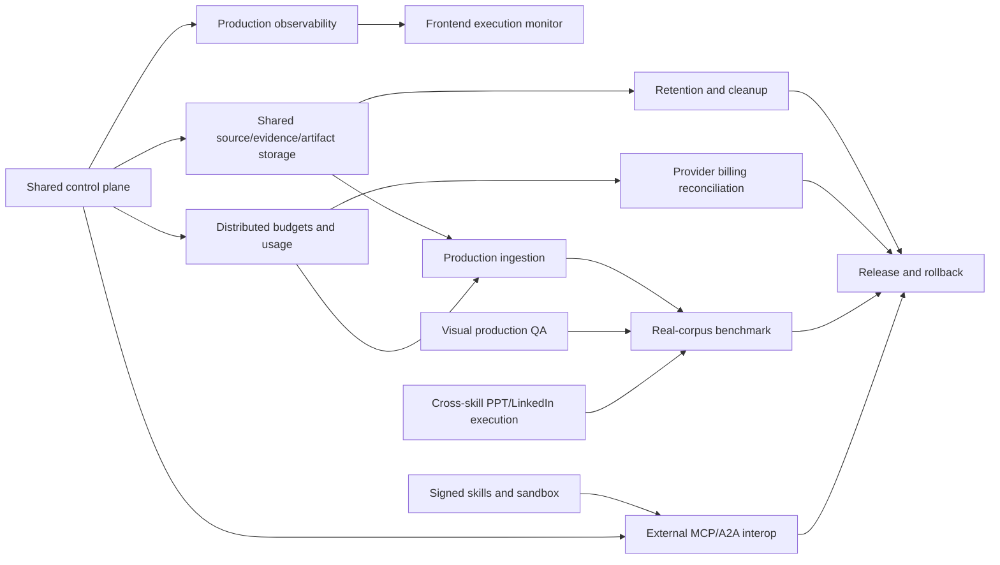

# Sudarshan 2.0 remaining-work execution plan

This plan starts after T38. The repository has a tested local agentic vertical
slice; this backlog closes the gap between that slice and a production-like,
multi-worker release.

## Release position

### T43–T52 implementation ledger (current branch)

The code slices for T43–T52 are implemented and covered by local component,
pipeline, frontend, and compile checks. They are not yet a production claim:
the live gates below require the team’s deployed Redis/object store,
sanitized real corpus, provider receipts, sandbox host, and human visual
approval.

| Ticket | Code now present | Remaining release gate |
| --- | --- | --- |
| T43 | `api/lifecycle.py` dry-run, lineage-aware cleanup, MCP operation | Kill-9/host-loss drill on deployed storage and retention policy review |
| T44 | `integrations/providers/receipts.py` common receipt/error mapping | Import real provider invoices and reconcile observed vs estimated cost |
| T45 | Native parent/child execution lanes and evidence drawer | Browser reconnect/E2E test through gateway and external MCP |
| T46 | Object-backed ingestion references and restart-safe resolution | Shared object-store migration, OCR/VLM measurements, long-video load test |
| T47 | Report archive schema and promotion metrics | Run reviewed sanitized corpora and approve per-artifact thresholds |
| T48 | Signed package verification and Docker/local sandbox policy | Production key management, resource limits, and hostile-package drills |
| T49 | Agent Card and A2A task/status/cancel adapter | Staging test with an independent MCP/A2A client |
| T50 | Shared SVG/raster/PDF/PPTX/video integrity gate and renderer promotion | Font/raster/video visual regression snapshots and human approval |
| T51 | Typed child-task specs, dependency validation, fallback reconciliation, runtime adapter | Wire every PPT/LinkedIn/video planner to the typed child plan and run full DAG demo |
| T52 | Release preflight models plus release/rollback runbooks | Execute all environment gates, backup/restore, and final owner sign-off |
| T53 | Capability-aware model/provider health router for image and TTS calls | Persist health across workers, add provider failover priorities, and validate with real quota/rate-limit receipts |
| T54 | Hierarchical L0/L1/L2 memory context selection | Run stage-policy checks against reviewed multimodal corpora and measure token/quality trade-offs |
| T55 | Lazy, bounded skill reference/resource policy | Expand pilot metadata to every built-in skill and add hostile-package/resource-limit drills |
| T56 | Shared renderer capability registry | Register deployed adapter versions and run visual promotion snapshots |
| T57 | Semantic diagram family and self-checker | Add reviewed examples for all diagram kinds and accessibility/human approval checks |
| T58 | Slide jobs and presentation quality workflow | Run editable PPTX visual regression and targeted repair loop on real decks |
| T59 | Provider-neutral video timeline and asset ledger | Run long-video/codec tests and verify shared object-store resume behavior |
| T60 | Memory lifecycle events and evaluation report | Run reviewed corpus benchmarks and connect event projection to production retention |

### Ready now

- Native DeepSeek Harness and external MCP application boundary.
- LangGraph routing/lifecycle with CrewAI specialist skills.
- Bounded parallel child execution, waiting, cancellation, retries, and
  reconnect-safe status/events.
- Typed ingestion for text, PDF, PPTX, images, and video.
- Scoped evidence index, Cognee projection boundary, cache, budgets, fallback,
  quality gates, artifacts, and dashboard-safe telemetry.
- Offline T38 benchmark and promotion gate.

### Not yet a production claim

- SQLite is still process/local-instance state.
- Raw sources, derived evidence, and artifacts need shared durable storage.
- External MCP/A2A clients need staging interoperability evidence.
- Visual production QA and real-corpus quality thresholds need deployed runs.
- Untrusted skill execution needs production key management and sandbox drills.
- Provider billing reconciliation is not yet authoritative.

## Non-negotiable architecture rules

1. Sudarshan contracts remain the source of truth; DeepSeek Harness, CrewAI,
   MCP, A2A, and provider SDKs are adapters.
2. LangGraph/application services own routing, lifecycle, authorization,
   budgets, idempotency, and terminal state. Harness session history does not
   become scheduler truth.
3. Exact evidence stays outside Cognee. Skills receive scoped,
   provenance-bearing context through `MemoryManager` and `EvidenceIndex`.
4. A cache hit is valid only for the same input, skill/version, policy,
   renderer/provider versions, authorization scope, and passed quality result.
5. Every retry consumes budget and produces a visible event. Every partial
   artifact carries an explicit quality state and fallback reason.
6. No model critic can override deterministic schema, security, source-map,
   renderer, or artifact-integrity gates.
7. Do not migrate from CrewAI, LangGraph, or the native Harness during this
   backlog. Prove portability through adapters and matched evaluations first.

## Dependency map

## Ticket backlog

### T39 — Shared control plane and lease semantics

Owner: backend/platform. Depends on: T08, T11, T14, T28, T37.

Implement a production-like control-plane adapter for run queue, ingestion
queue, DAG state, progress cursors, cache claims, and budget reservations.
Keep the current SQLite implementation as the local adapter. The selected
shared store must support atomic claim, lease renewal, fencing token, retry
schedule, idempotency key, and terminal transition.

Acceptance:

- Two workers cannot execute the same run or ingestion lease concurrently.
- A stale worker cannot write a terminal result after lease fencing.
- Restart and host-loss recovery preserve idempotency and event ordering.
- A contract test runs against both SQLite and the production-like adapter.

Current implementation slice (T39.11): `api/control_plane.py` freezes the
shared admission, lease, fencing, retry, terminal-transition, event, Redis
Stream discovery, `XAUTOCLAIM` recovery, and progress-projection contract.
`LocalRunScheduler` can use that adapter for shared admission, worker claims,
renewals, retries, terminal fencing, discovery of jobs admitted by another
process, and recovery of pending messages after consumer loss. The existing
typed `ProgressEvent` contract now has a Redis-backed sink with monotonic
per-run cursors, so SSE/replay consumers can reconnect to any worker. Run and
ingestion jobs use separate stream names, while SQLite remains the local
durable queue and default development mode. A reclaimed message whose fenced
run is still actively running is deliberately retained instead of
acknowledged. `DependencyDAG` and the PPT vertical can now accept the same
control plane for shared node claims, fenced completion, dependent-node
unlocking, and atomic per-run snapshot replication. A run snapshot is created
once and changed nodes are merged through Redis transactions, so a restarted
bridge can sync sibling completions without overwriting unrelated progress.
The exact-match cache
now uses Redis for shared entries, TTL, stampede claims, release, and
invalidation when the shared mode is enabled; SQLite remains the local
projection in default mode. Budget reservations, commits, releases, and
snapshots for the main run budget now use atomic Redis scripts in shared mode;
`UsageRecord.is_estimate` remains explicit and is not treated as billing truth.
The ingestion queue is shared, and parser/OCR/vision/summary/embedding stage
budgets and usage receipts now use the same Redis control-plane boundary when
shared mode is enabled. Optional live Redis
tests in `tests/integration/test_redis_control_plane.py` cover cross-process
discovery, single execution, stale-worker fencing, and DAG dependent unlock
when `REDIS_URL` (or
`SUDARSHAN_REDIS_URL`) and the `redis` extra are available. The code and
contract tests for T39 are complete; live deployment smoke and crash/host-loss
evidence remain an environment release gate.

### T40 — Shared source, evidence, and artifact storage

Owner: backend/data. Depends on: T32, T36, T39.

Separate immutable original sources, derived evidence, exact index rows, and
delivered artifacts. Add object-store interfaces with local filesystem and
staging implementations. Store checksums, media type, classification, owner,
retention class, and lineage; never put raw source content in events or Cognee.

Acceptance:

- Every source/evidence/artifact is addressable by an opaque ID and checksum.
- Download/preview requires scope and classification authorization.
- Restarted workers can resolve inputs without a process-local path.
- Encryption, backup, restore, and retention configuration are documented.

Current implementation slice (T40): `api/storage.py` provides an `ObjectStore`
contract, an opaque-ID/checksum-verified local backend, and an injected-client
S3-compatible backend with classification/scope checks, lineage metadata,
restart-safe materialization, and expiry cleanup. `ArtifactStore` and
ingestion can use `SUDARSHAN_OBJECT_STORE_MODE=durable` or `s3`; local
development remains backward-compatible. At-rest encryption is delegated to
the configured filesystem volume or S3/MinIO server-side encryption policy;
backup/restore drills remain an environment release gate.

### T41 — Distributed budget and usage ledger

Owner: backend/platform. Depends on: T13, T26, T37, T39.

Move reservations, child budgets, retry charges, fan-out limits, and usage
receipts from process-local counters to the control plane. Normalize provider
responses into `UsageRecord`; preserve `is_estimate` when the provider does
not return usage. Reconcile estimates and actuals without pretending gateway
token counts are billing truth.

Acceptance:

- Parent usage equals child usage plus explicitly labeled orchestration cost.
- Concurrent workers cannot overspend a run or ingestion budget.
- Retries, cache hits, provider cache reads/writes, and estimates are separate.
- A billing reconciliation report identifies missing or estimated fields.

Current implementation slice (T41): `IngestionBudgetController` and
`IngestionUsageRecorder` delegate to the shared control plane in Redis mode.
Atomic stage-unit/token/fan-out checks, shared registration, separate
estimated versus observed usage receipts, and the typed usage charge taxonomy
(`provider`, `retry`, `cache_hit`, `cache_write`, `orchestration`) are covered
by component tests. Reconciliation remains explicitly non-billing-truth until
provider invoices or gateway receipts are imported by T44.

### T42 — Production observability and audit retention

Owner: backend/operations. Depends on: T26, T39, T41.

Export structured traces/logs/metrics through a controlled collector. Keep the
safe dashboard projection separate from restricted operator diagnostics. Add
retention, role-based access, correlation across workers, and redaction tests.

Acceptance:

- A run can be followed from request to child skill, provider call, artifact,
  quality decision, and delivery.
- Prompts, raw memory, credentials, and hidden reasoning never enter the safe
  projection.
- Queue wait, provider wait, worker time, retries, cache savings, and quality
  status are queryable by run and skill.
- Audit records are tamper-evident and retention-expired records are removed.

Current implementation slice (T42): the safe observability collector now
stores allow-listed correlated events with a per-run hash chain, classification
and operator checks, dashboard-safe summaries, integrity verification, and
retention dry-run/purge. Redis provides a bounded cross-worker dashboard
projection while SQLite remains the tamper-evident audit source. An optional
dependency-free HTTP collector is configured by
`SUDARSHAN_OBSERVABILITY_EXPORT_URL`; export failures are isolated from work.
Collector authentication, retention, and deployment topology remain
environment configuration gates.

### T43 — Retention, garbage collection, and abandoned-work cleanup

Owner: backend/operations. Depends on: T40, T42.

Implement lifecycle workers for expired cache metadata, abandoned leases,
staged sources, incomplete evidence, previews, and unreferenced artifacts.
Deletion must be lineage-aware and classification-aware; never delete a file
only because a worker crashed.

Acceptance:

- A dry-run reports candidates before deletion.
- Active manifests and referenced parents are never deleted.
- Failed and cancelled runs clean temporary data without removing audit rows.
- Kill-9 and host-loss tests prove cleanup is safe and repeatable.

### T44 — Provider and billing reconciliation

Owner: backend/provider. Depends on: T41, T42.

Add provider adapters for normalized latency, request ID, model, input/output
tokens, cached tokens, media units, finish reason, and retry-after hints.
Record provider response IDs for reconciliation, while redacting prompts and
credentials. Keep provider-specific fields under an extension namespace.

Acceptance:

- OpenAI/DeepSeek/other configured providers map to the same common receipt.
- Missing usage is explicitly marked estimated.
- A run can show estimated, observed, and reconciled cost separately.
- Provider timeout/rate-limit/auth tests exercise distinct retry behavior.

### T45 — Native execution monitor and evidence drawer

Owner: frontend. Depends on: T39, T40, T42, current status API.

Add parent/child execution lanes, wait reasons, queue wait, usage, cache,
fallback, quality, and artifact cards. Add an evidence drawer showing only
authorized evidence IDs, source locations, confidence, provenance, and links
to previews. Do not display raw model reasoning.

Acceptance:

- Refresh/reconnect resumes from a cursor and does not duplicate events.
- Users can distinguish queued, capacity wait, provider pending, approval,
  retry, partial, failed, and cancelled states.
- The same monitor works through native Harness and ordinary MCP entry points.

### T46 — Production ingestion migration

Owner: ingestion/data/backend. Depends on: T39, T40, T41, T43.

Replace process-local source paths with object references, persist manifests,
typed evidence, chunks, relationships, and quality reports, and run bounded
page/slide/scene fan-out through the shared control plane. Add OCR/VLM fallback
selection from measured modality confidence, not unrestricted agent decisions.

Acceptance:

- Reconnect and restart resume ingestion without reparsing completed stages.
- Duplicate uploads with the same source/policy identity are idempotent.
- Cross-user, cross-case, and classification isolation tests pass.
- Long video ingestion remains bounded by duration, scene, token, and wall-time
  budgets.

### T47 — Real-corpus multimodal promotion benchmark

Owner: evaluation/all teams. Depends on: T38, T40, T41, T42, T46, T50, T51.

Run the existing evaluator against reviewed sanitized corpora: scanned and
table-heavy PDFs, PPTX decks with notes/shapes, infographics, long videos,
paraphrased queries, partial failures, and cross-skill evidence reuse. Compare
flat text, typed evidence, and progressive context packs.

Acceptance:

- The archived report includes coverage, recall, faithfulness, groundedness,
  tokens, cost, P50/P95 latency, queue wait, cache hit rate, repair rate, and
  human correction time.
- Thresholds are approved per artifact type; no universal score is invented.
- Promotion is blocked when quality, security, or cost thresholds fail.

### T48 — Signed skill packages and execution sandbox

Owner: security/platform. Depends on: T27, T39, T40, T42.

Add signed/versioned skill manifests, package hashes, trust tiers, dependency
allow-lists, capability grants, and an OS/container sandbox for untrusted or
user-added skills. Keep built-in skills on the same contract but with a
separate trusted execution profile.

Acceptance:

- Tampered or unsigned packages cannot be loaded as executable skills.
- A skill cannot access another case, secret, source, or tool outside its grant.
- CPU, memory, network, file, subprocess, and wall-time limits are enforced.
- Sandbox failures produce typed, auditable, non-secret errors.

### T49 — External MCP and A2A interoperability

Owner: Harness/agentic/backend. Depends on: T39, T41, T42, T48.

Run the same request through native DeepSeek Harness, an independent MCP
client, and an A2A-compatible adapter. Preserve Sudarshan run IDs, budgets,
events, artifacts, quality reports, and cancellation semantics at every entry
point.

Acceptance:

- External clients receive handles for long work and use bounded wait/status.
- MCP/A2A clients cannot bypass policy, memory, budgets, or artifact checks.
- Native Harness adds UI/skill composition value but is not required for the
  backend to execute a valid request.

### T50 — Production visual QA and renderer promotion

Owner: rendering/frontend/evaluation. Depends on: T18, T19, T20, T21, T22,
T40, T42.

Add font-aware measurement, rasterized PPT inspection, contrast/density checks,
PNG visual regression for infographics/diagrams, rendered-media checks for
video, and renderer-version promotion. Store QA snapshots and diagnostics as
artifacts linked to the quality report.

Acceptance:

- Off-canvas, overlap, overflow, unreadable text, missing media, and broken
  source maps fail deterministically.
- PPT preview and editable PPTX use the same layout source.
- Renderer fallback is visible as degraded/partial, never silently equivalent.
- A human can approve/reject a visual artifact with an auditable reason.

### T51 — Full cross-skill execution

Owner: agentic/pipeline teams. Depends on: T10, T11, T20, T22, T25, T40,
T41, T50.

Complete dynamic child routing: PPT planner can request flowchart, diagram,
infographic, or chart skills per slide; LinkedIn can request a visual child;
video can request evidence/visual/audio children. The central planner creates
typed child tasks, not free-form nested prompts, and reconciles child artifact
and quality references into the parent output.

Acceptance:

- Child calls are explicit in the plan/DAG with input evidence IDs and output
  contracts.
- Independent children execute in parallel; dependencies and budgets are
  enforced.
- A failed optional child yields a typed fallback; a required child blocks
  delivery with an actionable quality report.
- Parent artifacts include child lineage and no orphaned visual artifacts.

### T52 — Release, rollback, and operating sign-off

Owner: release/all teams. Depends on: T43, T44, T47, T48, T49, T50, T51.

Run Python, Node, frontend, Harness, MCP, A2A, sandbox, migration, backup,
restore, and failure-injection checks. Pin versions, publish manifests,
prepare rollback and data-migration notes, and run a synthetic end-to-end demo.

Acceptance:

- Release candidate passes all stop/go gates below.
- Every production dependency has an owner, health check, backup, rollback,
  and failure runbook.
- The demo can show planning, bounded parallel skills, waiting, evidence,
  quality failure/repair, final artifact, and safe logs without secrets.
- Product claims say “measured on our benchmark” and include the benchmark
  date/version.

### T53 — Capability-aware model/provider routing

Owner: backend/provider. Depends on: T13, T21, T26, T44.

The local slice adds `ProviderRouter`, model resolution for media capabilities,
quota/rate-limit/authentication classification, cooldown protection, and
explicit LinkedIn/video degradation metadata. It deliberately does not create
a second scheduler or hide provider failures behind a successful-looking
artifact.

Acceptance for the local slice:

- Repeated quota failures are blocked during cooldown instead of creating a
  parallel retry storm.
- LinkedIn falls back to prompt-only output with a stable failure class.
- Video falls back to a local title card or silent narration and reports
  `degraded` plus per-scene reasons.
- Model/provider state is safe for concurrent in-process scene execution.

Remaining release work:

- Move health state into the shared control plane for multi-worker deployment.
- Add provider priority/failover configuration when a second media provider is
  approved.
- Reconcile provider receipts and expose safe health/fallback events in the
  operator dashboard.

## T61–T83 — Audit-derived capability improvements

These tickets extend the existing contract-first architecture. They do not
replace LangGraph, the durable scheduler, `SkillRuntime`, CrewAI specialist
crews, MCP, or the current artifact/quality boundaries. A social connector is
an adapter behind the capability firewall; it is not a second scheduler. The
default LinkedIn behavior remains draft-only.

### T61 — LinkedIn skill contracts

Owner: agentic/backend. Depends on: T15, T25, T51.

Split the current LinkedIn surface into versioned contracts for
`linkedin.post`, `linkedin.comment`, `linkedin.reply`, `linkedin.reshare`, and
`linkedin.humanizer`. Keep the existing `linkedin.post` input/output
compatibility projection while adding separate manifests, schemas, policies,
failure cases, and smoke fixtures.

Acceptance:

- Each skill declares its own tools, risk class, budget, child skills, and side
  effects.
- Draft skills cannot access external write capabilities.
- Existing `linkedin.post` tests and frontend projections remain compatible.

### T62 — Deterministic LinkedIn humanizer V2

Owner: agentic/evaluation. Depends on: T61, T25.

Extend `pipelines/linkedin/humanizer.py` with explainable paragraph-density,
rhythm, fragment, triad, reveal-bridge, and over-correction checks. Preserve
the NTRO rule that humanization cannot change evidence or invent personal
details and never claim to defeat an AI detector.

Acceptance:

- The report contains stable rule IDs, locations, severity, and repair advice.
- A clean draft is not rewritten merely to produce a score.
- Missing concrete details produce a request or warning, never fabricated text.
- Existing humanizer tests remain green and new fixtures cover every new rule.

### T63 — Social connector boundary

Owner: backend/platform. Depends on: T12, T27, T49, T61.

Add a provider-neutral social capability boundary for reading posts/comments
and writing posts/comments/replies. Implement it as an adapter contract using
the existing provider receipt, policy, timeout, cancellation, and audit seams.

Acceptance:

- Skills do not import provider SDKs or read credentials directly.
- Manual mode works without credentials.
- External providers are represented by typed receipts and failure classes.
- No connector can bypass scheduler, approval, scope, or artifact policy.

### T64 — LinkedIn environment and configuration contract

Owner: backend/platform. Depends on: T53, T63.

Document optional LinkedIn read/write provider settings in `.env.example`,
including provider selection, cache TTL, timeout, retry, rate-limit, and
platform connection identifiers. Keep `.env` ignored and do not add secrets or
reference-provider credentials.

Acceptance:

- Startup validates configuration shape without requiring LinkedIn credentials.
- Secret values never enter skill context, events, cache metadata, or safe logs.
- Missing credentials result in an explicit manual/draft fallback.

### T65 — LinkedIn read layer and scoped cache

Owner: backend/provider. Depends on: T40, T41, T42, T63, T64.

Implement bounded `fetch_post`, `fetch_comments`, and `fetch_thread` adapter
operations. Cache only authorization-scoped, versioned, non-secret responses;
mark fetched content as untrusted data and preserve source/provenance metadata.

Acceptance:

- Cache fingerprints include provider, URL/URN, request parameters, skill
  version, authorization scope, and policy version.
- TTL, invalidation, timeout, retry, and rate-limit behavior are tested.
- Fetched text cannot alter approval, target, tool, or publication decisions.

### T66 — Durable social approval and release

Owner: backend/frontend. Depends on: T39, T42, T63, T65.

Add separate approval-resume operations for comment, reply, post, reshare, and
schedule. Persist the approved payload hash, actor, policy decision,
idempotency key, provider request ID, and final receipt.

Acceptance:

- No external write occurs without an authorized approval event.
- Duplicate worker execution cannot publish the same action twice.
- Timeout, rate-limit, provider-pending, cancellation, and rejection states
  remain visible and resumable.
- Draft-only mode never invokes a write adapter.

### T67 — Execute and reconcile LinkedIn child plans

Owner: agentic/pipeline. Depends on: T51, T61, T63.

Wire the real LinkedIn flow to execute its typed child plan through
`SkillRuntime`, then reconcile child artifact and quality references into the
parent output. Storing a child plan without executing it is not completion.

Acceptance:

- LinkedIn visual children execute through the same runtime as PPT and
  infographic children.
- Optional child failure returns a typed fallback and does not create an orphan.
- Required child failure blocks delivery with a quality report.
- Parent output includes child lineage and remains `draft_only`.

### T68 — LinkedIn end-to-end evaluation

Owner: evaluation/release. Depends on: T62, T65, T66, T67.

Add offline fixtures for grounded posts, unsupported claims, humanizer repair,
missing connector, approval, retry, timeout, cancellation, visual child
execution, and safe fallback.

Acceptance:

- The test demonstrates parent → child → quality → approval → artifact receipt.
- Tests use fake providers only; no live LinkedIn call is required.
- Token, latency, cache, retry, and correction-time measurements are recorded.

### T69 — Semantic visual-child routing

Owner: agentic/rendering. Depends on: T57, T67.

Route visual requests between `visual.flowchart`, `infographic`, and future
diagram-family skills using typed semantic intent, not only keyword matching.

Acceptance:

- The selected child and reason are recorded in the child plan.
- Parent evidence IDs and theme/layout constraints are passed explicitly.
- Existing flowchart routing remains the compatibility fallback.

### T70 — Opt-in LinkedIn voice profile

Owner: agentic/memory. Depends on: T24, T60, T61.

Add a user-scoped, versioned voice profile with explicit opt-in, edit, and
forget operations. It may guide wording but cannot create facts, authority, or
release permission.

Acceptance:

- Voice data is isolated by user scope and excluded from unrelated cases.
- Profile changes are auditable and reversible.
- Missing profile data does not block ordinary draft generation.

### T71 — Comment/reply quality policies

Owner: agentic. Depends on: T61, T62, T65.

Add typed checks for comment length, generic praise, duplicate text, stale
threads, author context, and correct top-level LinkedIn parent resolution.

Acceptance:

- A reply to a nested comment resolves the correct top-level parent.
- Generic praise and thread spam are blocked or explicitly flagged.
- Thread text remains untrusted source data.

### T72 — Social retry, rate-limit, and idempotency policy

Owner: backend/provider. Depends on: T41, T63, T66.

Normalize transient status handling, retry-after hints, provider request IDs,
and deterministic action keys for social writes.

Acceptance:

- Retryable and non-retryable errors are distinct.
- Retries consume the existing budget ledger.
- A replayed job does not duplicate a successful external action.

### T73 — Durable LinkedIn scheduling

Owner: backend. Depends on: T39, T66, T72.

Represent scheduled publication as a durable Sudarshan job rather than a
fire-and-forget provider call. Support status, cancellation, retry, and
provider receipt projection.

Acceptance:

- Scheduled work survives process restart.
- Past schedules, cancellation, provider-pending, and failed states are safe.
- Scheduling remains approval-gated.

### T74 — LinkedIn frontend workspace

Owner: frontend. Depends on: T45, T66, T68.

Add social preview, humanizer findings, target/thread context, approval action,
connector status, scheduling state, and final publishing receipt to the
existing artifact/run projections.

Acceptance:

- The UI renders safe projections only; it never renders raw prompts or
  private memory.
- Refresh/reconnect preserves approval and job status.
- Manual mode provides a copy/export fallback.

### T75 — Optional thread monitoring

Owner: agentic/backend. Depends on: T65, T73.

Add opt-in monitoring for replies and warm threads. Produce suggestions and
approval requests; never auto-reply from a monitor result.

Acceptance:

- Monitoring is rate-limited, cached, cancellable, and scope-aware.
- Old or deleted threads are reported as non-actionable.
- Suggested replies remain separate from publishing.

### T76 — Offline social provider test doubles

Owner: backend/evaluation. Depends on: T63.

Provide fake manual, MCP, provider-success, timeout, quota, rate-limit, and
authorization-failure adapters.

Acceptance:

- Social tests are deterministic and network-free.
- Each fake emits the same receipt/error shape as a real adapter.
- No test requires real provider credentials.

### T77 — Memory lifecycle hooks and lessons

Owner: memory/agentic. Depends on: T24, T60.

Add bounded session/tool/compaction/end hooks for asynchronous lesson capture,
while keeping scheduler work independent of memory telemetry.

Acceptance:

- Hook failures never fail the user run.
- Lessons are scoped, confidence-bearing, reviewable, and forgettable.
- Hook work has a timeout and does not block the main request path.

### T78 — Hierarchical context references

Owner: memory/backend. Depends on: T36, T54.

Expose stable Sudarshan-owned abstract, overview, and detail references for
sources, skills, and artifacts. Reimplement the useful OpenViking semantics;
do not copy AGPL code.

Acceptance:

- Agents can request overview before detail.
- References preserve scope, provenance, classification, and checksum.
- Full content is loaded only after a policy-allowed detail request.

### T79 — Diagram self-checker

Owner: rendering/security. Depends on: T50, T57.

Add deterministic checks for SVG/HTML accessibility, unsafe URLs/scripts,
connector geometry, overflow, complexity budget, and missing labels.

Acceptance:

- Unsafe or externally dependent artifacts fail closed.
- Accessibility and geometry diagnostics are attached to quality reports.
- Existing SVG/PPTX artifact contracts remain unchanged.

### T80 — Infographic template and theme registry

Owner: rendering/frontend. Depends on: T22, T50, T57.

Add a discoverable typed registry for approved infographic layouts, themes, and
SSR/export capabilities. Keep the current AntV bridge as the renderer seam.

Acceptance:

- Templates are selected by typed data shape and visual intent.
- SVG, PNG, and fallback modes remain explicit.
- No template can introduce external network dependencies silently.

### T81 — Video asset fingerprint cache

Owner: video/backend. Depends on: T40, T41, T59.

Fingerprint scene prompts, source media, audio settings, subtitles, and
composition parameters so unchanged video stages are reused safely.

Acceptance:

- Cache hits preserve authorization scope and renderer/provider versions.
- Partial failures rerun only missing or invalid stages.
- Cleanup is lineage-aware and never deletes referenced assets.

### T82 — PPT targeted repair loop

Owner: PPT/rendering. Depends on: T50, T51, T58.

Convert visual QA diagnostics into bounded slide-level repair patches and
rerender only affected slides.

Acceptance:

- Repairs cannot alter evidence bindings without revalidation.
- A failed repair remains an explicit quality failure.
- Preview and editable PPTX continue to use the same layout source.

### T83 — Reference provenance and license ledger

Owner: security/release. Depends on: T48, T52.

Record adopted design ideas, source repositories, versions, and license
constraints. Keep reference repositories as design inputs unless code reuse is
individually reviewed.

Acceptance:

- OpenViking AGPL code is not copied into Sudarshan.
- MIT/Apache reuse retains required notices and review records.
- Release documentation identifies which behavior is native Sudarshan code.

## Agentic ticket status — current implementation pass

Completed locally with focused and full-suite verification:

- T61: `linkedin.post`, `linkedin.comment`, `linkedin.reply`,
  `linkedin.reshare`, and `linkedin.humanizer` packages now have manifests,
  schemas, policies, failure cases, and smoke fixtures.
- T62: Humanizer V2 adds stable rule IDs, paragraph locations, cadence,
  density, reveal-bridge, triad, fragment, over-correction, concrete-detail,
  and explicit voice-policy findings without rewriting evidence.
- T67: LinkedIn visual child plans execute through `SkillRuntime`; successful
  artifact and quality references reconcile into the parent `visual_child`
  projection, while failure remains typed and draft-only.
- T68: Offline tests cover package discovery, humanizer findings, visual child
  execution/reconciliation, voice profiles, and comment/reply policy seams.
- T69: Explicit LinkedIn infographic intent routes to `infographic`; diagram
  intent remains on `visual.flowchart`, with the existing fallback preserved.
- T70: Explicit, bounded `VoiceProfile` parsing is available and is applied as
  style guidance only; no profile data creates facts or publish authority.
- T71: Comment/reply length/link/exclamation checks and identifier-based
  top-level parent resolution are available as deterministic policy helpers.
- T77: Non-blocking lifecycle hooks and scoped `MemoryManager.remember_lesson`
  are available; hook failures are isolated from the main run.
- T78: Stable `sudarshan://context/.../L0|L1|L2` references are attached to
  memory/context projections and preserve scope and source identity.

Still open and intentionally not marked complete in this pass: T63–T66,
T72–T76 (social connector, durable scheduling, frontend, and provider-test
infrastructure), and T79–T83 (renderer hardening, video/PPT repair, and
release/license ledger). Those require backend/frontend/rendering/release
ownership beyond the agentic slice.

### T61–T83 compatibility gate

Before marking any ticket complete, run the existing contract, component, API,
frontend, and compile suites. The following rules are mandatory:

- No second scheduler is introduced.
- No existing manifest loses a required field or capability.
- `linkedin.post` remains draft-only by default.
- Child skills use `SkillRuntime`, `RunPolicy`, existing budgets, cancellation,
  lineage, and quality reconciliation.
- Provider failures degrade explicitly; they never become successful-looking
  artifacts.
- New external integrations use fake adapters in tests and optional settings
  in `.env.example`; `.env` remains ignored.

## Parallel team plan

### Backend/platform

Start T39, then T40/T41 in parallel. Follow with T42–T44 and T46. Own common
contracts, leases, budgets, storage, provider receipts, cleanup, APIs, and
failure injection.

### Agentic/Harness

Start T48 design alongside T39. Implement T49 and T51 after the control-plane
contracts stabilize. Own planner/DAG child routing, native Harness adapters,
MCP/A2A portability, skill manifests, and sandbox policy integration.

### Frontend

Start T45 against the current API projection. Integrate T42 telemetry and T50
visual QA after backend contracts are frozen. Own execution monitor, evidence
drawer, artifact/quality workspace, approvals, reconnect behavior, and safe
operator logs.

### Rendering/media

Start T50 with existing artifacts and fixtures. Add rasterized PPT, infographic,
diagram, and video checks; then support T51 child reconciliation. Do not change
renderer APIs without a compatibility fixture.

### Evaluation/release/security

Define T47 thresholds early, review T48 threat cases, and own T52 sign-off.
Evaluation must report failures and regressions, not only successful demos.

## Stop/go gates

| Gate | Required tickets | Go condition |
| --- | --- | --- |
| Demo-ready | Current local work through T38 | Local tests pass; native Harness demo is reproducible; claims are limited to a vertical slice. |
| Staging-ready | T39–T46, T48 | Shared control/storage path, safe telemetry, retention, sandbox policy, and restart/cross-case tests pass. |
| Interoperability-ready | T49, T51 | Native Harness, independent MCP, and A2A path complete the same lifecycle with identical policy and artifact contracts. |
| Quality-ready | T47, T50 | Real/sanitized benchmark meets per-artifact thresholds and visual gates pass. |
| Production-ready | T52 plus all previous gates | Backup/restore, rollback, security, cost, reliability, ownership, and operating runbooks are signed off. |

## Immediate next sprint

1. Backend: choose and prototype the shared control-plane adapter (T39).
2. Backend/data: define object-store and lineage interfaces (T40).
3. Platform: define distributed budget/usage receipt fixtures (T41).
4. Frontend: build the monitor against current status/telemetry fields (T45).
5. Evaluation/security: freeze benchmark thresholds and sandbox threat cases
   before implementation shortcuts become production assumptions.

## Deployment assumptions to resolve

Track every unresolved item in
[the assumption ledger](sudarshan-2.0-assumptions.md). In particular, confirm
the shared store, object-storage classification/retention policy, provider
billing fields, sandbox runtime, external MCP/A2A clients, benchmark corpus
owner, and final visual acceptance authority before T52 sign-off.
