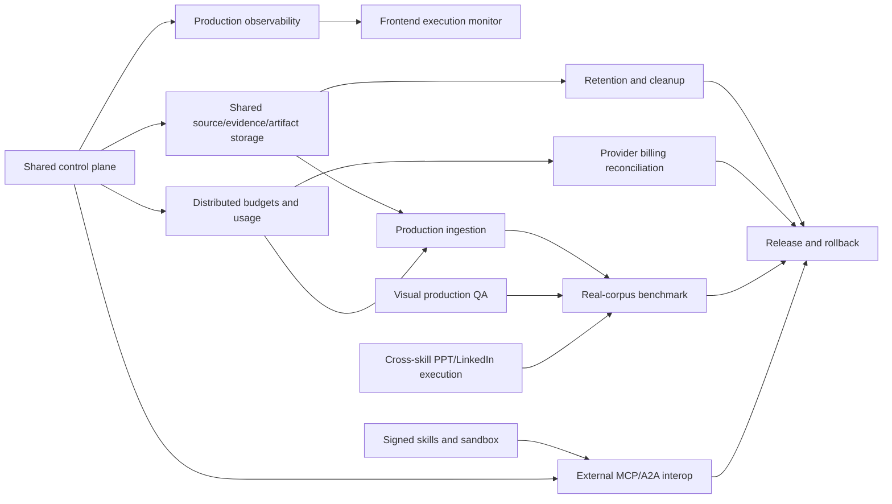

# Sudarshan 2.0 remaining-work execution plan

This plan starts after T38. The repository has a tested local agentic vertical
slice; this backlog closes the gap between that slice and a production-like,
multi-worker release.

## Release position

### Ready now

- Native DeepSeek Harness and external MCP application boundary.
- LangGraph routing/lifecycle with CrewAI specialist skills.
- Bounded parallel child execution, waiting, cancellation, retries, and
  reconnect-safe status/events.
- Typed ingestion for text, PDF, PPTX, images, and video.
- Scoped evidence index, Cognee projection boundary, cache, budgets, fallback,
  quality gates, artifacts, and dashboard-safe telemetry.
- Offline T38 benchmark and promotion gate.

### Not yet a production claim

- SQLite is still process/local-instance state.
- Raw sources, derived evidence, and artifacts need shared durable storage.
- External MCP/A2A clients need staging interoperability evidence.
- Visual production QA and real-corpus quality thresholds are incomplete.
- Untrusted skill execution needs signed packages and an OS/container sandbox.
- Provider billing reconciliation is not yet authoritative.

## Non-negotiable architecture rules

1. Sudarshan contracts remain the source of truth; DeepSeek Harness, CrewAI,
   MCP, A2A, and provider SDKs are adapters.
2. LangGraph/application services own routing, lifecycle, authorization,
   budgets, idempotency, and terminal state. Harness session history does not
   become scheduler truth.
3. Exact evidence stays outside Cognee. Skills receive scoped,
   provenance-bearing context through `MemoryManager` and `EvidenceIndex`.
4. A cache hit is valid only for the same input, skill/version, policy,
   renderer/provider versions, authorization scope, and passed quality result.
5. Every retry consumes budget and produces a visible event. Every partial
   artifact carries an explicit quality state and fallback reason.
6. No model critic can override deterministic schema, security, source-map,
   renderer, or artifact-integrity gates.
7. Do not migrate from CrewAI, LangGraph, or the native Harness during this
   backlog. Prove portability through adapters and matched evaluations first.

## Dependency map

## Ticket backlog

### T39 — Shared control plane and lease semantics

Owner: backend/platform. Depends on: T08, T11, T14, T28, T37.

Implement a production-like control-plane adapter for run queue, ingestion
queue, DAG state, progress cursors, cache claims, and budget reservations.
Keep the current SQLite implementation as the local adapter. The selected
shared store must support atomic claim, lease renewal, fencing token, retry
schedule, idempotency key, and terminal transition.

Acceptance:

- Two workers cannot execute the same run or ingestion lease concurrently.
- A stale worker cannot write a terminal result after lease fencing.
- Restart and host-loss recovery preserve idempotency and event ordering.
- A contract test runs against both SQLite and the production-like adapter.

### T40 — Shared source, evidence, and artifact storage

Owner: backend/data. Depends on: T32, T36, T39.

Separate immutable original sources, derived evidence, exact index rows, and
delivered artifacts. Add object-store interfaces with local filesystem and
staging implementations. Store checksums, media type, classification, owner,
retention class, and lineage; never put raw source content in events or Cognee.

Acceptance:

- Every source/evidence/artifact is addressable by an opaque ID and checksum.
- Download/preview requires scope and classification authorization.
- Restarted workers can resolve inputs without a process-local path.
- Encryption, backup, restore, and retention configuration are documented.

### T41 — Distributed budget and usage ledger

Owner: backend/platform. Depends on: T13, T26, T37, T39.

Move reservations, child budgets, retry charges, fan-out limits, and usage
receipts from process-local counters to the control plane. Normalize provider
responses into `UsageRecord`; preserve `is_estimate` when the provider does
not return usage. Reconcile estimates and actuals without pretending gateway
token counts are billing truth.

Acceptance:

- Parent usage equals child usage plus explicitly labeled orchestration cost.
- Concurrent workers cannot overspend a run or ingestion budget.
- Retries, cache hits, provider cache reads/writes, and estimates are separate.
- A billing reconciliation report identifies missing or estimated fields.

### T42 — Production observability and audit retention

Owner: backend/operations. Depends on: T26, T39, T41.

Export structured traces/logs/metrics through a controlled collector. Keep the
safe dashboard projection separate from restricted operator diagnostics. Add
retention, role-based access, correlation across workers, and redaction tests.

Acceptance:

- A run can be followed from request to child skill, provider call, artifact,
  quality decision, and delivery.
- Prompts, raw memory, credentials, and hidden reasoning never enter the safe
  projection.
- Queue wait, provider wait, worker time, retries, cache savings, and quality
  status are queryable by run and skill.
- Audit records are tamper-evident and retention-expired records are removed.

### T43 — Retention, garbage collection, and abandoned-work cleanup

Owner: backend/operations. Depends on: T40, T42.

Implement lifecycle workers for expired cache metadata, abandoned leases,
staged sources, incomplete evidence, previews, and unreferenced artifacts.
Deletion must be lineage-aware and classification-aware; never delete a file
only because a worker crashed.

Acceptance:

- A dry-run reports candidates before deletion.
- Active manifests and referenced parents are never deleted.
- Failed and cancelled runs clean temporary data without removing audit rows.
- Kill-9 and host-loss tests prove cleanup is safe and repeatable.

### T44 — Provider and billing reconciliation

Owner: backend/provider. Depends on: T41, T42.

Add provider adapters for normalized latency, request ID, model, input/output
tokens, cached tokens, media units, finish reason, and retry-after hints.
Record provider response IDs for reconciliation, while redacting prompts and
credentials. Keep provider-specific fields under an extension namespace.

Acceptance:

- OpenAI/DeepSeek/other configured providers map to the same common receipt.
- Missing usage is explicitly marked estimated.
- A run can show estimated, observed, and reconciled cost separately.
- Provider timeout/rate-limit/auth tests exercise distinct retry behavior.

### T45 — Native execution monitor and evidence drawer

Owner: frontend. Depends on: T39, T40, T42, current status API.

Add parent/child execution lanes, wait reasons, queue wait, usage, cache,
fallback, quality, and artifact cards. Add an evidence drawer showing only
authorized evidence IDs, source locations, confidence, provenance, and links
to previews. Do not display raw model reasoning.

Acceptance:

- Refresh/reconnect resumes from a cursor and does not duplicate events.
- Users can distinguish queued, capacity wait, provider pending, approval,
  retry, partial, failed, and cancelled states.
- The same monitor works through native Harness and ordinary MCP entry points.

### T46 — Production ingestion migration

Owner: ingestion/data/backend. Depends on: T39, T40, T41, T43.

Replace process-local source paths with object references, persist manifests,
typed evidence, chunks, relationships, and quality reports, and run bounded
page/slide/scene fan-out through the shared control plane. Add OCR/VLM fallback
selection from measured modality confidence, not unrestricted agent decisions.

Acceptance:

- Reconnect and restart resume ingestion without reparsing completed stages.
- Duplicate uploads with the same source/policy identity are idempotent.
- Cross-user, cross-case, and classification isolation tests pass.
- Long video ingestion remains bounded by duration, scene, token, and wall-time
  budgets.

### T47 — Real-corpus multimodal promotion benchmark

Owner: evaluation/all teams. Depends on: T38, T40, T41, T42, T46, T50, T51.

Run the existing evaluator against reviewed sanitized corpora: scanned and
table-heavy PDFs, PPTX decks with notes/shapes, infographics, long videos,
paraphrased queries, partial failures, and cross-skill evidence reuse. Compare
flat text, typed evidence, and progressive context packs.

Acceptance:

- The archived report includes coverage, recall, faithfulness, groundedness,
  tokens, cost, P50/P95 latency, queue wait, cache hit rate, repair rate, and
  human correction time.
- Thresholds are approved per artifact type; no universal score is invented.
- Promotion is blocked when quality, security, or cost thresholds fail.

### T48 — Signed skill packages and execution sandbox

Owner: security/platform. Depends on: T27, T39, T40, T42.

Add signed/versioned skill manifests, package hashes, trust tiers, dependency
allow-lists, capability grants, and an OS/container sandbox for untrusted or
user-added skills. Keep built-in skills on the same contract but with a
separate trusted execution profile.

Acceptance:

- Tampered or unsigned packages cannot be loaded as executable skills.
- A skill cannot access another case, secret, source, or tool outside its grant.
- CPU, memory, network, file, subprocess, and wall-time limits are enforced.
- Sandbox failures produce typed, auditable, non-secret errors.

### T49 — External MCP and A2A interoperability

Owner: Harness/agentic/backend. Depends on: T39, T41, T42, T48.

Run the same request through native DeepSeek Harness, an independent MCP
client, and an A2A-compatible adapter. Preserve Sudarshan run IDs, budgets,
events, artifacts, quality reports, and cancellation semantics at every entry
point.

Acceptance:

- External clients receive handles for long work and use bounded wait/status.
- MCP/A2A clients cannot bypass policy, memory, budgets, or artifact checks.
- Native Harness adds UI/skill composition value but is not required for the
  backend to execute a valid request.

### T50 — Production visual QA and renderer promotion

Owner: rendering/frontend/evaluation. Depends on: T18, T19, T20, T21, T22,
T40, T42.

Add font-aware measurement, rasterized PPT inspection, contrast/density checks,
PNG visual regression for infographics/diagrams, rendered-media checks for
video, and renderer-version promotion. Store QA snapshots and diagnostics as
artifacts linked to the quality report.

Acceptance:

- Off-canvas, overlap, overflow, unreadable text, missing media, and broken
  source maps fail deterministically.
- PPT preview and editable PPTX use the same layout source.
- Renderer fallback is visible as degraded/partial, never silently equivalent.
- A human can approve/reject a visual artifact with an auditable reason.

### T51 — Full cross-skill execution

Owner: agentic/pipeline teams. Depends on: T10, T11, T20, T22, T25, T40,
T41, T50.

Complete dynamic child routing: PPT planner can request flowchart, diagram,
infographic, or chart skills per slide; LinkedIn can request a visual child;
video can request evidence/visual/audio children. The central planner creates
typed child tasks, not free-form nested prompts, and reconciles child artifact
and quality references into the parent output.

Acceptance:

- Child calls are explicit in the plan/DAG with input evidence IDs and output
  contracts.
- Independent children execute in parallel; dependencies and budgets are
  enforced.
- A failed optional child yields a typed fallback; a required child blocks
  delivery with an actionable quality report.
- Parent artifacts include child lineage and no orphaned visual artifacts.

### T52 — Release, rollback, and operating sign-off

Owner: release/all teams. Depends on: T43, T44, T47, T48, T49, T50, T51.

Run Python, Node, frontend, Harness, MCP, A2A, sandbox, migration, backup,
restore, and failure-injection checks. Pin versions, publish manifests,
prepare rollback and data-migration notes, and run a synthetic end-to-end demo.

Acceptance:

- Release candidate passes all stop/go gates below.
- Every production dependency has an owner, health check, backup, rollback,
  and failure runbook.
- The demo can show planning, bounded parallel skills, waiting, evidence,
  quality failure/repair, final artifact, and safe logs without secrets.
- Product claims say “measured on our benchmark” and include the benchmark
  date/version.

## Parallel team plan

### Backend/platform

Start T39, then T40/T41 in parallel. Follow with T42–T44 and T46. Own common
contracts, leases, budgets, storage, provider receipts, cleanup, APIs, and
failure injection.

### Agentic/Harness

Start T48 design alongside T39. Implement T49 and T51 after the control-plane
contracts stabilize. Own planner/DAG child routing, native Harness adapters,
MCP/A2A portability, skill manifests, and sandbox policy integration.

### Frontend

Start T45 against the current API projection. Integrate T42 telemetry and T50
visual QA after backend contracts are frozen. Own execution monitor, evidence
drawer, artifact/quality workspace, approvals, reconnect behavior, and safe
operator logs.

### Rendering/media

Start T50 with existing artifacts and fixtures. Add rasterized PPT, infographic,
diagram, and video checks; then support T51 child reconciliation. Do not change
renderer APIs without a compatibility fixture.

### Evaluation/release/security

Define T47 thresholds early, review T48 threat cases, and own T52 sign-off.
Evaluation must report failures and regressions, not only successful demos.

## Stop/go gates

| Gate | Required tickets | Go condition |
| --- | --- | --- |
| Demo-ready | Current local work through T38 | Local tests pass; native Harness demo is reproducible; claims are limited to a vertical slice. |
| Staging-ready | T39–T46, T48 | Shared control/storage path, safe telemetry, retention, sandbox policy, and restart/cross-case tests pass. |
| Interoperability-ready | T49, T51 | Native Harness, independent MCP, and A2A path complete the same lifecycle with identical policy and artifact contracts. |
| Quality-ready | T47, T50 | Real/sanitized benchmark meets per-artifact thresholds and visual gates pass. |
| Production-ready | T52 plus all previous gates | Backup/restore, rollback, security, cost, reliability, ownership, and operating runbooks are signed off. |

## Immediate next sprint

1. Backend: choose and prototype the shared control-plane adapter (T39).
2. Backend/data: define object-store and lineage interfaces (T40).
3. Platform: define distributed budget/usage receipt fixtures (T41).
4. Frontend: build the monitor against current status/telemetry fields (T45).
5. Evaluation/security: freeze benchmark thresholds and sandbox threat cases
   before implementation shortcuts become production assumptions.

## Deployment assumptions to resolve

Track every unresolved item in
[the assumption ledger](sudarshan-2.0-assumptions.md). In particular, confirm
the shared store, object-storage classification/retention policy, provider
billing fields, sandbox runtime, external MCP/A2A clients, benchmark corpus
owner, and final visual acceptance authority before T52 sign-off.
